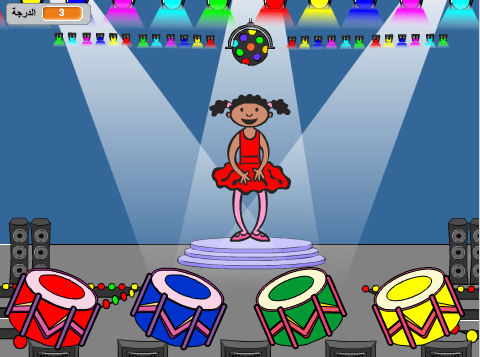

\--- no-print \---

This is the **Scratch 3** version of the project. There is also a [Scratch 2 version of the project](https://projects.raspberrypi.org/en/projects/memory-scratch2).

\--- /no-print \---

## المقدمة

في هذا المشروع، ستقوم بإنشاء لعبة تذكر. حيث سيتطلب منك تذكر وتكرار تسلسل عشوائي للألوان!

### ما الذي ستصنعه

\--- no-print \--- Click on the green flag to start. Watch the sequence of colours shown by the dancer's dress and listen to the accompanying drum beats, then repeat the colours back to her. If you get the colours' order wrong, it's game over!

  <iframe allowtransparency="true" width="485" height="402" src="//scratch.mit.edu/projects/embed/284452634/?autostart=false" frameborder="0" allowfullscreen scrolling="no" mark="crwd-mark"></iframe> 

\--- /no-print \---

\--- print-only \---  \--- /print-only \---

## \--- collapse \---

## title: ما الذي ستتعلمه

+ How to add sound to your Scratch project
+ How to create and use lists to store data
+ How to create and use custom blocks for repeating code

\--- /collapse \---

## \--- collapse \---

## title: ما الذي ستحتاجه

### الأجهزة

+ جهاز كمبيوتر يدعم تشغيل برنامج Scratch 3

### البرامج

Scratch 3 (either [online](https://rpf.io/scratchon){:target="_blank"} or [offline](https://rpf.io/scratchoff){:target="_blank"}) \--- /collapse \---

## \--- collapse \---

## title: Additional information for educators

\--- no-print \---

إذا كنت بحاجة إلى طباعة هذا المشروع، فالرجاء استخدام [نسخة متوافقة مع الطابعة](https://projects.raspberrypi.org/en/projects/memory/print){:target="_blank"}.

\--- /no-print \---

You can [download the completed project here](http://rpf.io/p/en/memory-get).

\--- /collapse \---