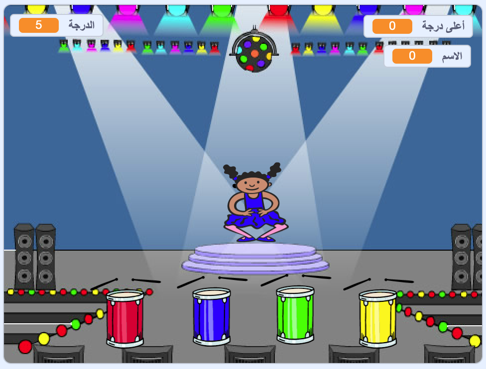

\--- no-print \---

هذا هو إصدار ** Scratch 3 ** من المشروع. هناك أيضًا [ إصدار Scratch 2 للمشروع ](https://projects.raspberrypi.org/en/projects/memory-scratch2).

\--- /no-print \---

## المقدمة

في هذا المشروع، ستقوم بإنشاء لعبة تذكر. حيث سيتطلب منك تذكر وتكرار تسلسل عشوائي للألوان!

### ما الذي ستصنعه

\--- no-print \---

أنقر على العلم الأخضر للبدء. شاهد تسلسل الألوان الذي يظهر به ثوب الراقصة واستمع إلى دقات الطبلة المصاحبة ، ثم قم بتكرار الألوان مرة آخرى رداً عليها. إذا ادخلت ترتيب الألوان بشكل خاطئ، فإنها نهاية اللعبة!

  <iframe allowtransparency="true" width="485" height="402" src="//scratch.mit.edu/projects/embed/284452634/?autostart=false" frameborder="0" allowfullscreen scrolling="no" mark="crwd-mark"></iframe> 

\--- /no-print \---

\--- print-only \---

\--- /print-only \---

## \--- collapse \---

## title: ما الذي ستتعلمه

+ كيفية إضافة الصوت إلى مشروع Scratch الخاص بك
+ كيفية إنشاء و استخدام القوائم لتخزين البيانات
+ كيفية إنشاء و استخدام اللبنات لتكرار التعليمات البرمجية

\--- /collapse \---

## \--- collapse \---

## title: ما الذي ستحتاجه

### الأجهزة

+ جهاز كمبيوتر يدعم تشغيل برنامج Scratch 3

### البرامج

برنامج Scratch 3 (سواء أكان [عبر الإنترنت](https://rpf.io/scratchon){:target="_blank"} أو [دون اتصال بالإنترنت](https://rpf.io/scratchoff){:target="_blank"})

\--- /collapse \---

## \--- collapse \---

## title: معلومات إضافية للمعلمين

\--- no-print \---

إذا كنت بحاجة إلى طباعة هذا المشروع، فالرجاء استخدام [نسخة متوافقة مع الطابعة](https://projects.raspberrypi.org/en/projects/memory/print){:target="_blank"}.

\--- /no-print \---

You can find the [completed project here](https://rpf.io/p/en/memory-get).

\--- /collapse \---