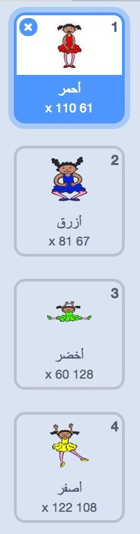
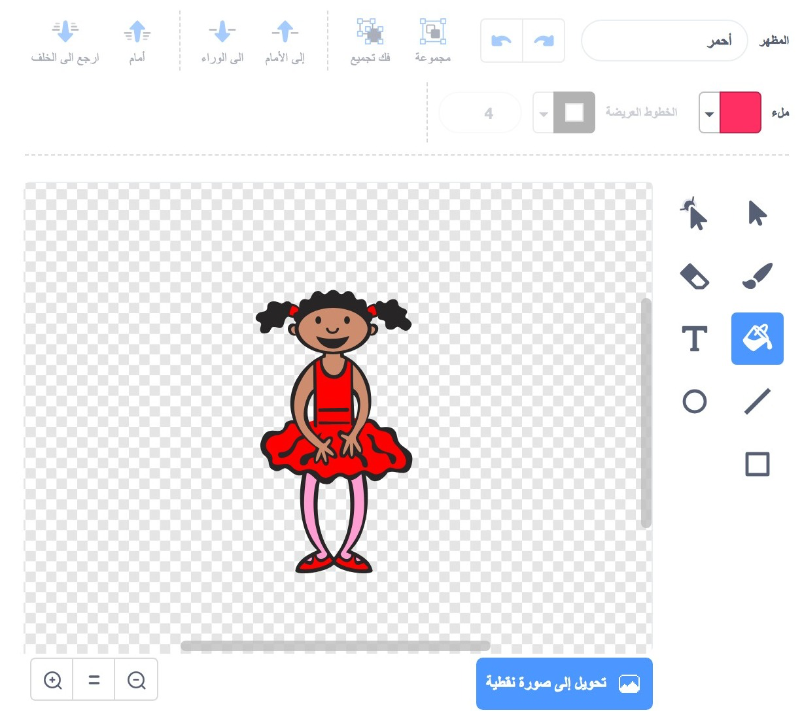
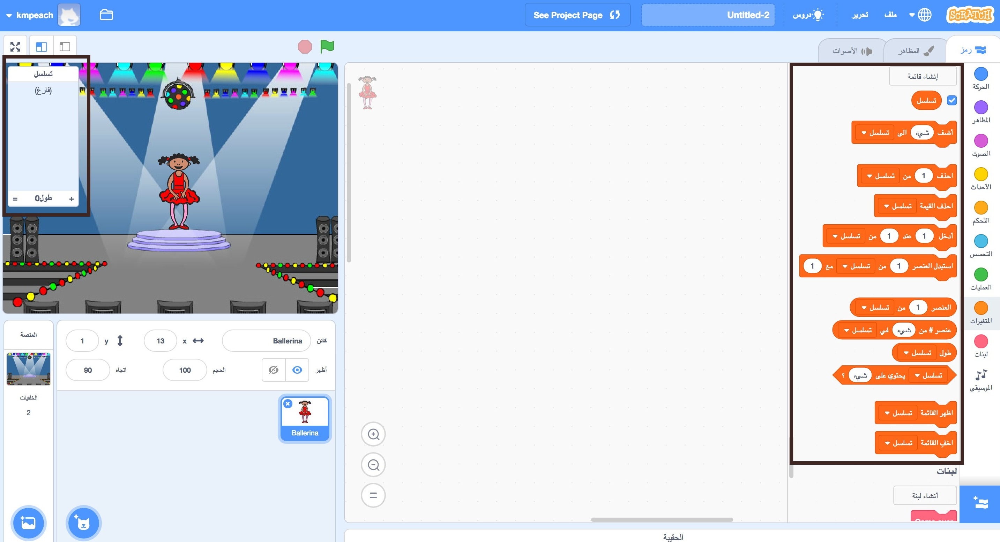

## إنشاء تسلسل لوني

في البداية ، دعنا ننشئ شخصية ستعرض تسلسلًا عشوائيًا من الألوان.

--- task ---

افتح مشروع سكراتش (Scratch) جديدًا وفارغًا.

**اتصال بالانترنيت:** افتح مشروع سكراتش Scratch جديد عبر الانترنيت من [rpf.io/scratch-new](https://rpf.io/scratch-new){:target="_blank"}.

**دون اتصال بالانترنت**: افتح مشروع Scratch جديد عبر المحرر الموجود على جهازك دون اتصال بالانترنت.

اذا تحتاج تنزيل وتنصيب برنامج السكراتش Scratch على جهازك الشخصي، ستجده في [rpf.io/scratchoff](https://rpf.io/scratchoff){:target="_blank"}.

--- /task ---

--- task ---

اختر كائن للشخصية وخلفية. يمكنك استخدام شخصية راقصة البالية، لولكن يس من الضروري ان تكون الشخصية لشخص، ولكن يجب أن تكون قادرة على إظهار ألوان مختلفة.


--- /task ---

+ يجب أن تستخدم لعبتك رقمًا مختلفًا لتمثيل كل لون:
    
    + 1 = أحمر
    + 2 = أزرق
    + 3 = أخضر
    + 4 = أصفر

--- task ---

امنح شخصيتك أربعة أزياء ملونة مختلفة، واحدة لكل من الألوان الأربعة المذكورة أعلاه. تأكد من أن الأزياء الخاصة بك الملونة هي بنفس الترتيب كما في القائمة أعلاه.



--- /task ---

إذا كنت ترغب، يمكنك استخدام أداة **ملء** لتلوين بعض أجزاء المظهر بلون مختلف.



بعد ذلك ، أضف قائمة لتخزين التسلسل العشوائي للألوان التي يجب على اللاعب أن يتذكرها.

--- task ---

قم بإنشاء قائمة باسم `تسلسل`{:class="block3variables"}. كائن الشخصية التي اخترتها هو فقط من سيتعامل مع هذه القائمة،لذلك حدد الخيار **لهذا الكائن فقط** عندما تنشىء القائمة.

[[[generic-scratch3-make-list]]]

--- /task ---

سترى الآن الكثير من كتل التعليمات البرمجية الجديدة الخاصة باستخدام القوائم. القائمة الفارغة يجب أن تكون مرئية على الزاوية العلوية اليسرى من المنصة.



كل لون له رقم مختلف، لذلك يمكنك اختيار لون عشوائي عن طريق اختيار رقم بشكل عشوائي و إضافته إلى القائمة.

--- task ---

أضف هذه التعليمة البرمجية لكائن شخصيتك حتى يتم اختيار رقم عشوائي و من ثم إضافته إلى قائمة`تسلسل`{:class="block3variables"}:


```blocks3
وقتی که پرچم کلیک شد
(انتخاب تصادفی از (1) تا (4)) را به [تسلسل v] اضافه کن
```

--- /task ---

--- task ---

اختبر التعليمة البرمجية التي أضفتها. تأكد من أنه في كل مرة تقوم بالنقر على العلم، يتم إضافة رقم عشوائي بين 1 و 4 إلى القائمة.

--- /task ---

--- task ---

هل يمكنك إضافة تعليمة برمجية إلى برنامجك لتوليد خمس أرقام عشوائية في آن واحد؟

--- hints ---


--- hint ---

أضف `احذف القيمة تسلسل`{:class="block3variables"} حتى يتم حذف جميع الأرقام من القائمة, ثم أضف التعليمة البرمجية `كرر 5 مرة`{:class="block3control"} و التي تقوم بإضافة خمس أرقام عشوائية للقائمة.

--- /hint ---

--- hint ---

و هذا ما يجب أن تبدو عليه التعليمات البرمجية الخاصة بك:


```blocks3
عند نقر ⚑
احذف (الكل v) من [تسلسل v]
(5) بار تکرار کن 
  (انتخاب تصادفی از (1) تا (4)) را به [تسلسل v] اضافه کن
end
```

--- /hint ---

--- /hints ---

--- /task ---

--- task ---

في كل مرة تتم إضافة رقم إلى القائمة، سيتغير مظهر الشخصية بحيث يتطابق لون المظهر مع الرقم. أضف هذه التعليمات البرمجية لبرنامجك مباشرة أسفل التعليمة البرمجية الخاصة بإضافة رقم عشوائي إلى قائمة `تسلسل`{:class="block3variables"}:


```blocks3
تعویض حالت به (عنصر (طول [تسلسل v]) از [تسلسل v])
(1) ثانیه صبر کن
```

--- /task ---