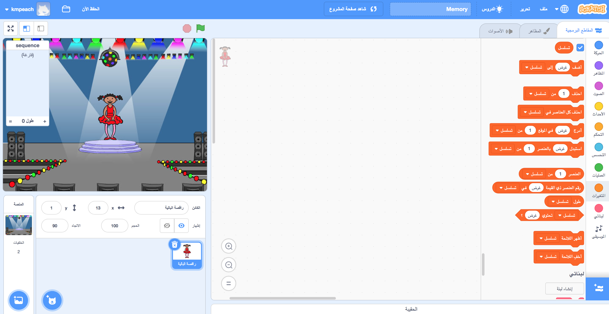

## إنشاء تسلسل لوني

أولاً ، دعنا ننشئ شخصية ستعرض تسلسلًا عشوائيًا من الألوان لحفظها.

+ ابدأ مشروع Scratch الجديد ، واحذف كائن القطة الموجود بحيث يكون مشروعك فارغًا. يمكنك العثور على محرر Scratch عبر الإنترنت [هنا](http://jumpto.cc/scratch-new).

+ اختر كائن للشخصية وخلفية. ليس من الضروري أن تكون الشخصية لإنسان، ولكن يجب أن تكون قادرة على إظهار ألوان مختلفة.


+ في لعبتك، ستستخدم رقمًا مختلفًا لتمثيل كل لون:
    
    + 1 = أحمر
    + 2 = أزرق
    + 3 = أخضر
    + 4 = أصفر
    
    امنح شخصيتك أربعة أزياء ملونة مختلفة، واحدة لكل من الألوان الأربعة المذكورة أعلاه. تأكد من أن الأزياء الخاصة بك الملونة هي بنفس الترتيب كما في القائمة أعلاه.
    
    
    
    يمكنك استخدام أداة *لوّن الشكل* لملء أجزاء الزي المختلف اللون.

لنقم بإنشاء تسلسل ألوان عشوائي.

+ قم بإنشاء قائمة بمسمى `sequence `{:class="blockdata"}. سنستخدم هذه القائمة لتخزين تسلسل الألوان الذي يجب على اللاعب تذكره. فقط كائن الشخصية الذي اخترته يحتاج لرؤية القائمة، لذا يمكنك اختيار **فقط لهذا الكائن**.

[[[generic-scratch-make-list]]]

ستشاهد الآن القائمة الفارغة في الجزء العلوي الأيسر في المرحلة الخاصة بك، كذلك إلى العديد من المجموعات الجديدة لاستخدام القوائم.



+ تذكر أننا أعطينا رقم لكل لون؟ يمكننا اختيار لون عشوائي عن طريق اختيار رقم عشوائي وإضافته إلى القائمة. أضف هذا الكود:

```blocks
عند نقر ⚑
أضف (اختر عدداً عشوائياً بين (1) و (4)) إلى [sequence v]
```

+ اختبر الكود من خلال النقر على العلم الأخضر. تأكد من أنه في كل مره تقوم بالنقر عليه، يتم إضافة رقم عشوائي بين 1 و 4 إلى القائمة.

+ هل يمكنك إضافة هذه المجموعة إلى برنامجك، لإنشاء خمسة ألوان عشوائية في وقت واحد؟

```blocks
كرِّر (5) مرة
end
```

+ قد تلاحظ أن قائمتك أصبحت ممتلئة قليلاً الآن. دعونا نضيف مجموعة لحذف القائمة بأكملها في البداية قبل أن نولّد أي أرقام.

```blocks
عند نقر ⚑
احذف (الكل v) من [sequence v]
كرِّر (5) مرة 
  أضف (اختر عدداً عشوائياً بين (1) و (4)) إلى [sequence v]
end
```

+ وأخيرًا، في كل مرة نختار رقمًا، لنغير زي الراقصة إلى آخر عنصر تمت إضافته إلى القائمة، وهو الرقم الذي اخترناه للتو. أضف هذه المجموعة إلى الكود الخاص بك مباشرة بعد إضافة رقم عشوائي إلى قائمتك:

```blocks
غيّر المظهر إلى (العنصر (last v) من [sequence v] :: list)
انتظر (1) ثانية
```