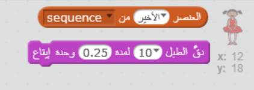

\--- challenge \---

## التحدي: إضافة صوت

اختبر مشروعك عدة مرات. قد تلاحظ أنه في بعض الأحيان يتم اختيار نفس العدد مرتين (أو أكثر) على التوالي، مما يجعل التسلسل أصعب في الحفظ. هل يمكنك عمل صوت للطبل في كل مرة يتغير فيها زي الشخصية؟

هل يمكنك عمل صوت صوت طبلة مختلف اعتمادًا على الرقم الذي تم اختياره؟ هذا سيكون مشابه *جدا* للكود الخاص بتغيير زي الشخصية.

\--- hints \--- \--- hint \--- بإمكانك الانتهاء من هذا التحدي من خلال إضافة مجموعتين إلى كود شخصيتك الحالية! \--- /hint \--- \--- hint \--- هذه هي المجموعة التي ستحتاج اليها:

 \--- hint/ \---

\--- hint \--- سيكون الكود النهائي كالتالي:

```blocks
عند نقر ⚑
احذف (الكل v) من [sequence v]
كرِّر (5) مرة 
  أضف (اختر عدداً عشوائياً بين (1) و (4)) إلى [sequence v]
  دقَّ الطبل (العنصر (last v) من [sequence v] :: list) لمدة (0.25) وحدة إيقاع
  غيّر المظهر إلى (العنصر (last v) من [sequence v] :: list)
  انتظر (1) ثانية
end
```

\--- hint/ \---

\--- hints/ \---

\--- challenge/ \---