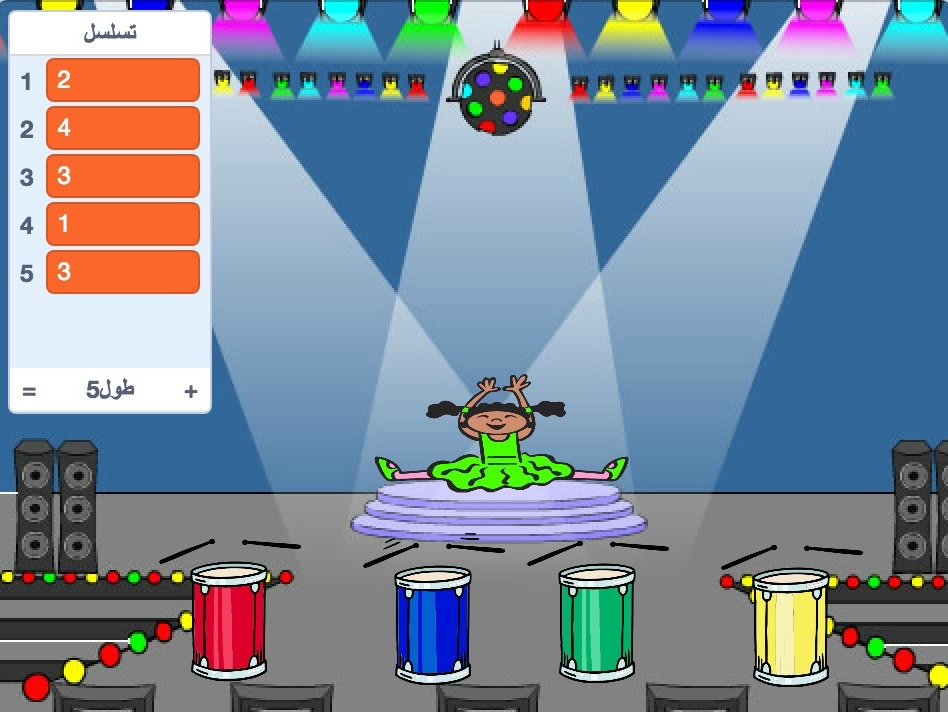

## كرر التسلسل

الآن ستقوم بإضافة أربعة أزرار و سيكون على اللاعب الضغط عليها لتكرار تسلسل اللون.

\--- task \--- أضف أربع كائنات جديدة لمشروعك لتمثيل أزرار الألوان الأربعة المختلفة.

+ عدّل على مظهر الكائنات التي اخترتها بحيث يصبح لكل كائن لون واحد فقط من الألوان الأربعة
+ رتب الكائنات على المنصة حسب ألوانها بالترتيب التالي: أحمر، أزرق، أخضر، أصفر

 \---/task--

\--- task \--- أضف تعليمة برمجية للكائن الأحمر بحيث أنه ،عندما يتم النقر على الكائن يقوم ببث `broadcasts`{:class="block3events"} رسالة إلى كائن الشخصية الرئيسية بأن اللون الآن 'أحمر':


```blocks3
    عند نقر هذا الكائن :: events
بث (أحمر v) :: events
```

\--- /task \---

عملية البث `broadcast`{:class="block3events"} تشبه الرسالة التي يتم إعلانها عبر مكبر الصوت، مثل التي تسمعها في المدرسة أو السوبر ماركت على سبيل المثال. جميع الكائنات قادرة على سماع `البث`{:class="block3events"}, و لكن فقط الكائن الذي تكون مهمته الاستجابة الآن سيفعل شيئاً.

\--- task \---

أضف برمجية تعليمية مشابهه للكائن الأزرق، و الأخضر، و الأصفر لجعلهم يقومون بعمل `بث`{:class="block3events"} لرسائل عن ألوانهم.

\---/task\---

هل تتذكر بأن `البث`{:class="block3events"} يشبه رسالة عبر مكبر الصوت؟ ستضيف الآن تعليمة برمجية ستجعل مهمة كائن الشخصية الرئيسية أن يستجيب لرسائل`البث`{:class="block3events"}.

\--- task \---

عندما تقوم شخصيتك الرئيسية باستقبال الرسالة `أحمر`{:class="block3events"}, ستقوم التعليمة البرمجية بالتحقق من أن الرقم `1` يقع فعلاً في بداية القائمة `تسلسل`{:class="block3variables"} (بمعنى أن `أحمر`{:class="block3events"} هو اللون التالي في التسلسل).

إذا كان الرقم `1` في بداية القائمة, يجب أن تقوم التعليمة البرمجية بإزالته من القائمة, و ذلك لأن اللاعب تذكر اللون بشكل صحيح. و خلاف ذلك فإن اللعبة انتهت، و على التعليمة البرمجية أن تقوم بـ `أوقف الكل`{:class="block3control"} لإنهاء اللعبة.


```blocks3
عندما تستقبل [أحمر v] :: events
إذا <(العنصر (1 v) of [تسلسل v]) = [1] :: operators> 
  احذف (1 v) من [تسلسل v] :: list

  قل [انتهت اللعبة!] لمدة (1) ثانية :: looks
  أوقف [الكل v] :: control :: control
end
```

\--- /task \---

\--- task \--- أضف ايضا التعليمة البرمجية التالية و التي ستضيف صوت ايقاع طبل عندما يستقبل كائن الشخصية الرئيسية رسالة`بث`{:class="block3events"} باللون الصحيح.

\--- hints \--- \--- hint \--- هل بإمكانك استخدام الأرقام التي تتوافق مع كل لون لعزف نغمة الطبلة الصحيحة؟

+ 1 = أحمر
+ 2 = أزرق
+ 3 = أخضر
+ 4 = أصفر \--- /hint \--- \--- hint \--- فوق كتلة `احذف 1 من تسلسل`{:class="block3variables"}, أضف كتلة `دقّ الطبل`{:class="block3sound"} لتشغيل أول صوت في القائمة `تسلسل`{:class="block3variables"}.

\--- hint/ \--- \--- hint \--- هنا الكود الذي تحتاج لإضافته:

```blocks3
عندما تستقبل [أحمر v] :: events
إذا <(العنصر (1 v) of [تسلسل v]) = [1] :: operators> 
  + دقَّ الطبل ((1) Snare Drum v) لمدة (0.25) وحدة إيقاع :: music
  احذف (1 v) من [تسلسل v] :: list

  قل [انتهت اللعبة!] لمدة (1) ثانية :: looks
  أوقف [الكل v] :: control :: control
end

```

\--- /hint \--- \--- /hints \--- \--- /task \---

\--- task \--- كرر التعليمة البرمجية التي استخدمتها لجعل كائن شخصيتك يستجيب للرسالة `أحمر`{:class="block3events"}. عدّل على التعليمة البرمجية المكررة بحيث ترسل الرسالة `أزرق`{:class="block3events"}. \--- /task \---

عندما يستجيب كائن الشخصية للرسالة `أزرق`{:class="block3events"}, أي جزء من التعليمة البرمجية يجب أن يبقى كما هو, و أي جزء يجب أن يتغير؟ تذكر بأن لكل لون رقم مقابل خاص به.

\--- task \--- غير التعليمة البرمجية الخاصة بكائن الشخصية الرئيسية بحيث تصبح الشخصية قادرة على الاستجابة للون `أزرق`{:class="block3events"} بشكل صحيح.

\--- hints \--- \--- hint \---

احتفظ بهذه الكتل البرمجية، و لكنك ستحتاج إلى عمل بعض التغييرات بطريقة ما:


```blocks3
<(العنصر (1 v) of [تسلسل v]) = [1] :: operators>

عندما تستقبل [أحمر v] :: events

دقَّ الطبل ((1) Snare Drum v) لمدة (0.25) وحدة إيقاع :: music
```

\--- /hint \--- \--- hint \--- هنا نوضح لك كيف ستبدو التعليمة البرمجية لرسالة بث اللون `أزرق`{:class="block3events"}.


```blocks3
عندما تستقبل [أزرق v] :: events
إذا <(العنصر (1 v) of [تسلسل v]) = [2] :: operators> 
  دقَّ الطبل ((2) Bass Drum v) لمدة (0.25) وحدة إيقاع :: music
  احذف (1 v) من [تسلسل v] :: list

  قل [انتهت اللعبة!] لمدة (1) ثانية :: looks
  أوقف [الكل v] :: control :: control
end
```

\--- /hint \--- \--- /hints \--- \--- /task \---

\--- task \--- كرر التعليمة البرمجية مرتين ايضاً (للونين الأخضر و الأصفر), و عدّل على الاجزاء الضرورية و التي ستجعل كائن الشخصية يستجيب بشكل صحيح للرسائل الجديدة`broadcasts`{:class="block3events"}. \--- /task \---

تذكر بأن تقوم باختبار تعليماتك البرمجية! هل يمكنك تذكر تسلسل مكون من خمس ألوان؟ هل التسلسل مختلف كل مرة؟

عندما يقوم اللاعب بتكرار تسلسل الألوان كاملاً بشكل صحيح, ستكون قائمة `تسلسل`{:class="block3variables"} فارغة و سيعتبر اللاعب فائز. اذا كنت ترغب, يمكنك إضافة بعض الأنوار الوامضة كجائزة للاعب الفائز، و يكون ذلك بعد أن تصبح قائمة `تسلسل` فارغة {:class="block3variables"}.

\--- task \--- أضف هذه التعليمة البرمجية في نهاية مقطع`عند النقر على`{:class="block3events"}:


```blocks3
    انتظر حتى <(طول [تسلسل v] :: list) = [0] :: operators> :: control
بث (فزت! v) وانتظر :: events
```

\--- /task \---

\--- task \--- من جزء المنصة, استورد صوت `آلة الطبلة` أو أي صوت تفضله.

[[[generic-scratch3-sound-from-library]]]

\--- /task \---

\--- task \--- أضف هذه التعليمات البرمجية لتشغيل صوت و لتغيير ألوان الخلفية عندما يفوز اللاعب.


```blocks3
    عندما تستقبل [فزت! v] :: events
شغل الصوت (drum machine v) :: sound
كرِّر (50) مرة 
  غيِّر تأثير [اللون v] بمقدار (25) :: looks
  انتظر (0.1) ثانية :: control :: control
end
أزل التأثيرات الرسومية :: looks
```

\--- /task \---