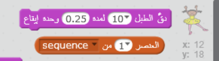
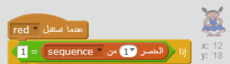

## تكرار التسلسل

لنقم بإضافة أربعة أزرار لينقر عليها اللاعب لتكرار التسلسل الذي يتذكره.

+ أضف أربعة كائنات إلى مشروعك لتمثيل الأزرار الأربعة. قم بتحرير الأزياء بحيث يكون هناك كائن واحد في كل لون من الألوان الأربعة. قم بوضع الكائنات بنفس ترتيب الأزياء - أحمر، أزرق، أخضر، أصفر.


+ عند النقر على الطبل الأحمر، ستحتاج إلى بث رسالة إلى شخصيتك، لإحاطتهم علم بأنه تم الضغط على الزر الأحمر. قم بإضافة هذا الكود إلى الطبل الأحمر:

```blocks
    عند نقر هذا الكائن
بث [red v]
```

البث يشبه إلى حد ما الإعلان عبر مكبر الصوت - ربما سمعت هذا عند التسوق في السوبر ماركت. جميع الكائنات يمكنها سماع الرسالة، ولكن فقط الكائن الذي تكون مهمته الاستجابة سيفعل شيئاً.

+ قم بإضافة كود مشابه إلى الطبل الأزرق، والأخضر والأصفر لجعلها تبث رسالة عن لونها الخاص.

\--- hints \--- \--- hint \--- هنا طريقة سهلة لنسخ الكود من كائن إلى آخر. قم بتغيير رسالة البث في كل كائن لتتطابق مع لون الكائن.  \--- hint/ \--- \--- hints/ \---

تذكر قولنا بأن البث يشبه إلى حد ما القيام بإعلان عبر مكبر الصوت؟ فقط الكائن الذي يكون مهمته الاستجابة سيقوم بعمل شيئ ما، لذا دعنا نعمل على أن تكون وظيفة الكائن الاستجابة للرسائل. نقوم بعمل ذلك من خلال كتابة كود للشخصية لتقوم بالعمل عندما تسمع كل رسالة.

+ عندما يتلقى كائن الشخصية الرسالة `أحمر`، يجب أن يتحقق الكود ما إذا كان الرقم`1` في بداية القائمة ( مما يعني أن `أحمر` هو اللون التالي في التسلسل).
    
    إذا كان الأمر كذلك، يجب أن يزيل الكود الرقم من القائمة، حيث تم التخمين الصحيح للون. بخلاف ذلك تنتهي اللعبة، ونحتاج `إيقاف كل شيء`{:class="blockcontrol"} لإيقاف اللعبة.

```blocks
    عندما أستقبل [red v]
إذا <(item (1 v) of [sequence v] :: list) = [1]> 
  احذف (1 v) من [sequence v]

  قل [Game over!] لمدة (1) ثانية
  أوقف [الكل v]
end
```

+ أضف الكود الذي كتبته للتو حتى يتم عزف ضربات الطبل عند تلقي اللون الصحيح.

\--- hints \--- \--- hint \--- هل بإمكانك استخدام الأرقام التي تتوافق مع كل لون لعزف نغمة الطبلة الصحيحة؟

+ 1 = أحمر
+ 2 = أزرق
+ 3 = أخضر
+ 4 = أصفر \--- hint/ \--- \--- hint \--- تحتاج لإضافة مجموعة `عزف الطبل`{:class="blocksound"} لعزف أول صوت في قائمة التسلسل قبل `حذف 1 من التسلسل`{:class="blockdata"}:

 \--- hint/ \--- \--- hint \--- هنا الكود الذي تحتاج لإضافته:

```blocks
دق الطبل (العنصر (1 v) من [sequence v] :: list) لمدة (0.25) وحدة إيقاع
```

\--- hint/ \--- \--- hints/ \---

+ قم بتكرار الكود الذي استخدمته لجعل شخصية الكائن تستجيب للرسالة `أحمر`. هذه المرة غير الرسالة إلى `أزرق`.

عندما يستجيب الكائن إلى الرسالة `أزرق`، أي جزء من الكود يجب أن يبقى كما هو، وأي جزء يجب أن يتغير؟ تذكر أن كل لون له رقم مقابل.

+ غير الكود حتى تستجيب الشخصية بشكل صحيح للرسالة `أزرق`.

\--- hints \--- \--- hint \--- احتفظ بهذه المجموعات، ولكن ستحتاج لتغييرها بشكل ما:  \--- hint/ \--- \--- hint \--- هنا كيف سيكون الكود أثناء البث الأزرق.

```blocks
    عندما أستقبل [blue v]
إذا <(item (1 v) of [sequence v] :: list) = [2]> 
  دق الطبل (العنصر (1 v) من [sequence v] :: list) لمدة (0.25) وحدة إيقاع
  احذف (1 v) من [sequence v]

  قل [Game over!] لمدة (1) ثانية
  أوقف [الكل v]
end
```

\--- hint/ \--- \--- hints/ \---

+ قم بتكرار الكود مرتين للزر الأخضر والزر الأصفر، وغير الأجزاء الضرورية حتى تستجيب الشخصية بشكل صحيح.

+ تذكر لتقوم باختبار الكود لقد قمت بإضافة! هل يمكنك تذكر تسلسل من خمسة ألوان؟ هل التسلسل يختلف في كل مرة؟

يمكنك أيضا عرض بعض الأضواء الوامضة كمكافأة بمجرد أن تصبح القائمة فارغة، وذلك يعني أنه تم تذكر التسلسل كاملًا بشكل صحيح.

+ قم بإضافة الكود في نهاية كائن شخصيتك `عند النقر على العلم`{:class="blockevents"}:

```blocks
    انتظر حتى <(length of [sequence v] :: list) = [0]>
بث [won v] وانتظر
```

+ قم بالانتقال إلى الجزء الرئيسي، وأضف هذا الكود لعزف الصوت وجعل لون الخلفية يتغير بمجرد أن يفوز اللاعب. يمكنك اختيار أي صوت تفضله.

```blocks
    عندما أستقبل [won v]
شغل الصوت [drum machine v]
كرِّر (50) مرة 
  غيِّر تأثير [اللون v] بمقدار (25)
  انتظر (0.1) ثانية
end
أزل التأثيرات الرسومية
```