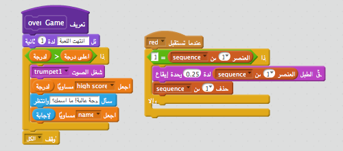

## أعلى درجة

لنقم بحفظ أعلى درجة، بحيث يمكنك اللعب ضد أصدقائك.

+ قم بإضافة متغيرين إلى مشروعك أحدهما بعنوان `أعلى درجة`{:class="blockdata"}والآخر بعنوان `الاسم`{:class="blockdata"}.

عند انتهاء اللعبة بسبب أن اللاعب أخطأ بالتسلسل،فإنك تحتاج إلى التحقق مما إذا كانت درجته أعلى من أعلى درجة حالية. إذا كان الأمر كذلك، تحتاج لحفظ الدرجة التي حصل عليها كأعلى درجة، وحفظ اسم اللاعب.

+ أضف الكود إلى شخصية الكائن الخاص بك لحفظ أعلى درجة. أطلب أيضا من اللاعب اسمه وقم بتسجيله في متغير `الاسم`{:class="blockdata"}.

[[[generic-scratch-high-score]]]

\--- hints \--- \--- hint \--- الكود الجديد الخاص بك يحتاج لاتباع المنطق التالي: بعد رسالة `انتهاء اللعبة` `إذا<code> كانت <code>الدرجة``أعلى من``أعلى درجة``اجعل``الدرجة` هي `أعلى درجة`و`إطلب` اسم اللاعب `اجعل` `الاسم` إلى <0>الإجابة</code> \--- hint/ \--- \--- hint \--- ستحتاج إلى المجموعات التالية:


\--- hint/ \--- \--- hint \--- هنا كيفية ظهور الكود الخاص بك عند النقر على الزر الأحمر:

```blocks
    عندما تستقبل [red v]
إذا <(item (1 v) of [sequence v] :: list) = [1]> 
  احذف (1 v) من [sequence v]

  قل [Game over!] لمدة (1) ثانية
  إذا <(score) > (high score)> 
    اجعل [high score v] مساوياً (score)
    ask [High score!]
  end
end ما اسمك؟\] and wait
اجعل [name v] مساوياً (الإجابة)
end
أوقف [الكل v]

end
```

\--- hint/ \--- \--- hints/ \---

+ أيضا ستحتاج إلى إضافة الكود الجديد إلى شخصية الكائن للألوان الثلاثة الأخرى! هل لاحظت أن كود ’انتهت اللعبة’ لكل لون من الألوان الأربعة هو نفسه تماما؟


إذا احتجت في أي وقت إلى تغيير أي كود، على سبيل المثال تريد إضافة صوت أو تغيير رسالة ’انتهت اللعبة’ فسيتعين عليك تغييرها أربع مرات. يمكن أن يصبح ذلك مزعج، وفيه مضيعة للوقت.

بدلاً من ذلك، يمكنك تعريف مجموعاتك الخاصة، وإعادة استخدامها في مشروعك. للقيام بذلك `المزيد من المجموعات`{:class="blockmoreblocks"}، ثم **إنشاء مجموعة**. قم بتسمية هذه المجموعة الجديدة ’ انتهت اللعبة’.


+ أضف الكود من المجموعة `آخر`{:class="blockcontrol"} المرتبطة بالزر الأحمر إلى المجموعة التي قمت بإنشائها:



+ قمت الآن بعمل *وظيفة* جديدة تسمى `انتهت اللعبة`{:class="blockmoreblocks"}، والتي يمكنك استخدامها في أي مكان تريد. اسحب مجموعتك الجديدة `انتهت اللعبة`{:class="blockmoreblocks"} إلى أزرار النصوص البرمجية الأربعة.


+ الآن قم بإضافة صوت لـ عند النقر على الزر الخاطئ. ما عليك سوى إضافة الكود مرة واحدة فقط في مجموعة `انتهت اللعبة`{:class="blockmoreblocks"} التي قمت بإنشاءها، وليس أربع مرات منفصلة!

