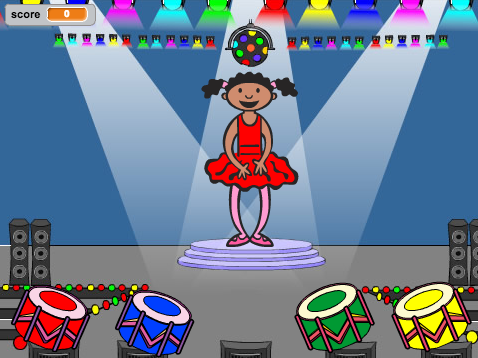

## Cyflwyniad

Yn y prosiect yma, fe fyddi di'n creu gêm gofio, lle mae'n rhaid i ti gofio ac ailadrodd dilyniant o liwiau ar hap!

  <iframe allowtransparency="true" width="485" height="402" src="https://scratch.mit.edu/projects/embed/34874510/?autostart=false" frameborder="0"></iframe>
  

Mae'r prosiect yma yn trin elfennau sydd yn rhan o'r adran ganlynol o [Faes Llafur Gwneud Digidol Raspberry Pi](http://rpf.io/curriculum):

+ [Cyfuno adeiladwaith rhaglenni i ddatrys problem.](https://www.raspberrypi.org/curriculum/programming/builder)
