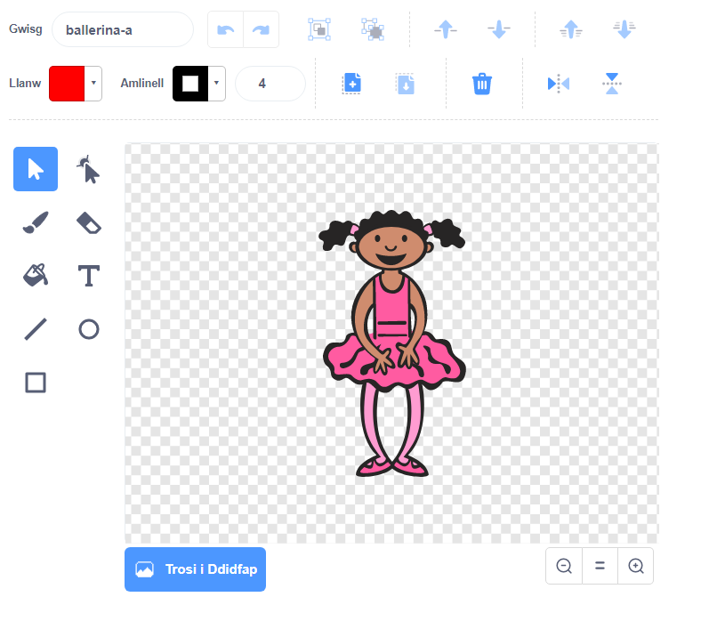
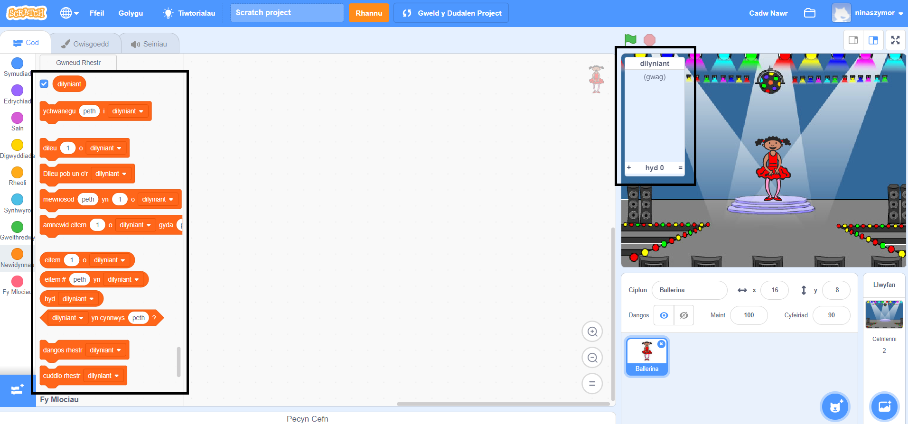

## Creu dilyniant o liwiau

Yn gyntaf, fe wnawn ni greu cymeriad sydd yn gallu newid ei gwisg yn ôl dilyniant o liwiau ar hap.

\--- task \---

Open a new Scratch project.

**Online**: open a new online Scratch project at [rpf.io/scratch-new](https://rpf.io/scratch-new){:target="_blank"}.

**Offline**: open a new project in the offline editor.

If you need to download and install the Scratch offline editor, you can find it at [rpf.io/scratchoff](https://rpf.io/scratchoff){:target="_blank"}.

\--- /task \---

\--- task \---

Choose a character sprite and a backdrop. You could use the ballerina, but your character doesn't have to be a person, they only need to be able to show different colours.


\--- /task \---

+ Dylai dy gêm ddefnyddio rhif gwahanol i gynrychioli pob lliw:
    
    + 1 = coch
    + 2 = glas
    + 3 = gwyrdd
    + 4 = melyn

\--- task \---

Give your character four costumes that have different colours, one costumes for each of the four colours shown above. Make sure that your coloured costumes are in the same order as the list above.


\--- /task \---

If you want, you can use the **color a shape** tool to fill parts of the costume with a different colour.



Next, add a list for storing the random sequence of colours that the player has to remember.

\--- task \---

Create a list called `sequence`{:class="block3variables"}. Only the character sprite needs to see this list, so you can select **For this sprite only** when you create the list.

[[[generic-scratch3-make-list]]]

\--- /task \---

You should now see lots of new code blocks for using lists. The empty list should be visible in the top left-hand corner of the Stage.



Each colour has a different number, so you can choose a random colour by randomly choosing a number and adding it to the list.

\--- task \---

Add this code to the character sprite to choose a random number and add it to `sequence`{:class="block3variables"}:


```blocks3
pan fo'r flag werdd yn cael ei glicio
ychwanegu (dewis ar hap (1) i (4)) i [dilyniant v]
```

\--- /task \---

\--- task \---

Test your code. Check that, each time you click the flag, a random number between 1 and 4 gets added to the list.

\--- /task \---

\--- task \---

Can you add code to your program to generate five random numbers at once?

\--- hints \---

\--- hint \---

Add a `delete all of sequence`{:class="block3variables"} to first delete all the items on the list, and then add a `repeat`{:class="block3control"} block that adds five random numbers to the list.

\--- /hint \---

\--- hint \---

This is what your code should look like:


```blocks3
pan fo'r flag werdd yn cael ei glicio
dileu (all v) o [dilyniant v]
ailadrodd (5) 
  ychwanegu (dewis ar hap (1) i (4)) i [dilyniant v]
end
```

\--- /hint \---

\--- /hints \---

\--- /task \---

\--- task \---

Each time a number gets added to the list, the character should change its costume so the costume's colour matches the number. Put these blocks into your code immediately below where a random number is added to `sequence`{:class="block3variables"}:


```blocks3
newid gwisg i (eitem (hyd [dilyniant v]) o [dilyniant v])
aros (1) eiliad
```

\--- /task \---