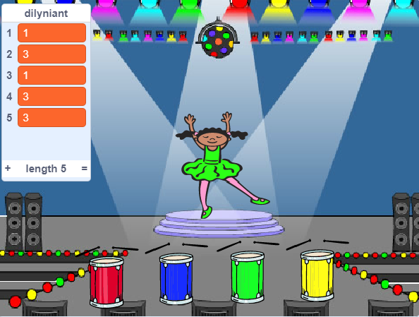

## Ailadrodd y dilyniant

Rwy ti nawr am ychwanegu pedwar botwm i'r chwareuwr wasgu i ail-adrodd dilyniant y lliwiau.

--- task --- Ychwanegu pedwar corlun newydd i dy brosiect i gynrychioli'r pedwar botwm.

+ Golyga gwisgoedd y corluniau newydd fel bod un corlun ym mhob un o'r pedwar lliw
+ Rho'r corluniau yn yr un drefn ar y llwyfan â'r gwisgoedd: coch, glas, gwyrdd, melyn

 --- /task ---

--- task --- Ychwanega gôd i dy gorlun coch fel ei fod yn `darlledu`{:class="block3events"} y neges "coch" pan mae'n cael ei glicio:


```blocks3
    pan gaiff y ciplun yma ei glicio
darlledu (coch v)
```

--- /task ---

Mae `darllediad`{:class="block3events"} fel neges sy'n cael ei ddarlledu ar uchelseinydd. Mae modd i'r holl gorluniau glywed y `darllediad`{:class="block3events"}, ond dim ond y corlun sydd angen ymateb fydd yn gwneud rhywbeth.

--- task ---

Ychwanega gôd tebyg i'r corluniau glas, gwyrdd a melyn i wneud iddynt `ddarlledu`{:class="block3events"} neges am eu lliw eu hunain.

--- /task ---

Wyt ti'n cofio bod y `darllediad`{:class="block3events"} fel neges uchelseinydd? Byddi di'n ychwanegu côd i wneud hi'n rhan o swydd y corlun i ymateb i'r `darllediad`{:class="block3events"}.

--- task ---

Pan fydd dy gymeriad yn derbyn neges `coch`{:class="block3events"}, fe ddylai'r côd wirio os yw'r rhif `1` ar ddechrau'r `dilyniant`{:class="block3variables"} (sy'n golygu mai `coch`{:class="block3events"} yw'r lliw nesaf yn y dilyniant).

Os mai `1` sydd ar gychwyn y rhestr, fe ddylai'r côd dynnu'r rhif o'r rhestr, gan fod y chwareuwr wedi cofio'r lliw yn gywir. Fel arall mae'r gêm ar ben, ac mae angen i'r côd `stopio y cyfan`{:class="block3control"} i orffen y gêm.


```blocks3
pan rwy'n derbyn [coch v]
os <(eitem (1 v) o [dilyniant v]) = [1]> yna 
  dileu (1 v) o [dilyniant v]
fel arall 
  dweud [Game over!] am (1) eiliad
  aros [all v]
end
```

--- /task ---

--- task --- Ychwanega'r côd rwyt ti newydd ei ysgrifennu fel bod y drwm hefyd yn chwarae pan fo'r cymeriad yn derbyn y `darllediad`{:class="block3events"} cywir.

--- hints ---
 --- hint --- Alli di gofio'r rhifau sy'n cyfateb â phob lliw i chwarae'r curiad drwm cywir?

+ 1 = coch
+ 2 = glas
+ 3 = gwyrdd
+ 4 = melyn
--- /hint ---
 --- hint --- Uwchben bloc `dileu 1 yn y dilyniant`{:class="block3variables"} ychwanega bloc `chwarae drwm`{:class="block3sound"} i chwarae'r sain cyntaf yn rhestr y `dilyniant`{:class="block3variables"}.

--- /hint --- --- hint --- Dyma'r blociau côd rwyt ti eu hangen:

```blocks3
pan rwy'n derbyn [coch v]
os <(eitem (1 v) o [dilyniant v]) = [1]> yna 
  + chwarae drwm ((1) Snare Drum v) am (0.25) curiad
  dileu (1 v) o [dilyniant v]
fel arall 
  dweud [Game over!] am (1) eiliad
  aros [all v]
end

```

--- /hint ------ /hints --- --- /task ---

--- task --- Dyblyga'r côd wnes di ei ddefnyddio i wneud i dy gymeriad ymateb i'r neges `coch`{:class="block3events"}. Newida'r côd wedi dyblygu fel ei fod yn anfon neges `glas`{:class="block3events"}. --- /task ---

Pan fo'r corlun yn ymateb i'r neges `glas`{:class="block3events"}, pa ran o'r côd ddylai aros yr un peth a pha ran ddylai newid? Cofia fod gan bob lliw rif cyfatebol.

--- task --- Newida gôd y corlun fel fod pob cymeriad yn ymateb yn gywir i'r neges `glas`{:class="block3events"}.

--- hints ---
 --- hint ---

Cadwa'r blociau yma, ond bydd angen eu newid mewn ryw ffordd:


```blocks3
<(eitem (1 v) o [dilyniant v]) = [1]>

pan rwy'n derbyn [coch v]

chwarae drwm ((1) Snare Drum v) am (0.25) curiad
```

--- /hint --- --- hint --- Dyma sut ddylai dy gôd edrych ar gyfer y darllediad `glas`{:class="block3events"}.


```blocks3
pan rwy'n derbyn [glas v]
os <(eitem (1 v) o [dilyniant v]) = [2]> yna 
  chwarae drwm ((2) Bass Drum v) am (0.25) curiad
  dileu (1 v) o [dilyniant v]
fel arall 
  dweud [Game over!] am (1) eiliad
  aros [all v]
end
```

--- /hint ------ /hints --- --- /task ---

--- task --- Dyblyga'r côd yma ddwywaith arall (ar gyfer y botymau gwyrdd a melyn), a newid y rhannau angenrheidiol fel fod y cymeriad yn ymateb yn gywir i'r `darllediad`{:class="block3events"} . --- /task ---

Cofia brofi'r cod! Alli di gofio dilyniant o bum lliw? A yw'r dilyniant yn wahanol bob tro?

Pan fydd y chwaraewr yn ailadrodd y dilyniant lliw cyfan yn gywir, bydd rhestr y `dilyniant`{:class="block3variables"} yn wag a'r chwaraewr yn ennill. Os hoffet ti, fe alli di hefyd arddangos goleuadau yn fflachio fel gwobr unwaith mae'r rhestr `dilyniant`{:class="block3variables"} yn wag.

--- task --- Ychwanega'r côd yma i ddiwedd sgript dy gymeriad `pan fo'r faner wedi ei chlicio`{:class="block3events"}:


```blocks3
    aros hyd at <(hyd [dilyniant v]) = [0]>
darlledu (won v) ac aros
```

--- /task ---

--- task --- Newida i'r Llwyfan, a mewnforio sain y `peiriant drwm` neu unrhyw sain arall.

[[[generic-scratch3-sound-from-library]]]

--- /task ---

--- task --- Ychwanega'r côd yma i chwarae sain a gwneud i'r cefndir newid lliw pan mae'r chwareuwr yn ennill.


```blocks3
    pan rwy'n derbyn [won v]
cychwyn sain (drum machine v)
ailadrodd (50) 
  newid effaith [color v] gan (25)
  aros (0.1) eiliad
end
clirio effeithiau graffeg
```

--- /task ---