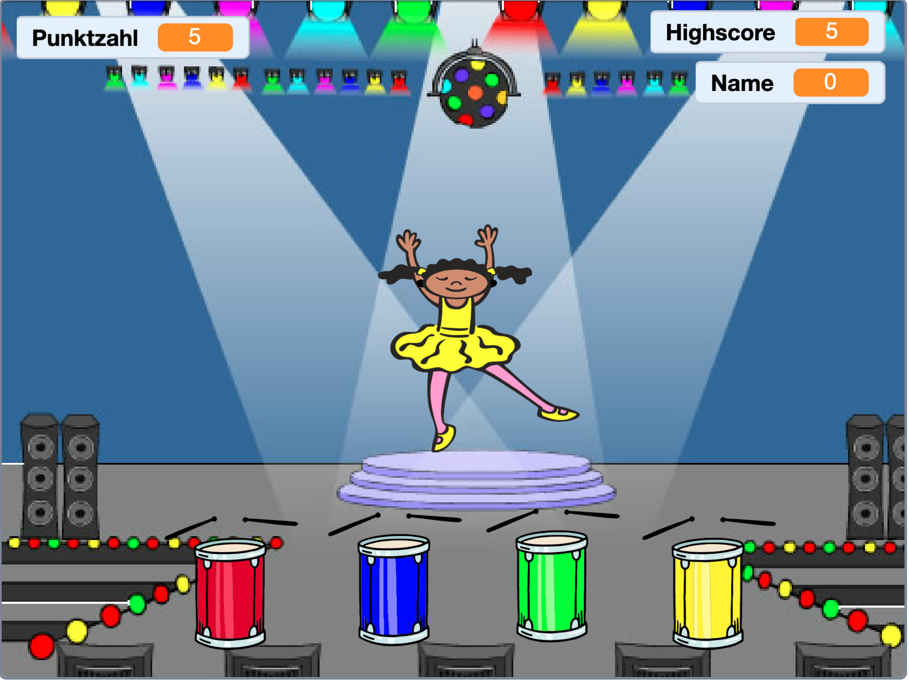

\--- no-print \---

Dies ist die **Scratch-3**-Version des Projekts. Es gibt auch eine [Scratch-2-Version des Projekts](https://projects.raspberrypi.org/en/projects/memory-scratch2).

\--- /no-print \---

## Einleitung

In diesem Projekt erstellst du ein Gedächtnis-Spiel, bei dem man sich eine Folge von zufälligen Farben merken und wiederholen muss!

### Was du machen wirst

\--- no-print \---

Klicke zum Starten auf die grüne Flagge. Beobachte die Farbenfolge, die das Kleid des Tänzers/der Tänzerin zeigt und höre den begleitenden Trommelschlägen zu, wiederhole dann die Reihenfolge, um ein Level weiter zu kommen. Wenn du die Reihenfolge der Farben falsch eingegeben hast, ist das Spiel vorbei!

  <iframe allowtransparency="true" width="485" height="402" src="//scratch.mit.edu/projects/embed/284452634/?autostart=false" frameborder="0" allowfullscreen scrolling="no" mark="crwd-mark"></iframe> 

\--- /no-print \---

\--- print-only \---

\--- /print-only \---

## \--- collapse \---

## title: Was du lernen wirst

+ Wie ein Klang zu deinem Scratch-Projekt hinzugefügt wird
+ Wie man Listen erstellt und verwendet, um Daten zu speichern
+ Wie man benutzerdefinierte Blöcke erstellt und verwendet, um Code zu wiederholen

\--- /collapse \---

## \--- collapse \---

## title: Was du brauchen wirst

### Hardware

+ Ein Computer, auf dem Scratch 3 ausgeführt werden kann

### Software

Scratch 3 (entweder [online](https://rpf.io/scratchon){:target="_blank"} oder [offline](https://rpf.io/scratchoff){:target="_blank"})

\--- /collapse \---

## \--- collapse \---

## title: Zusätzliche Informationen für Lehrer

\--- no-print \---

Wenn du dieses Projekt ausdrucken möchtest, verwende die [druckerfreundliche Version](https://projects.raspberrypi.org/en/projects/memory/print){:target="_blank"}.

\--- /no-print \---

You can find the [completed project here](https://rpf.io/p/en/memory-get).

\--- /collapse \---