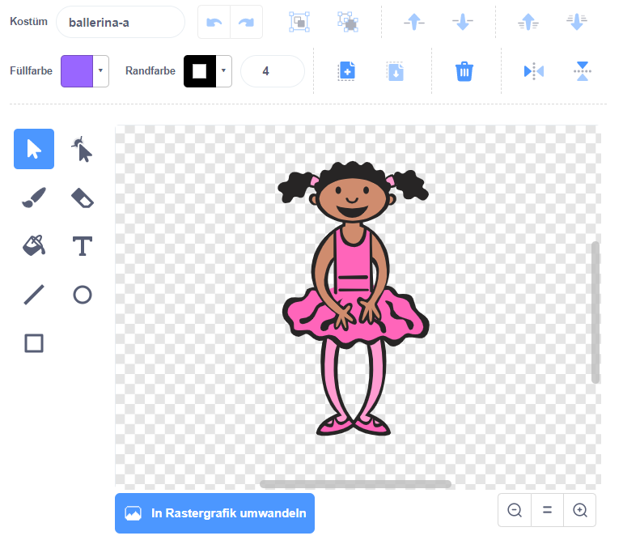
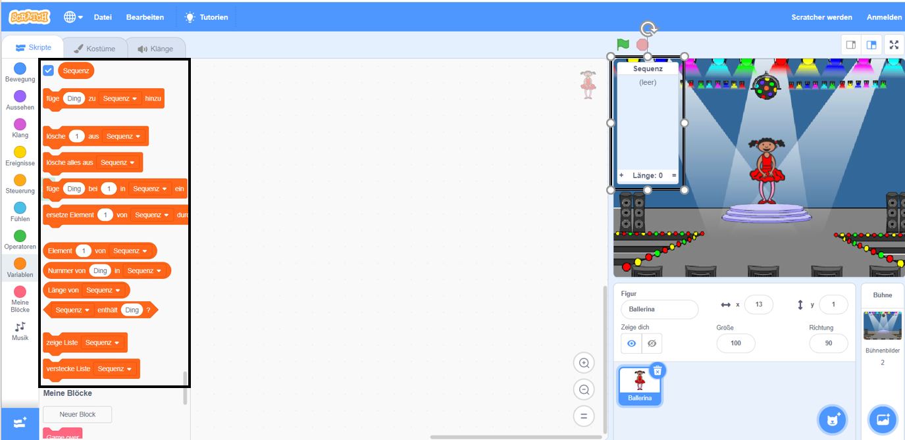

## Zufällige Farben

Erstelle zunächst einen Charakter, der eine zufällige Reihenfolge von unterschiedlichen Farben annehmen kann.

\--- task \--- Öffne ein neues Scratch-Projekt.

**Online**: Erstelle ein neues Scratch-Projekt unter [rpf.io/scratch-new](https://rpf.io/scratchon).

**Offline**: Öffne ein neues Projekt im Offline-Editor.

Wenn du den Scratch-Offline-Editor herunterladen und installieren möchtest, findest du diesen unter [rpf.io/scratchoff](https://rpf.io/scratchoff).

\--- /task \---

\--- task \--- Füge eine neue Figur, sowie den passenden Bühnenhintergrund hinzu. Dein Charakter muss keine Person sein, aber er muss verschiedene Farben annehmen können.

 \--- /task \---

+ In dem Spiel sollte für jede Farbe eine andere Nummer verwendet werden:
    
    + 1 = rot
    + 2 = blau
    + 3 = grün
    + 4 = gelb

\--- Aufgabe \--- Gib deinen Charakter vier Kostüme mit unterschiedliche Farben. Jedem Kostüm soll eine der oben genannten vier Farben zugeordnet werden. Stelle sicher, dass die farbigen Kostüme in der gleichen Reihenfolge zugeordnet werden wie in der oben aufgeführten Liste.

 \--- /task \---

Du kannst das **Farb-Werkzeug** verwenden, um Teile des Kostüms mit einer anderen Farbe zu füllen.



Als nächste füge eine Liste hinzu, um die zufällige Reihenfolge der Farben zu speichern, die der Spieler sich dann merken muss.

\--- task \--- Erstelle unter ‘Daten’ eine neue Liste namens `Sequenz`. Da nur Dein Charakter die Liste sehen muss, können wir auf **Nur für diese Figur** klicken.

[[[generic-scratch3-make-list]]]

\--- /task \---

Du solltest nun sowohl Deine leere Liste in der oberen linken Ecke Deiner Bühne sehen, als auch eine Menge neuer Bausteine für die Verwendung der Liste.



Jede Farbe hat eine andere Nummer. Um eine zufällige Farbe zu erhalten kannst Du eine Zahl Dir ausdenken und in die Liste einfügen.

Füge diesen Code zur Figur hinzu, um `Sequenz`{:class="block3variables"} nacheinander eine zufällige Nummer zuzuordnen:


```blocks3
Wenn die grüne Flagge angeklickt
füge (Zufallszahl von (1) bis (4)) zu [Sequenz v] hinzu
```

\--- /task \---

\--- task \--- Test deinen Code. Überprüfe, dass jedes Mal, wenn Du auf die Flagge klickst, eine zufällige Nummer zwischen 1 und 4 zur Liste hinzugefügt wird. \--- /task \---

\--- task \--- Kannst dem Programm einen Code hinzufügen, um damit fünf zufällige Zahlen gleichzeitig zu erhalten?

\--- hints \--- \---- hint \---- Füge ein `Sequenz leeren` {:class="block3variables"} hinzu, um zunächst alle Elemente in der Liste zu entfernen und dann über einen `Wiederhole`{:class="block3control"} - Block 5 zufällige Elemente zu der Liste hinzufügen. \--- /hint \--- \--- hint \---

So sollte dein Code aussehen:


```blocks3
Wenn die grüne Flagge angeklickt
lösche (alle v) aus [Sequenz v]
wiederhole (5) mal 
  füge (Zufallszahl von (1) bis (4)) zu [Sequenz v] hinzu
end
```

\--- /hint \--- \--- /hints \--- \--- /task \---

\--- task \--- Ändere jedes Mal, wenn eine neue Zahl zur Liste hinzugefügt wird, das Kostüm, sodass die Farbe des Kostüms zur Zahl passt. Füge diese Blöcke in deinen Code ein, direkt unter dem Teil, an dem die Zufallszahlen zur `Sequenz`{:class="block3variables"} hinzugefügt werden:


```blocks3
wechsle zu Kostüm (Element (Länge von [Sequenz v]) von [Sequenz v])
warte (1) Sekunden
```

\--- /task \---