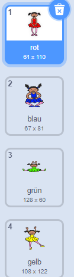
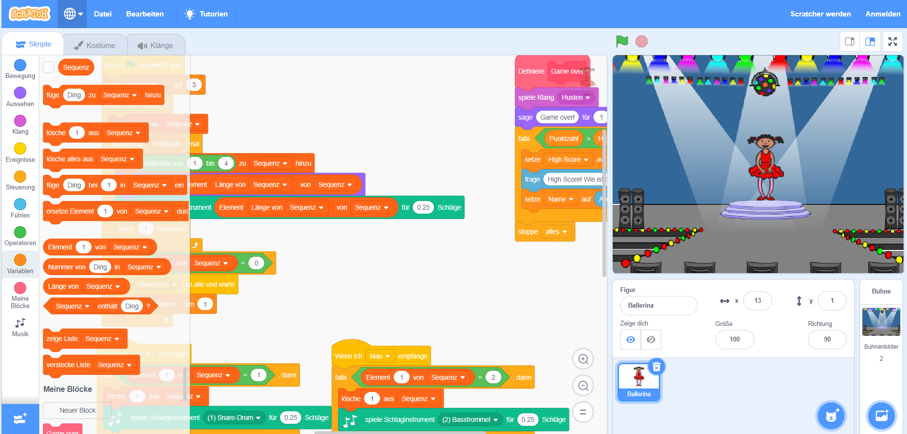

## Zufällige Farben

Lass uns zunächst einen Charakter erstellen, der eine zufällige Reihenfolge an unterscheidlichen Farben annehmen kann, die sich der Spieler merken muss.

+ Starte ein neues Scratch-Projekt und lösche die Katzenfigur, so dass Dein Projekt leer ist. Du findest das Scratch-Bearbeitungsprogramm online auf jumpto.cc/scratch-new.

+ Füge eine neue Figur, sowie den passeden Bühnenhintergrund hinzu. Dein Charakter muss keine Person sein, aber er muss verschiedene Farben annehmen können.


+ Du wirst im Spiel unterschiedliche Zahlen für die jeweiligen Farben benutzen:
    
    + 1 = rot
    + 2 = blau
    + 3 = grün
    + 4 = gelb
    
    Gib Deinem Charakter vier unterschiedlich farbige Kostüme in den obigen Farben. Stelle sicher, dass die Farben der Kostüme richtig geordnet sind.
    
    
    
    Du kannst mit der * -Farbe eine Form einfärben * Werkzeug, um Teile des Kostüms eine andere Farbe zu füllen.

Lässt uns eine zufällige Abfolge von Farben erstellen.

+ Erstelle eine neue Liste namens `Sequenz`{:class="blockdata"}. Wir verwenden diese Liste, um die Reihenfolge der Farben zu speichern, an die sich der Spieler erinnern soll. Nur diese Figur muss die Liste sehen, also kannst du auf **Nur für diese Figur** klicken.

[[[generic-scratch-make-list]]]

Du solltest nun sowohl Deine leere Liste in der oberen linken Ecke Deiner Bühne sehen, als auch eine Menge neuer Bausteine für die Verwendung der Liste.



+ Denkst du daran, dass wir jeder Farbe eine Nummer gegeben haben? Wir können eine zufällige Farbe wählen, indem wir eine Zufallszahl wählen und sie der Liste hinzufügen. Füge diesen Code hinzu:

```blocks
wenn das Flag angeklickt wurde, addiere (wähle Zufall (1) bis (4)) zu [Sequenz v]
```

+ Teste deinen Code, indem due auf die grüne Flagge klickst. Stelle sicher, dass jedes Mal, wenn du darauf klickst, eine zufällige Zahl zwischen 1 und 4 zur Liste hinzugefügt wird.

+ Kannst du diesen Code hinzufügen, um der Liste 5 Mal nacheinander eine zufällige Nummer zu vergeben?

```blocks
wiederhole (5) Ende
```

+ You might notice that your list is getting a bit full by now. Let's add a block to delete the whole list at the start before we generate any numbers.

```blocks
when flag clicked
delete (all v) of [sequence v]
repeat (5)
    add (pick random (1) to (4)) to [sequence v]
end
```

+ Finally, each time we choose a number, let's change the dancer's costume to the last item that was added to the list, which will be the number we just chose. Add these blocks to your code immediately after you add the random number to your list:

```blocks
switch costume to (item (last v) of [sequence v])
wait (1) secs
```