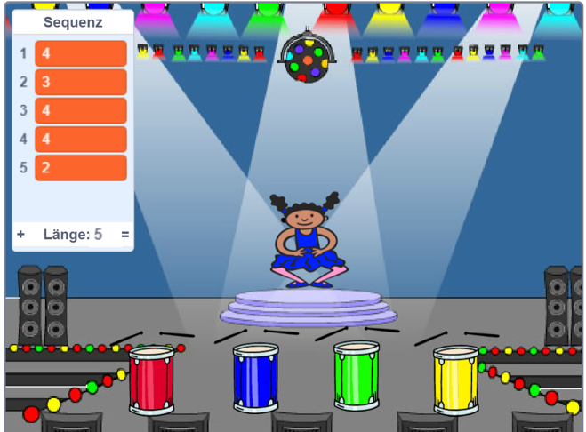

## Wiederhole die Reihenfolge

Jetzt musst Du vier Tasten hinzufügen, die der Spieler drücken muss, um die Farbsequenz zu wiederholen.

--- task ---

Füge deinem Projekt vier Figuren hinzu, die die Tasten darstellen werden.

+ Bearbeite die Kostüme der neuen Figuren, sodass es eine Figur in jeder der vier Farben gibt
+ Bringe die Figuren in der gleichen Reihenfolge auf die Bühne wie die Kostüme: rot, blau, grün, gelb



--- /task ---

--- task ---

Füge nun Code zur roten Figur hinzu, so dass sie, wenn sie geklickt wird, die Nachricht 'rot' `an alle sendet`{:class="block3events"}:


```blocks3
    when this sprite clicked
	broadcast (rot v)
```

--- /task ---

Ein `Sendung an alle`{:class="block3events"} ist wie eine Nachricht über einen Lautsprecher, die man zum Beispiel in Schulen oder Supermärkten hören kann. Alle Sprites hören die `Sendung an alle`{:class="block3events"}, aber nur die Figur, deren Aufgabe es ist, zu reagieren, wird etwas tun.

--- task ---

Füge einen ähnlichen Code zu den blauen, grünen und gelben Figuren hinzu, damit auch sie eine `Sendung an alle`{:class="block3events"} für ihre eigene Farbe senden.

--- /task ---

Erinnerst du dich, dass die `Sendung an alle`{:class="block3events"} wie eine Lautsprecherdurchsage funktioniert? Füge nun Code zu deiner Figur hinzu, damit sie auf die `Sendung an alle`{:class="block3events"} - Nachrichten reagiert.

--- task ---

Wenn deine Figur die Nachricht `rot`{:class="block3events"} empfängt, sollte der Code prüfen, ob die Nummer `1` am Anfang der `Sequenz`{:class="block3variables"} steht (was bedeutet, dass `rot`{:class="block3events"} die nächste Farbe in der Sequenz ist).

Wenn `1` am Beginn der Liste steht, kann die Nummer aus der Liste entfernt werden, da sie richtig erraten worden ist, weil der Spieler sich an die richtige Farbe erinnert hat. Ansonsten ist das Spiel vorbei und der Code muss `alles anhalten`{:class="block3control"} um das Spiel zu beenden.


```blocks3
when I receive [rot v]
if <(item (1 v) of [Sequenz v])=[1]> then
delete (1 v) of [Sequenz v]
else
say [Spiel vorbei!] for (1) seconds
stop [all v]
end
```

--- /task ---

--- task ---

Füge zu dem Code, den du gerade geschrieben hast, auch ein Trommelschlag hinzu, wenn die Figur die korrekte `Sendung an alle`{:class="block3events"} erhält.

--- hints ---


--- hint ---

Kannst du Zahlen nutzen, passend zu der jeder Farbe, um das Trommel-Geräusch zu spielen?

+ 1 = rot
+ 2 = blau
+ 3 = grün
+ 4 = gelb

--- /hint ---

--- hint ---

Füge über dem `lösche 1 aus Sequenz`{:class="block3variables"} - Block einen `spiele Schlaginstrument`{:class="block3sound"} - Block hinzu, um das erste Geräusch der `Sequenz`{:class="block3variables"} - Liste zu spielen.

--- /hint ---

--- hint ---

Hier ist der Code, den du hinzufügen musst:

```blocks3
when I receive [rot v]
if <(item (1 v) of [Sequenz v])=[1]> then
+ play drum (\(1\) Snare Drum v) for (0.25) beats
delete (1 v) of [Sequenz v]
else
say [Spiel vorbei!] for (1) seconds
stop [all v]
end
```

--- /hint ---

--- /hints ---

--- /task ---

--- task ---

Kopiere den Code, den du gerade genutzt hast, um deine Figur auf die Nachricht `rot`{:class="block3events"} reagieren zu lassen. Ändere den kopierten Code, sodass er die Nachricht `blau`{:class="block3events"}sendet.

--- /task ---

Wenn die Figur auf die Nachricht `blau`{:class="block3events"} reagiert, welcher Teil des Codes sollte dann gleich bleiben und welcher sich verändern? Erinnere dich daran, dass jede Farbe eine zugehörige Ziffer hat.

--- task ---

Ändere den Code der Figur so, dass die Figur jedes Mal korrekt auf die Nachricht `blau`{:class="block3events"} reagiert.

--- hints ---


--- hint ---

Behalte diese Blöcke, aber du musst sie irgendwie ändern:


```blocks3
<(item (1 v) of [Sequenz v]) = [1]>

when I receive [rot v]

play drum (\(1\) Snare Drum v) for (0.25) beats
```

--- /hint ---

--- hint ---

So sollte dein Code für die `blau`{:class="block3events"} - Nachrichten aussehen.


```blocks3
when I receive [blau v]
if <(item (1 v) of [Sequenz v])=[2]> then
	play drum (\(2\) Bass Drum v) for (0.25) beats
	delete (1 v) of [Sequenz v]
else
	say [Spiel vorbei!] for (1) seconds
	stop [all v]
end
```

--- /hint ---

--- /hints ---

--- /task ---

--- task ---

Kopiere den Code erneut (für die grünen und gelben Schaltflächen), und ändere die notwendigen Teile, damit die Figur korrekt auf die neuen `Sendung an alle`{:class="block3events"} reagiert.

--- /task ---

Denke daran, den Code, den du hinzugefügt hast, zu testen! Kannst du dir eine Folge von 5 Farben merken? Ist die Reihenfolge jedes Mal anders?

Wenn der Spieler die komplette `Sequenz`{:class="block3variables"} korrekt wiederholt, ist die Liste leer und der Spieler gewinnt. Du kannst auch ein paar blinkende Lichter anzeigen, sobald die `Liste`{:class="block3variables"} leer ist, da es bedeutet, dass die komplette Reihenfolge der Farben richtig erraten worden ist.

--- task ---

Fügen diesen Code an das Ende des `wenn Fahne angeklickt wird`{:class="block3events"}-Skripts deiner Figur hinzu:


```blocks3
    wait until < (length of [Sequenz v]) = [0]>
	broadcast (Gewonnen v) and wait
```

--- /task ---

--- task ---

Wechsel die Bühne und importiere den `Drum Maschine`-Ton oder andere Töne, die du magst.

[[[generic-scratch3-sound-from-library]]]

--- /task ---

--- task ---

Füge diesen Code hinzu, um einen Ton abzuspielen und das Bühnenbild zu wechseln, sobald der Spieler gewonnen hat.


```blocks3
    when I receive [Gewonnen v]
	start sound (drum machine v)
	repeat (50)
		change [color v] effect by (25)
		wait (0.1) seconds
	end
	clear graphic effects
```

--- /task ---