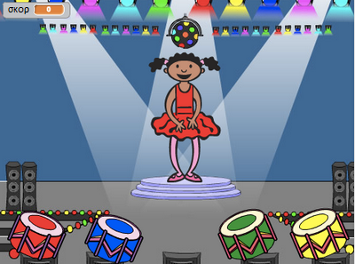
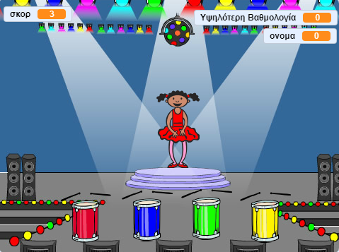

\--- χωρίς εκτύπωση \---

Αυτή είναι η έκδοση **Scratch 3** του έργου. Υπάρχει επίσης μια έκδοση [Scratch 2 του έργου](https://projects.raspberrypi.org/en/projects/memory-scratch2).

\--- / χωρίς εκτύπωση \---

## Εισαγωγή

Σε αυτό το έργο, θα δημιουργήσετε ένα παιχνίδι μνήμης στο οποίο θα πρέπει να απομνημονεύσετε και να επαναλάβετε μια τυχαία σειρά χρωμάτων!

### Τι θα κάνετε

\--- no-print \--- Κάντε κλικ στην πράσινη σημαία για να ξεκινήσετε. Παρακολουθήστε την ακολουθία των χρωμάτων που εμφανίζεται στο φόρεμα του χορευτή και ακούστε τα συνοδευτικά τυμπανικά κτυπήματα και στη συνέχεια επαναλάβετε τα χρώματα πίσω σε αυτήν. Εάν παίρνετε τη σειρά των χρωμάτων λανθασμένη, το παιχνίδι είναι πάνω!

  <iframe allowtransparency="true" width="485" height="402" src="//scratch.mit.edu/projects/embed/284452634/?autostart=false" frameborder="0" allowfullscreen scrolling="no" mark="crwd-mark"></iframe> 

\--- / χωρίς εκτύπωση \---

\--- μόνο για εκτύπωση \---  \--- / μόνο για εκτύπωση \---

## \--- κατάρρευση \---

## τίτλος: Τι θα μάθετε

+ Πώς να προσθέσετε ήχο στο έργο Scratch
+ Πώς να δημιουργήσετε και να χρησιμοποιήσετε λίστες για την αποθήκευση δεδομένων
+ Πώς να δημιουργήσετε και να χρησιμοποιήσετε προσαρμοσμένα μπλοκ για την επανάληψη κώδικα

\--- /κατάρρευση \---

## \--- κατάρρευση \---

## τίτλος: Τι θα χρειαστείτε

### Σκεύη, εξαρτήματα

+ Ένας υπολογιστής που μπορεί να τρέξει το Scratch 3

### Λογισμικό

Scratch 3 (είτε [απευθείας σύνδεση](https://rpf.io/scratchon){: target = "_ κενό"} ή [εκτός σύνδεσης](https://rpf.io/scratchoff){: target = "_ κενό")) \--- /

## \--- κατάρρευση \---

## τίτλος: Πρόσθετες πληροφορίες για εκπαιδευτικούς

\--- χωρίς εκτύπωση \---

Αν χρειαστεί να εκτυπώσετε αυτό το έργο, χρησιμοποιήστε την έκδοση [φιλική προς τον εκτυπωτή](https://projects.raspberrypi.org/en/projects/memory/print){: target = "_ blank"}.

\--- / χωρίς εκτύπωση \---

Μπορείτε να [κατεβάσετε το ολοκληρωμένο έργο εδώ](http://rpf.io/p/en/memory-get).

\--- /κατάρρευση \---