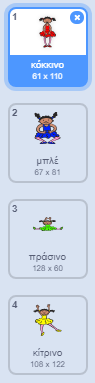
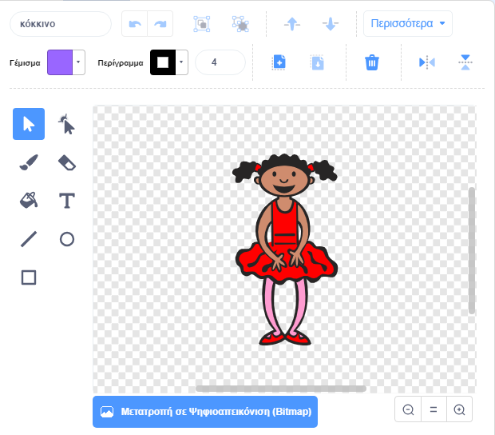
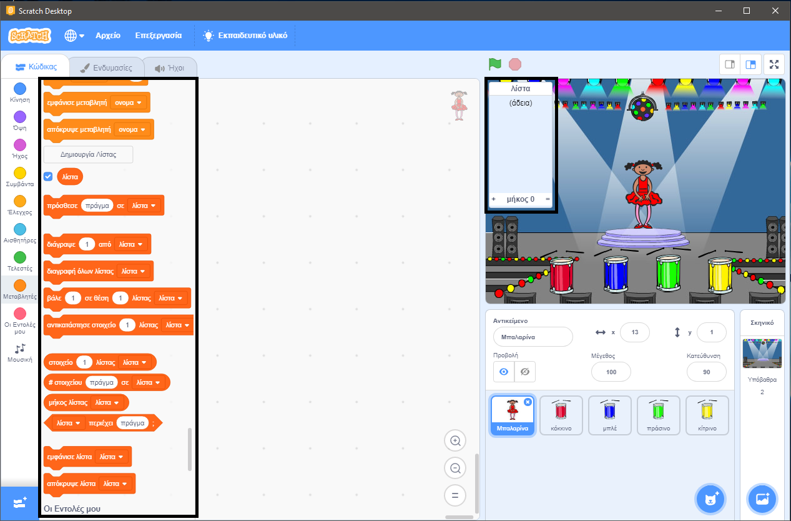

## Δημιουργήστε μια σειρά χρωμάτων

Αρχικά δημιουργήστε ένα χαρακτήρα που μπορεί να εμφανίσει μια τυχαία ακολουθία χρωμάτων.

\--- task \---

Δημιούργησε ένα νέο έργο Scratch.

**Online:** άνοιξε ένα νέο έργο Scratch στη διεύθυνση [rpf.io/scratch-new](https://rpf.io/scratch-new){:target="_blank"}.

**Eκτός σύνδεσης**: ανοίξτε ένα νέο project στο Scratch.

Αν χρειαστεί να κατεβάσεις και να εγκαταστήσεις τον offline editor για το Scratch, μπορείς να το βρεις στο [rpf.io/scratchoff](https://rpf.io/scratchoff){:target="_blank"}.

\--- /task \---

\--- task \---

Επιλέξτε ένα χαρακτήρα και ένα σκηνικό. Θα μπορούσατε να χρησιμοποιήσετε τη μπαλαρίνα, αλλά ο χαρακτήρας σας δεν χρειάζεται να είναι ένα πρόσωπο, χρειάζεται μόνο να είναι σε θέση να παρουσιάσει διαφορετικά χρώματα.


\--- /task \---

+ Το παιχνίδι σας πρέπει να χρησιμοποιεί διαφορετικό αριθμό για να αναπαριστά κάθε χρώμα:
    
    + 1 = κόκκινο
    + 2 = μπλε
    + 3 = πράσινο
    + 4 = κίτρινο

\--- task \---

Δώστε στον χαρακτήρα σας τέσσερα κοστούμια που έχουν διαφορετικά χρώματα, ένα κοστούμι για κάθε ένα από τα τέσσερα χρώματα που εμφανίζονται παραπάνω. Βεβαιωθείτε ότι τα έγχρωμα κοστούμια σας είναι στην ίδια σειρά με την παραπάνω λίστα.



\--- /task \---

Εάν θέλετε, μπορείτε να χρησιμοποιήσετε το εργαλείο **χρωμάτισε ένα σχήμα** για να γεμίσετε τα μέρη του κοστουμιού με διαφορετικό χρώμα.



Στη συνέχεια, προσθέστε μια λίστα για την αποθήκευση της τυχαίας σειράς χρωμάτων που πρέπει να θυμάται η συσκευή αναπαραγωγής.

\--- task \---

Δημιουργήστε μια λίστα που ονομάζεται `λίστα`{: class = "block3variables"}. Μόνο ο χαρακτήρας sprite πρέπει να δει αυτή τη λίστα, οπότε επιλέξετε **Μόνο για αυτό το αντικείμενο** όταν δημιουργείτε τη λίστα.

[[[generic-scratch3-make-list]]]

\--- / task \---

Θα δείτε πολλά νέα μπλοκ κώδικα για τη χρήση λιστών. Η κενή λίστα πρέπει να είναι ορατή στην επάνω αριστερή γωνία της σκηνής.



Κάθε χρώμα έχει διαφορετικό αριθμό, ώστε να μπορείτε να επιλέξετε τυχαίο χρώμα επιλέγοντας τυχαία έναν αριθμό και προσθέτοντάς τον στη λίστα.

\--- task \---

Προσθέστε αυτόν τον κώδικα στον χαρακτήρα για να επιλέξετε έναν τυχαίο αριθμό και να τον προσθέσετε στην `λίστα`{: class = "block3variables"}:


```blocks3
Όταν στην πράσινη σημαία γίνει κλικ
πρόσθεσε (επίλεξε τυχαίο (1) εώς (4)) στη λίστα [sequence v]
```

\--- /task \---

\--- task \---

Δοκιμάστε τον κώδικά σας. Βεβαιωθείτε ότι κάθε φορά που κάνετε κλικ στη σημαία, ένας τυχαίος αριθμός μεταξύ 1 και 4 θα προστεθεί στη λίστα.

\--- /task \---

\--- task \---

Μπορείτε να προσθέσετε κώδικα στο πρόγραμμά σας για να δημιουργήσετε πέντε τυχαίους αριθμούς ταυτόχρονα;

\--- hints \---

\--- hint \---

Add a `delete all of sequence`{:class="block3variables"} to first delete all the items on the list, and then add a `repeat`{:class="block3control"} block that adds five random numbers to the list.

\--- /hint \---

\--- hint \---

Έτσι πρέπει να μοιάζει ο κώδικας:


```blocks3
Όταν στην πράσινη σημαία γίνει κλικ
διάγραψε (all v) από λίστα [sequence v]
επανάλαβε (5) 
  πρόσθεσε (επίλεξε τυχαίο (1) εώς (4)) στη λίστα [sequence v]
end
```

\--- /hint \---

\--- /hints \---

\--- /task \---

\--- task \---

Κάθε φορά που ένας αριθμός προστίθεται στη λίστα, ο χαρακτήρας θα πρέπει να αλλάξει το κοστούμι του, ώστε το χρώμα του κοστουμιού να ταιριάζει με τον αριθμό. Βάλτε αυτά τα τετράγωνα στον κώδικα σας αμέσως κάτω από τον οποίο ένας τυχαίος αριθμός προστίθεται στην `λίστα`{: class = "block3variables"}:


```blocks3
άλλαξε ενδυμασία σε (στοιχείο(μήκος λίστας[λίστα]) λίστας [λίστα])
περίμενε (1) δευτερόλεπτα
```

\--- /task \---