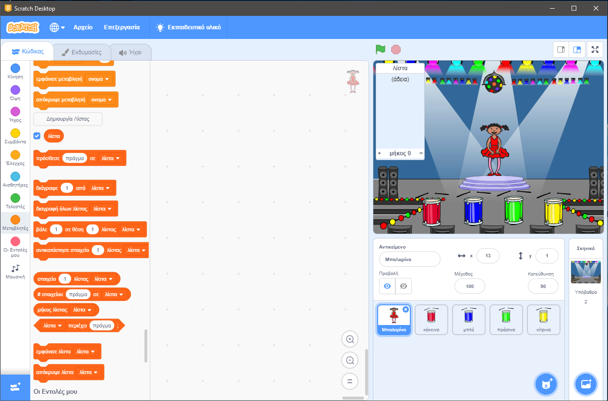

## Δημιουργήστε μια ακολουθία χρωμάτων

Αρχικά, ας δημιουργήσουμε ένα χαρακτήρα που θα εμφανίσει μια τυχαία ακολουθία χρωμάτων για απομνημόνευση.

+ Ξεκινήστε ένα νέο έργο Scratch και διαγράψτε το sprite cat έτσι ώστε το έργο σας να είναι άδειο. Μπορείτε να βρείτε τον ηλεκτρονικό επεξεργαστή Scratch [εδώ](http://jumpto.cc/scratch-new).

+ Επιλέξτε ένα sprite χαρακτήρα και ένα σκηνικό. Ο χαρακτήρας σας δεν πρέπει να είναι άτομο, αλλά πρέπει να είναι σε θέση να παρουσιάζει διαφορετικά χρώματα.


+ Στο παιχνίδι σας, θα χρησιμοποιήσετε διαφορετικό αριθμό για να αναπαριστάτε κάθε χρώμα:
    
    + 1 = κόκκινο
    + 2 = μπλε
    + 3 = πράσινο
    + 4 = κίτρινο
    
    Δώστε στον χαρακτήρα σας τέσσερα διαφορετικά έγχρωμα κοστούμια, ένα για κάθε ένα από τα τέσσερα παραπάνω χρώματα. Βεβαιωθείτε ότι τα έγχρωμα κοστούμια σας είναι στην ίδια σειρά με την παραπάνω λίστα.
    
    
    
    Μπορείτε να χρησιμοποιήσετε το εργαλείο *χρώματος ένα σχήμα* για να γεμίσετε τα μέρη του κοστουμιού με διαφορετικό χρώμα.

Ας δημιουργήσουμε μια τυχαία σειρά χρωμάτων.

+ Δημιουργήστε μια λίστα που ονομάζεται `ακολουθία`{: class = "blockdata"}. Θα χρησιμοποιήσουμε αυτήν τη λίστα για να αποθηκεύσετε την ακολουθία χρωμάτων που πρέπει να θυμάται η συσκευή αναπαραγωγής. Μόνο ο χαρακτήρας sprite πρέπει να δει τη λίστα, έτσι μπορείτε να επιλέξετε **Για αυτό το sprite μόνο**.

[[[generic-scratch-make-list]]]

Θα δείτε τώρα την κενή σας λίστα στα επάνω αριστερά της σκηνής σας, καθώς και πολλά νέα μπλοκ για τη χρήση λιστών.



+ Θυμηθείτε ότι δώσαμε σε κάθε χρώμα έναν αριθμό; Μπορούμε να επιλέξουμε ένα τυχαίο χρώμα επιλέγοντας έναν τυχαίο αριθμό και προσθέτοντάς τον στη λίστα. Προσθέστε αυτόν τον κωδικό:

```blocks
όταν η σημαία κάνει κλικ (προσθέστε τυχαία (1) έως (4)) σε [ακολουθία v]
```

+ Δοκιμάστε τον κώδικα σας κάνοντας κλικ στην πράσινη σημαία. Ελέγξτε ότι, κάθε φορά που κάνετε κλικ σε αυτό, ένας τυχαίος αριθμός μεταξύ 1 και 4 προστίθεται στη λίστα.

+ Μπορείτε να προσθέσετε αυτό το μπλοκ στο πρόγραμμά σας για να δημιουργήσετε πέντε τυχαία χρώματα ταυτόχρονα;

```blocks
επαναλάβετε (5) τέλος
```

+ Ίσως παρατηρήσετε ότι η λίστα σας είναι λίγο γεμάτη μέχρι τώρα. Ας προσθέσουμε ένα μπλοκ για να διαγράψουμε ολόκληρη τη λίστα στην αρχή πριν δημιουργήσουμε αριθμούς.

```blocks
(5) Προσθήκη (επιλέξτε τυχαία (1) έως (4)) έως [ακολουθία v] τέλος
```

+ Τέλος, κάθε φορά που επιλέγουμε έναν αριθμό, ας αλλάξουμε το κοστούμι του χορευτή στο τελευταίο στοιχείο που προστέθηκε στη λίστα, που θα είναι ο αριθμός που μόλις επιλέξαμε. Προσθέστε αυτά τα μπλοκ στον κωδικό σας αμέσως μόλις προσθέσετε τον τυχαίο αριθμό στη λίστα σας:

```blocks
μετακινήστε το κοστούμι σε (στοιχείο (τελευταίο v) της [ακολουθία v]) περιμένετε (1) δευτ
```