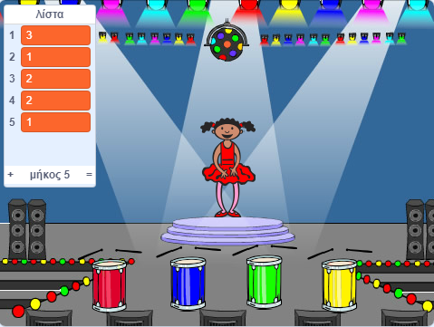

## Επαναλάβετε την ακολουθία

Τώρα θα προσθέσετε τέσσερα κουμπιά που πρέπει να πατήσετε για να επαναλάβετε την ακολουθία χρωμάτων.

\--- task \--- Προσθέστε τέσσερα νέα sprites στο έργο σας για να αναπαριστάτε τα τέσσερα κουμπιά.

+ Επεξεργαστείτε τα κοστούμια των νέων Sprites έτσι ώστε να υπάρχει ένα sprite σε κάθε ένα από τα τέσσερα χρώματα
+ Βάλτε τα σκίτσα στην ίδια σειρά με τα κοστούμια: κόκκινο, μπλε, πράσινο, κίτρινο

 \--- / task \---

\--- έργο \--- Προσθέστε τον κωδικό στο κόκκινο sprite, έτσι ώστε, όταν το sprite γίνεται κλικ, το `μεταδόσεις`{: class = «block3events»} ένα μήνυμα «κόκκινο» στο ξωτικό χαρακτήρα:


```blocks3
    όταν αυτό το sprite χτύπησε
    μετάδοση (κόκκινο v)
```

\--- / task \---

Ένας `εκπομπή`{: class = «block3events»} είναι σαν ένα μήνυμα ανακοινώθηκε πάνω από ένα μεγάφωνο, το οποίο θα μπορεί για παράδειγμα να ακούσετε σε σχολεία ή σούπερ μάρκετ. Όλοι οι sprites μπορούν να ακούσουν το `μεταδίδουν`{: class = "block3events"}, αλλά μόνο ο σπάρτης που η δουλειά του είναι να ανταποκριθεί θα κάνει κάτι.

\--- εργασία \---

Προσθέστε παρόμοιο κώδικα με τα μπλε, πράσινο, κίτρινο και ξωτικά για να γίνουν `εκπομπή`{: class = «block3events»} μηνύματα σχετικά με το δικό τους χρώμα.

\--- / task \---

Θυμάσαι ότι η μετάδοση `{`: class = "block3events"} είναι σαν ένα μήνυμα μεγαφώνου; Θα προσθέσω κώδικα για να κάνει τη δουλειά του sprite χαρακτήρα για την αντιμετώπιση της `εκπομπή`{: class = «block3events»} μηνύματα.

\--- εργασία \---

Όταν sprite χαρακτήρας σας λαμβάνει το μήνυμα `κόκκινη`{: class = «block3events»}, ο κώδικας οφείλει να ελέγξει εάν ο αριθμός `1` είναι κατά την έναρξη της `αλληλουχίας`{: class = «block3variables»} λίστα (που σημαίνει ότι το `κόκκινο`{: class = "block3events"} είναι το επόμενο χρώμα στην ακολουθία).

Εάν το `1` βρίσκεται στην αρχή της λίστας, ο κώδικας πρέπει να αφαιρέσει τον αριθμό από τη λίστα, επειδή ο παίκτης θυμόταν το σωστό χρώμα. Διαφορετικά, το παιχνίδι τελειώνει και ο κωδικός θα πρέπει να `στάση όλων`{: class = «block3control»} για να τελειώσει το παιχνίδι.


```blocks3
όταν λαμβάνω [κόκκινο v]
αν <(στοιχείο (1 v) [ακολουθίας v]) =[1]> στη συνέχεια
διαγράψετε (1 v) [ακολουθία v]
άλλον
πούμε [Game over!] για (1) δευτερόλεπτα
στάση [όλα]
τέλος
```

\--- / task \---

\--- έργο \--- Προσθέστε τον κώδικα που μόλις έγραψε, έτσι ώστε ένα τύμπανο κτύπησε παίζει επίσης όταν το ξωτικό χαρακτήρα λαμβάνει τις σωστές `εκπομπής`{: class = «block3events»}.

\--- Συμβουλές \--- \--- υπαινιγμός \--- Μπορείτε να χρησιμοποιήσετε τους αριθμούς που αντιστοιχούν σε κάθε χρώμα για να παίξετε το σωστό beat beat;

+ 1 = κόκκινο
+ 2 = μπλε
+ 3 = πράσινο
+ 4 = κίτρινο \--- / υπαινιγμός \--- \--- υπαινιγμός \--- Πάνω από το `διαγράψτε 1 από την αλληλουχία`{block: block3variables}}, προσθέστε το `τύμπανο αναπαραγωγής`{: class = " block3sound "} για να αναπαράγετε τον πρώτο ήχο στη λίστα `σειράς`{: class =" block3variables "}.

\--- / hint \--- \--- υπαινιγμός \--- Εδώ είναι ο κωδικός που θα χρειαστεί να προσθέσετε:

```blocks3
όταν λάβω [κόκκινο v]
αν <(στοιχείο (1 v) του [αλληλουχίας v]) =[1]> στη συνέχεια

+ παίξει τύμπανο (\ (1 \) Ταμπούρο v) για (0.25) κτυπά
διαγραφή (1 v ) της [ακολουθία v]
άλλο
λέει [Παιχνίδι πάνω!] για (1) δευτερόλεπτα
σταματήσει [όλα]
τέλος

```

\--- / υπαινιγμός \--- \--- / υπαινιγμοί \--- \--- / task \---

\--- task \--- Διπλασιάστε τον κώδικα που χρησιμοποιήσατε για να κάνετε το sprite χαρακτήρα σας να ανταποκριθεί στο μήνυμα `red`{: class = "block3events"}. Αλλάξτε τον διπλότυπο κώδικα έτσι ώστε να στέλνει το μήνυμα `μπλε`{: class = "block3events"}. \--- / task \---

Όταν ο σπρίτ απαντήσει στο μήνυμα `μπλε`{: class = "block3events"}, ποιο κομμάτι κώδικα θα πρέπει να παραμείνει το ίδιο και ποιο bit θα πρέπει να αλλάξει; Θυμηθείτε ότι κάθε χρώμα έχει έναν αντίστοιχο αριθμό.

\--- task \--- Αλλαγή του κώδικα του sprite χαρακτήρα, ώστε ο χαρακτήρας να ανταποκρίνεται σωστά στο μήνυμα `blue`{: class = "block3events"}.

\--- συμβουλές \--- \--- υπαινιγμός \---

Κρατήστε αυτά τα μπλοκ, αλλά πρέπει να τα αλλάξετε με κάποιο τρόπο:


```blocks3
<(στοιχείο (1 v) της ακολουθίας v) = [1]>

όταν λαμβάνω [κόκκινο v]

τύμπανο παιχνιδιού (\ (1 \) Snare Drum v)
```

\--- / hint \--- \--- υπαινιγμός \--- Εδώ είναι ο τρόπος με τον οποίο ο κώδικας σας θα πρέπει να αναζητήσει την εκπομπή `μπλε`{: class = "block3events"}.


```blocks3
όταν λάβω [blue v]
αν <(στοιχείο (1 v) του [αλληλουχίας v]) =[2]> , στη συνέχεια,
    τύμπανο ενέργεια (\ (2 \) Bass Drum v) για (0.25) κτυπά
    διαγραφή (1 v) του [ακολουθία v]
άλλο
    λέει [Παιχνίδι πέρα!] για (1) δευτερόλεπτα
    σταματήσει [όλα]
τέλος
```

\--- / υπαινιγμός \--- \--- / υπαινιγμοί \--- \--- / task \---

\--- καθήκον \--- Διπλασιασμός ο κωδικός πάλι δύο φορές (για τα πράσινα και κίτρινα κουμπιά), και να αλλάξετε τα απαραίτητα εξαρτήματα, έτσι ώστε ο χαρακτήρας ανταποκρίνεται σωστά στις νέες `μεταδόσεις`{: class = «block3events»}. \--- / task \---

Θυμηθείτε να δοκιμάσετε τον κώδικα! Μπορείτε να απομνημονεύσετε μια σειρά πέντε χρωμάτων; Είναι η ακολουθία διαφορετική κάθε φορά;

Όταν ο παίκτης επαναλαμβάνει σωστά ολόκληρη την ακολουθία των χρωμάτων, η `αλληλουχία`{: class = «block3variables»} λίστα emtpy και ο παίκτης κερδίζει. Εάν θέλετε, μπορείτε επίσης να εμφανίσετε φώτα που αναβοσβήνουν ως ανταμοιβή αφού η λίστα `ακολουθίας`{: class = "block3variables"} είναι κενή.

\--- task \--- Προσθέστε αυτόν τον κώδικα στο τέλος του χαρακτήρος `όταν πατήσετε σημαία`{: class = "block3events"} script:


```blocks3
    περιμένετε έως < (μήκος [ακολουθία v]) = [0]>
    μεταδίδεται (κερδίζεται v) και περιμένετε
```

\--- / task \---

\--- task \--- Μεταβείτε στο Stage και εισάγετε το `drum machine` ή άλλο ήχο που σας αρέσει.

[[[generic-scratch3-sound-from-library]]]

\--- / task \---

\--- task \--- Προσθέστε αυτόν τον κωδικό για να παίξετε έναν ήχο και να αλλάξετε το χρώμα της σκηνής όταν κερδίσει ο παίκτης.


```blocks3
    όταν λάβω [κερδίσει v]
    έναρξης ήχου (μηχανή τυμπάνων v)
    επανάληψης (50)
        αλλαγή [χρώματος v] αποτελέσματος από (25)
        αναμονής (0.1) δευτερόλεπτα
    άκρο
    σαφές εφέ γραφικών
```

\--- / task \---