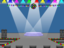

## Επαναλάβετε την ακολουθία

Τώρα θα προσθέσετε τέσσερα κουμπιά που πρέπει να πατήσετε για να επαναλάβετε την ακολουθία χρωμάτων.

\--- task \---

Add four new sprites to your project to represent the four buttons.

+ Επεξεργαστείτε τα κοστούμια των νέων Sprites έτσι ώστε να υπάρχει ένα sprite σε κάθε ένα από τα τέσσερα χρώματα
+ Βάλτε τα σκίτσα στην ίδια σειρά με τα κοστούμια: κόκκινο, μπλε, πράσινο, κίτρινο


\--- /task \---

\--- task \---

Add code to the red sprite so that, when the sprite is clicked, it `broadcasts`{:class="block3events"} a 'red' message to the character sprite:


```blocks3
    όταν γίνει κλικ σε αυτό το αντικείμενο 
    μετάδωσε (κόκκινο)
```

\--- /task \---

A `broadcast`{:class="block3events"} is like a message announced over a loudspeaker, which you can for example hear in schools or supermarkets. All of the sprites can hear the `broadcast`{:class="block3events"}, but only the sprite whose job it is to respond will do something.

\--- task \---

Add similar code to the blue, green, and yellow sprites to make them `broadcast`{:class="block3events"} messages about their own colour.

\--- /task \---

Do you remember that the `broadcast`{:class="block3events"} is like a loudspeaker message? You will add code to make it the character sprite's job to respond to the `broadcast`{:class="block3events"} messages.

\--- task \---

When your character sprite receives the message `red`{:class="block3events"}, the code should check whether the number `1` is at the start of the `sequence`{:class="block3variables"} list (which means that `red`{:class="block3events"} is the next colour in the sequence).

If `1` is at the start of the list, the code should remove the number from the list, because the player remembered the correct colour. Otherwise it's game over, and the code needs to `stop all`{:class="block3control"} to end the game.


```blocks3
όταν λάβω [κόκκινο v]
εάν <(στοιχείο (1 v) λίστας [sequence v]) = [1]> τότε 
  διάγραψε (1 v) από λίστα [sequence v]
αλλιώς 
  πες [Τέλος παιχνιδιού!] για (1) δευτερόλεπτα
  σταμάτησε [all v]
end
```

\--- /task \---

\--- task \---

Add to the code you just wrote so that a drum beat also plays when the character sprite receives the correct `broadcast`{:class="block3events"}.

\--- hints \---

\--- hint \---

Can you use the numbers that correspond to each colour to play the correct drum beat?

+ 1 = κόκκινο
+ 2 = μπλε
+ 3 = πράσινο
+ 4 = yellow

\--- /hint \---

\--- hint \---

Above the `delete 1 of sequence`{:class="block3variables"} block, add the `play drum`{:class="block3sound"} block to play the first sound in the `sequence`{:class="block3variables"} list.

\--- /hint \---

\--- hint \---

Here is the code you will need to add:

```blocks3
όταν λάβω [κόκκινο v]
εάν <(στοιχείο (1 v) λίστας [sequence v]) = [1]> τότε 
+  παίξε τύμπανο ((1) Snare Drum v) για (0.25) χτύπους
  διάγραψε (1 v) από λίστα [sequence v]
αλλιώς 
  πες [Τέλος παιχνιδιού!] για (1) δευτερόλεπτα
  σταμάτησε [all v]
end
```

\--- /hint \---

\--- /hints \---

\--- /task \---

\--- task \---

Duplicate the code you used to make your character sprite respond to the message `red`{:class="block3events"}. Change the duplicated code so that it sends the message `blue`{:class="block3events"}.

\--- /task \---

When the sprite responds to the message `blue`{:class="block3events"}, which bit of code should stay the same, and which bit should change? Remember that each colour has a corresponding number.

\--- task \---

Change the character sprite's code so that the character responds correctly to the `blue`{:class="block3events"} message.

\--- hints \---

\--- hint \---

Keep these blocks, but you need to change them in some way:


```blocks3
<(στοιχείο (1 v) της ακολουθίας v) = [1]>

όταν λαμβάνω [κόκκινο v]

τύμπανο παιχνιδιού (\ (1 \) Snare Drum v)
```

\--- /hint \---

\--- hint \---

Here is how your code should look for the `blue`{:class="block3events"} broadcast.


```blocks3
όταν λάβω [μπλε v]
εάν <(στοιχείο (1 v) λίστας [sequence v]) = [2]> τότε 
  παίξε τύμπανο ((2) Bass Drum v) για (0.25) χτύπους
  διάγραψε (1 v) από λίστα [sequence v]
αλλιώς 
  πες [Τέλος παιχνιδιού!] για (1) δευτερόλεπτα
  σταμάτησε [all v]
end
```

\--- /hint \---

\--- /hints \---

\--- /task \---

\--- task \---

Duplicate the code again twice (for the green and yellow buttons), and change the necessary parts so that the character responds correctly to the new `broadcasts`{:class="block3events"}.

\--- /task \---

Remember to test the code! Can you memorise a sequence of five colours? Is the sequence different each time?

When the player repeats the whole colour sequence correctly, the `sequence`{:class="block3variables"} list emtpy and the player wins. If you want, you can also display some flashing lights as a reward once the `sequence`{:class="block3variables"} list is empty.

\--- task \---

Add this code to the end of your character's `when flag clicked`{:class="block3events"} script:


```blocks3
    περίμενε ώσπου <(μήκος λίστας [sequence v]) = [0]>
μετάδωσε (νίκη v) και περίμενε
```

\--- /task \---

\--- task \---

Switch to the Stage, and import the `drum machine` sound or another sound you like.

[[[generic-scratch3-sound-from-library]]]

\--- /task \---

\--- task \---

Add this code to play a sound and make the backdrop change colour when the player wins.



```blocks3
    όταν λάβω [νίκη v]
παίξε τον ήχο (drum machine v)
επανάλαβε (50) 
  άλλαξε εφέ [color v] κατά (25)
  περίμενε (0.1) δευτερόλεπτα
end
επανάφερε εφέ γραφικών
```

\--- /task \---