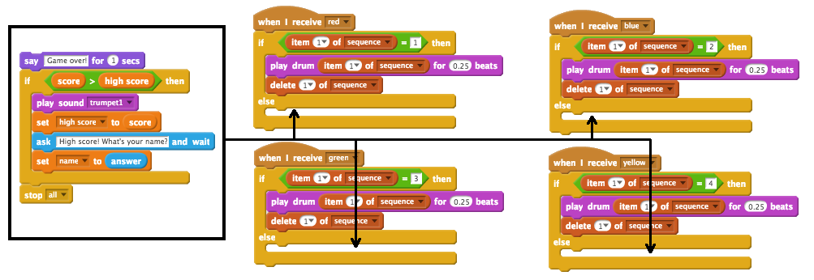

## Υψηλή βαθμολογία

Ας σώσει το υψηλό σκορ, ώστε να μπορείτε να παίξετε εναντίον των φίλων σας.

+ Προσθέστε δύο νέες μεταβλητές που ονομάζονται `υψηλό σκορ`{: class = "blockdata"} και `όνομα`{: class = "blockdata"} στο έργο σας.

Όταν τελειώσει το παιχνίδι επειδή ο παίκτης πήρε λάθος την ακολουθία, πρέπει να ελέγξετε αν η βαθμολογία του είναι υψηλότερη από την τρέχουσα υψηλή βαθμολογία. Αν είναι, πρέπει να αποθηκεύσετε το σκορ ως το υψηλό σκορ και να αποθηκεύσετε το όνομα του παίκτη.

+ Προσθέστε τον κώδικα στον sprite χαρακτήρα σας για να αποθηκεύσετε το υψηλό σκορ. Ζητήστε επίσης από τον παίκτη το όνομα του και να το καταγράψετε στη μεταβλητή `όνομα`{: class = "blockdata"}.

[[[generic-scratch-high-score]]]

\--- υπαινιγμοί \--- \--- υπαινιγμός \--- Ο νέος σας κωδικός πρέπει να ακολουθήσει αυτή τη λογική: Μετά το `Παιχνίδι πάνω από` μήνυμα `Εάν` το `σκορ` είναι `μεγαλύτερο από` το υψηλό σκορ `` `Σετ` το `υψηλό σκορ` έως το `` `Ρωτήστε` το όνομα του παίκτη `Ρύθμιση` το `όνομα` με `απάντηση` \--- / hint \--- \--- hint \--- Θα χρειαστείτε τα παρακάτω μπλοκ:


\--- / υπαινιγμός \--- \--- υπαινιγμός \--- Ακολουθεί ο τρόπος με τον οποίο ο κωδικός σας για το πότε πιέζεται το κόκκινο κουμπί θα πρέπει να φαίνεται:

```blocks
    όταν λαμβάνω [κόκκινο v], αν <(στοιχείο (1 v) [ακολουθίας v]) =[1]> , στη συνέχεια, διαγράψτε (1 v) [ακολουθίας v] άλλο να πω [Game over!] για (1) δευτερόλεπτα, αν < ( σκορ) > (υψηλό σκορ) > τότε ορίστε [υψηλή βαθμολογία v] σε (βαθμολογία) ρωτήστε [Υψηλή βαθμολογία! Ποιο είναι το όνομά σας;] και περιμένετε να ορίσετε [όνομα v] ως (απάντηση) τερματισμού λήξης [all v] end
```

\--- / υπαινιγμός \--- \--- / υπαινιγμοί \---

+ Θα χρειαστεί να προσθέσετε αυτόν τον νέο κώδικα στο χαρακτήρα sprite και για τα άλλα τρία χρώματα! Παρατηρήσατε ότι ο κωδικός "Παιχνίδι πάνω" για κάθε ένα από τα τέσσερα χρώματα είναι ακριβώς ο ίδιος;



Αν χρειάστηκε να αλλάξετε κάποιο από αυτό τον κώδικα, για παράδειγμα, για να προσθέσετε ήχο ή να αλλάξετε το μήνυμα "Παιχνίδι πέρα", θα πρέπει να το αλλάξετε τέσσερις φορές. Αυτό θα μπορούσε να πάρει ενοχλητικό, και σπαταλούν πολύ χρόνο.

Αντ 'αυτού, μπορείτε να ορίσετε τα δικά σας μπλοκ και να τα επαναχρησιμοποιήσετε στο έργο σας. Για να το κάνετε αυτό, κάντε κλικ στο κουμπί `Περισσότερα μπλοκ`{: class = "blockmoreblocks"} και, στη συνέχεια, κάντε **μπλοκ**. Καλέστε αυτό το νέο μπλοκ 'Παιχνίδι πάνω'.


+ Προσθέστε τον κώδικα από το μπλοκ `{`} {block: blockcontrol}} που είναι συνδεδεμένο στο κόκκινο κουμπί με το μπλοκ που δημιουργήσατε:


+ Έχετε κάνει τώρα μια νέα *λειτουργία* ονομάζεται `Game over`{: class = «blockmoreblocks»}, το οποίο μπορείτε να χρησιμοποιήσετε οπουδήποτε θέλετε. Σύρετε το νέο σας παιχνίδι `πάνω από`{: class = "blockmoreblocks"} μπλοκάρει στα τέσσερα σενάρια για τα κουμπιά.


+ Τώρα προσθέστε έναν ήχο όταν πατήσετε το λάθος κουμπί. Χρειάζεται μόνο να προσθέσετε αυτόν τον κώδικα μία φορά στο μπλοκ `παιχνιδιών πάνω από`μπλοκ {block = blockmoreblocks}} που κάνατε και όχι τέσσερις ξεχωριστές φορές!

