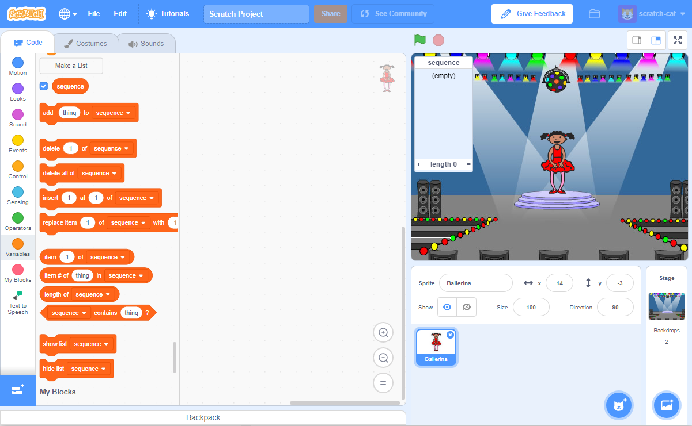

## Random colours

First, let's create a character that can change to a random sequence of colours for the player to memorise.

+ Start a new Scratch project, and delete the cat sprite so that your project is empty. You can find the online Scratch editor at <a href="http://jumpto.cc/scratch-new" target="_blank">jumpto.cc/scratch-new</a>.

+ Choose a character and a backdrop. Your character doesn't have to be a person, but it needs to be able to show different colours.

	

+ In your game, you'll use a different number to represent each colour:

	+ 1 = red;
	+ 2 = blue;
	+ 3 = green;
	+ 4 = yellow.

	Give your character 4 different colour costumes, one for each of the 4 colours above. Make sure that your coloured costumes are in the right order.

	

+ To create a random sequence, you need to create a __list__. A list is just a variable that stores lots of data _in order_. Create a new list called `sequence`{:class="blockdata"}. As only your character needs to see the list, we can also click 'For this sprite only'.

	

	You should now see your empty list in the top-left of your stage, as well as lots of new blocks for using lists.

	

+ Add this code to your character, to add a random number to your list (and show the correct costume) 5 times:

	```blocks
		when flag clicked
		delete (all v) of [sequence v]
		repeat (5)
			add (pick random (1) to (4)) to [sequence v]
			switch costume to (item (last v) of [sequence v]
			wait (1) secs
		end
	```

	Notice that you have also emptied the list to begin with.
