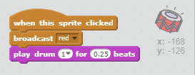
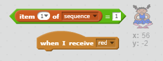

## Repeating the sequence

Let's add four buttons for the player to press to repeat the sequence they've remembered.

+ Add four new sprites to your project to represent the four buttons. Edit the costumes so that there is one sprite in each of the four colours.


+ When the red drum is clicked, you'll need to broadcast a message to your character, letting them know that the red button has been clicked. Add this code to your red drum:

```blocks
	when this sprite clicked
	broadcast [red v]
```

+ Add similar code to the blue, green and yellow drums to make them broadcast messages in their own colour

+ Add some code to each sprite so that a different drum beat also plays when each sprite is clicked.

--- hints ---
--- hint ---
Can you use the numbers that correspond to each colour to play the correct drum beat?

	+ 1 = red
	+ 2 = blue
	+ 3 = green
	+ 4 = yellow
--- /hint ---
--- hint ---
You will need to add the `play drum`{:class="blocksound"} block to happen when the sprite is clicked.
--- /hint ---
--- hint ---
Here is the code you will need:


--- /hint ---
--- /hints ---

+ When your character receives the message "red", they should check whether the number 1 is at the start of the list (which means that red is the next colour in the sequence). If it is, remove the number from the list, as it's been guessed correctly. Otherwise it's game over!

```blocks
	when I receive [red v]
	if <(item (1 v) of [sequence v])=[1]> then
		delete (1 v) of [sequence v]
	else
		say [Game over!] for (1) secs
		stop [all v]
	end
```

+ Add some more code to your character sprite to make it respond correctly when the blue, green or yellow button is pressed.

--- hints ---
--- hint ---
Which of the code above will stay the same, and which code will change for each colour? Remember that each colour has a corresponding number.
--- /hint ---
--- hint ---
Keep these blocks, but you will need to change them in some way for each colour message:

--- /hint ---
--- hint ---
Here is how your code should look for the blue broadcast. Can you work out what to change for the green and yellow?

```blocks
	when I receive [blue v]
	if <(item (1 v) of [sequence v])=[2]> then
		delete (1 v) of [sequence v]
	else
		say [Game over!] for (1) secs
		stop [all v]
	end
```

--- /hint ---
--- /hints ---

+ Remember to test the code you've added! Can you memorise a sequence of 5 colours? Is the sequence different each time?

You could also display some flashing lights as a reward once the list is empty, as it means the entire sequence has been guessed correctly.

+ Add this code to the end of your character's `when flag clicked`{:class="blockevents"} script:

	```blocks
		wait until < (length of [sequence v]) = [0]>
		broadcast [won v] and wait
	```

+ Click on your stage, and add this code to play __any__ sound and make the backdrop change colour once the player has won.

	```blocks
		when I receive [won v]
		play sound [drum machine v]
		repeat (50)
			change [color v] effect by (25)
			wait (0.1) secs
		end
		clear graphic effects
	```
