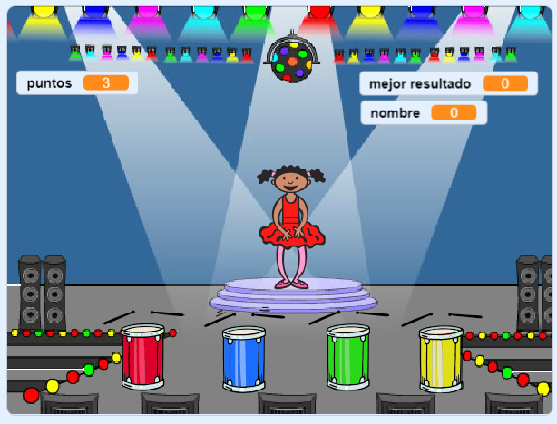

--- no-print ---

Esta es la versión **Scratch 3** del proyecto. También hay una [versión Scratch 2 del proyecto](https://projects.raspberrypi.org/es-ES/projects/memory-scratch2).

--- /no-print ---

## Introducción

En este proyecto, crearás un juego de memoria en el que tendrás que memorizar y repetir una secuencia aleatoria de colores.

### Lo que harás

--- no-print ---

Haz clic en la bandera verde para empezar. Observa la secuencia de colores que muestra el vestido de la bailarina y escucha al tambor que lo acompaña, luego repite la secuencia de colores. Si el orden de los colores es incorrecto, ¡el juego termina!

  <iframe allowtransparency="true" width="485" height="402" src="//scratch.mit.edu/projects/embed/390537913/?autostart=false" frameborder="0" allowfullscreen scrolling="no" mark="crwd-mark"></iframe> 

--- /no-print ---

--- print-only ---

--- /print-only ---

--- collapse ---
---
title: Lo que vas a aprender
---

+ Cómo añadir sonido a tu projecto Scratch
+ Cómo crear y usar listas para almacenar datos
+ Cómo crear y usar bloques personalizados para reutilizar código

--- /collapse ---

--- collapse ---
---
title: Lo que vas a necesitar
---

### Hardware

+ Un ordenador capaz de ejecutar Scratch 3

### Software

Scratch 3 (ya sea [en línea](https://rpf.io/scratchon){:target="_blank"} o [sin conexión](https://rpf.io/scratchoff){:target="_blank"})

--- /collapse ---

--- collapse ---
---
title: Información adicional para educadores
---

--- no-print ---

Si necesitas imprimir este proyecto, usa la [versión para imprimir](https://projects.raspberrypi.org/es-ES/projects/memory/print){:target="_blank"}.

--- /no-print ---

Puedes encontrar el [proyecto terminado aquí](https://rpf.io/p/es-ES/memory-get).

--- /collapse ---