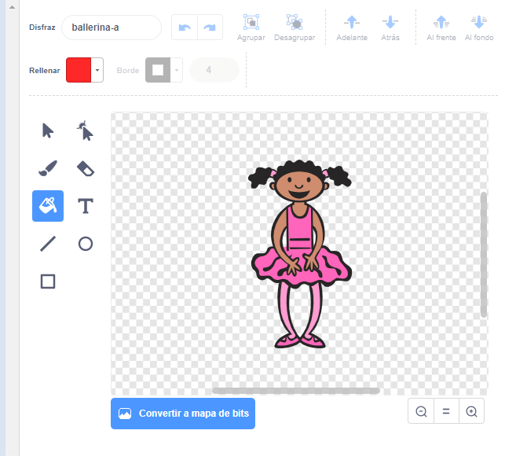

## Crea una secuencia de colores

Primero crea un personaje que pueda mostrar una secuencia aleatoria de colores.

\--- task \--- Abre un nuevo proyecto en Scratch.

**En línea:** abre un nuevo proyecto en [rpf.io/scratch-new](https://rpf.io/scratch-new){:target="_blank"}.

**Offline:** abre un nuevo proyecto en el editor offline.

Si necesitas descargar e instalar el editor offline de Scratch, puedes encontrarlo en [rpf.io/scratchoff](https://rpf.io/scratchoff){:target="_blank"}.

\--- /task \---

\--- task \--- Elige un personaje sprite y un escenario. Puedes usar la bailarina, pero tu personaje no tiene que ser una persona, solo necesita poder mostrar diferentes colores.

 \--- /task \---

+ Tu juego debe usar un número diferente para representar cada color:
    
    + 1 = rojo
    + 2 = azul
    + 3 = verde
    + 4 = amarillo

\--- task \--- Crea cuatro disfraces con colores diferentes para tu personaje, un disfraz para cada uno de los cuatro colores mostrados arriba. Asegúrate de que los colores de los disfraces están en el mismo orden que la lista anterior.

 \--- /task \---

Puedes usar la herramienta **colorear una parte** para colorear partes del traje de un color diferente.



A continuación, agregue una lista para almacenar la secuencia aleatoria de colores que el jugador debe recordar.

\--- tarea \--- Crea una lista llamada secuencia ` ` {: class = "block3variables"}. Solo el sprite de caracteres necesita ver esta lista, por lo que puede seleccionar ** Solo para este sprite ** cuando crea la lista.

[[[generic-scratch3-make-list]]]

\--- /task \---

Ahora debería ver muchos nuevos bloques de código para usar listas. La lista vacía debe estar visible en la esquina superior izquierda del escenario.


Cada color tiene un número diferente, por lo que puede elegir un color al azar al elegir un número al azar y agregarlo a la lista.

\--- tarea \--- Agregue este código al sprite de caracteres para elegir un número aleatorio y agregarlo a la secuencia ` ` {: class = "block3variables"}:


```blocks3
al presionar bandera verde
añade (número al azar entre (1) y (4)) a [secuencia v]
```

\--- /task \---

\--- tarea \--- Prueba tu código. Comprueba que, cada vez que haces clic en la bandera, un número aleatorio entre 1 y 4 se añade a la lista. \--- /task \---

\--- tarea \--- ¿Puedes agregar código a tu programa para generar cinco números aleatorios a la vez?

\--- pistas \--- \--- pista \--- Añadir a `eliminar toda la secuencia`{:class="block3variables"} para eliminar primero todos los elementos de la lista, y luego añadir un bloque `repetir`{:class="block3control"} que añade cinco números aleatorios a la lista. \--- /hint \--- \--- hint \---

Así es como debería verse tu c'odigo:


```blocks3
al presionar bandera verde
borrar (todos v) de [sequence v]
repetir (5) 
  añade (número al azar entre (1) y (4)) a [sequence v]
end
```

\--- /hint \--- \--- /hints \--- \--- /task \---

\--- tarea \--- Cada vez que se agrega un número a la lista, el personaje debe cambiar su traje para que el color del traje coincida con el número. Pon estos bloques en tu código inmediatamente debajo del cual se añade un número aleatorio a `secuencia`{:class="block3variables"}:


```blocks3
cambia de traje a (artículo (longitud de [secuencia v]) de [secuencia v])
esperar (1) segundos
```

\--- /task \---