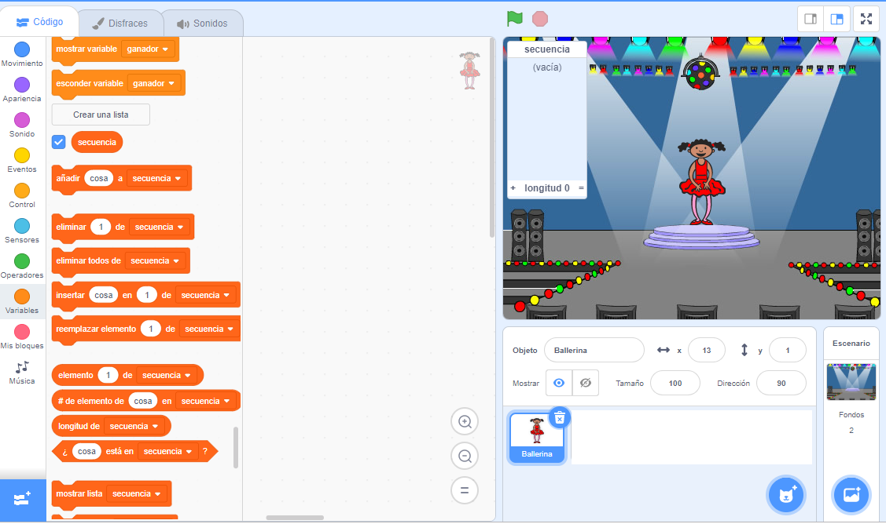

## cambiar disfraz a (elemento (last v) de [sequence v] :: list) esperar (1) segundos

Primero, vamos a crear un personaje que muestre una secuencia aleatoria de colores para memorizar.

+ Comience un nuevo proyecto de Scratch y elimine el sprite del gato para que el proyecto esté vacío. Puedes encontrar el editor de Scratch en línea pulsando [ aquí ](http://jumpto.cc/scratch-new).

+ Elige un personaje sprite y un telón de fondo. Tu personaje no tiene que ser una persona, pero debe poder mostrar diferentes colores.


+ En tu juego, usarás un número diferente para representar cada color:
    
    + 1 = rojo
    + 2 = azul
    + 3 = verde
    + 4 = amarillo
    
    Dale a tu personaje cuatro disfraces de diferentes colores, uno para cada uno de los cuatro colores anteriores. Asegúrate de que tus disfraces de colores estén en el mismo orden que la lista anterior.
    
    
    
    Puedes usar la herramienta *color a shape* para colorear partes del traje de un color diferente.

Vamos a crear una secuencia aleatoria de colores.

+ Crea una lista llamada `sequence`{:class="blockdata"}. Utilizaremos esta lista para almacenar la secuencia de colores que el jugador debe recordar. Solo el personaje sprite necesita ver la lista, por lo que puede seleccionar ** Solo para este sprite **.

[[[generic-scratch-make-list]]]

Ahora debería ver su lista vacía en la parte superior izquierda de su pantalla, así como muchos bloques nuevos para usar listas.



+ ¿Recuerdas que le dimos a cada color un número? Podemos elegir un color aleatorio eligiendo un número aleatorio y agregándolo a la lista. Agrega este código:

```blocks
al presionar bandera verde
añade (número al azar entre (1) y (4)) a [sequence v]
```

+ Pruebe tu código haciendo clic en la bandera verde. Comprueba que, cada vez que haces clic en él, se agregue un número aleatorio entre 1 y 4 a la lista.

+ ¿Puedes agregar este bloque a tu programa para generar cinco colores aleatorios a la vez?

```blocks
repetir (5)

end
```

+ Tal vez notes que tu lista está un poco llena. Vamos a añadir un bloque para eliminar toda la lista al comienzo antes de generar los números.

```blocks
al presionar bandera verde
borrar (todos v) de [sequence v]
repetir (5) 
  añade (número al azar entre (1) y (4)) a [sequence v]
end
```

+ Finalmente, cada vez elijamos un número, vamos a cambiar traje del bailarín al último elemento que se agregó a la lista, que será el número que acabamos de elegir. Añade estos bloques a tu código inmediatamente después de agregar el número aleatorio a su lista:

```blocks
cambiar disfraz a (elemento (last v) de [sequence v] :: list)
esperar (1) segundos
```