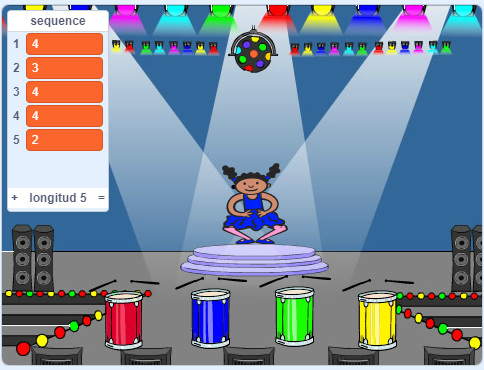

## Repite la secuencia

Ahora vas a añadir cuatro botones que el jugador tiene que presionar para repetir la secuencia de colores.

\--- task \---

Agrega cuatro nuevos objetos a tu proyecto para representar los cuatro botones.

+ Edita los disfraces de los nuevos objetos para que haya uno en cada uno de los cuatro colores
+ Pon los objetos en el escenario en el mismo orden que los trajes: rojo, azul, verde, amarillo



\--- /task \---

\--- task \---

Añade código al objeto rojo para que, cuando sea pulsado, `envíe`{:class="block3events"} un mensaje 'rojo' al objeto del personaje:


```blocks3
    cuando  haces clic en este objeto
enviar (rojo v)
```

\--- /task \---

Un `enviar` {: class = "block3events"} es como un mensaje anunciado a través de un altavoz, que puedes escuchar, por ejemplo, en escuelas o supermercados. Todos los objetos pueden escuchar el mensaje `broadcast`{:class="block3events"}, pero sólo el sprite cuya función es responder va a hacer algo.

\--- task \---

Añade código similar a los objetos azul, verde y amarillo para hacerlos `enviar`{:class="block3events"} mensajes sobre su propio color.

\--- /task \---

¿Te acuerdas de que `enviar` {: class = "block3events"} es como un mensaje de altavoz? Añadirás código para que la tarea del personaje sprite sea responder a los mensajes `enviar`{:class="block3events"}.

\--- task \---

Cuando el objeto de tu personaje recibe el mensaje `rojo`{:class="block3events"}, el código debería verificar si el número `1` está al comienzo de la lista `secuencia`{:class="block3variables"} (lo que significa que `rojo` es el siguiente color en la secuencia).

Si `1` está al comienzo de la lista, el código debe eliminar el número de la lista, porque el jugador recordó el color correcto. De lo contrario, se acaba el juego, y el código debe `detener todos` {: class = "block3control"} para finalizar el juego.


```blocks3
al recibir [rojo v]
si <(elemento (1 v) de [secuencia v])=[1]> entonces
eliminar (1 v) de [secuencia v]
si no
decir [¡Has perdido!] durante (1) segundos
detener [todos v]
end
```

\--- /task \---

\--- task \---

Añade al código que acabas de escribir instrucciones para que también suene un tambor cuando el objeto del personaje recibe el código `enviar`{:class="block3events"} correcto.

\--- hints \---

\--- hint \---

¿Puedes usar los números que corresponden a cada color para tocar el ritmo de tambor correcto?

+ 1 = rojo
+ 2 = azul
+ 3 = verde
+ 4 = amarillo

\--- /hint \---

\--- hint \---

Sobre el bloque `eliminar 1 de secuencia`{:class="block3variables"}, añade el bloque `tocar tambor`{:class="block3sound"} para reproducir el primer sonido en la lista `secuencia`{:class="block3variables"}.

\--- /hint \---

\--- hint \---

Aquí está el código que necesitarás añadir:

```blocks3
al recibir [rojo v]
si <(elemento (1 v) de [secuencia v])=[1]> entonces
+ tocar tambor (\(1\) Caja v) durante (0.25) tiempos
eliminar (1 v) de [secuencia v]
si no
decir [¡Has perdido!] durante (1) segundos
detener [todos v]
end
```

\--- /hint \---

\--- /hints \---

\--- /task \---

\--- task \---

Duplica el código que usaste para hacer que el objeto personaje responda al mensaje `rojo` {:class="block3events"}. Cambia el código duplicado para que envíe el mensaje `azul` {:class="block3events"}.

\--- /task \---

Cuando el objeto responde al mensaje `azul`{:class="block3events"}, ¿qué parte del código debería permanecer igual y cuál cambiar? Recuerda que cada color está asociado a un número.

\--- task \---

Cambia el código del objeto personaje para que responda correctamente al mensaje `azul`{:class="block3events"}.

\--- hints \---

\--- hint \---

Mantén estos bloques, pero necesitas cambiarlos de alguna manera:


```blocks3
<(elemento (1 v) de [secuencia v]) = [1]>

al recibir [rojo v]

tocar tambor (\(1\) Caja v) durante (0.25) tiempos
```

\--- /hint \---

\--- hint \---

Así es cómo tu código debería verse para el enviar `azul`{:class="block3events"}.


```blocks3
al recibir [azul v]
si <(elemento (1 v) de [secuencia v])=[2]> entonces 
tocar tambor (\(2\) Bombo v) durante (0.25) tiempos
eliminar (1 v) de [secuencia v]
si no
decir [¡Has perdido!] durante (1) segundos
detener [todos v]
end
```

\--- /hint \---

\--- /hints \---

\--- /task \---

\--- task \---

Duplica el código dos veces mas (para los botones verde y amarillo), y cambia las partes necesarias para que el personaje responda correctamente a los nuevos bloques `enviar`{:class="block3events"}.

\--- /task \---

¡Recuerda probar tu código! ¿Puedes memorizar una secuencia de cinco colores? ¿Es la secuencia diferente cada vez?

When the player repeats the whole colour sequence correctly, the `sequence`{:class="block3variables"} list is empty and the player wins. Si quieres, también puedes mostrar algunas luces parpadeantes como recompensa una vez que la lista `secuencia`:class="block3variables"} esté vacía.

\--- task \---

Agrega este código al final de tu personaje `cuando haga clic en la bandera` {: class = "blockevents"} secuencia de comandos:


```blocks3
    esperar hasta que < (longitud de [secuencia v]) = [0]>
enviar (¡Tu ganas! v) y esperar
```

\--- /task \---

\--- task \---

Cambia el escenario e importa el sonido `drum machine` (caja de ritmos) u otro sonido que te guste.

[[[generic-scratch3-sound-from-library]]]

\--- /task \---

\--- task \---

Añade este código para reproducir un sonido y hacer que el escenario cambie de color cuando el jugador gane.


```blocks3
    al recibir  [¡Tu ganas! v]
iniciar sonido (drum machine v)
repetir (50)
sumar al efecto [color v] (25)
esperar (0.1) segundos
end
quitar efectos gráficos
```

\--- /task \---