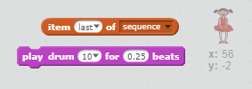

\--- desafío \---

## Desafío: añadir sonido

Prueba tu proyecto unas cuantas veces. Puede que observes que a veces el mismo número se elige dos veces consecutivas (o más), lo que hace que la secuencia sea más difícil de memorizar. ¿Puedes hacer un sonido de batería cada vez que el personaje cambia de disfraz?

¿Puedes hacer un sonido de batería diferente dependiendo de qué número fue elegido? Esto será * muy * similar a tu código para cambiar el disfraz del personaje.

\--- hints \---\--- hint \---¡Puedes completar este challenge agregando solo dos bloques al código actual de tu personaje! \--- / hint \--- \--- hint \--- Aquí están los bloques que necesitarás:

 \--- /hint \---

\--- hint \--- Así es como debería verse el código al final:

```blocks
al presionar bandera verde
borrar (todos v) de [sequence v]
repetir (5) 
  añade (número al azar entre (1) y (4)) a [sequence v]
  tocar tambor (elemento (last v) de [sequence v] :: list) durante (0.25) pulsos
  cambiar disfraz a (elemento (last v) de [sequence v] :: list)
  esperar (1) segundos
end
```

\--- /hint \---

\--- /hints \---

\--- /challenge \---