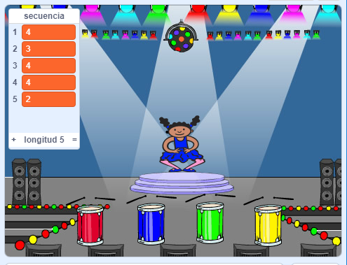

## Repitiendo la secuencia

Agreguemos cuatro botones para que el jugador presione para repetir la secuencia que recuerden.

+ Agrega cuatro nuevos sprites a tu proyecto para representar los cuatro botones. Edita los disfraces para que haya un sprite para cada uno de los cuatro colores. Coloque los sprites en el mismo orden que los disfraces: rojo, azul, verde, amarillo.



+ Cuando se hace clic en el tambor rojo, tendrás que transmitir un mensaje a tu personaje, haciéndoles saber que se ha hecho clic en el botón rojo. Agregue este código a su tambor rojo:

```blocks
    al hacer clic en este objeto
enviar [red v]
```

Un aviso es un poco como hacer un anuncio por un altavoz: es posible que hayas escuchado algo similar cuando estás de compras en el supermercado. Todos los sprites pueden escuchar el mensaje, pero sólo el sprite cuyo trabajo es responder va a hacer algo.

+ Agrega un código similar a los tambores azul, verde y amarillo para que emitan mensajes sobre su propio color.

\--- hints \--- \--- hint \--- Aquí encontrarás una manera fácil para copiar el código de un sprite a otro. Cambia el mensaje del aviso en cada sprite para que coincida con el color del sprite.  \--- /hint \--- \--- /hints \---

¿Recuerde que dijimos que el aviso era un poco como hacer un anuncio sobre un altavoz? Solo el sprite cuyo trabajo es responder hará algo, así que hagamos que el trabajo del sprite del personaje sea el responder a los mensajes. Hacemos esto escribiendo un código para que el personaje haga algo cuando escuchen cada mensaje.

+ Cuando el sprite de tu personaje recibe el mensaje ` rojo `, el código debería verificar si el número ` 1 ` está al comienzo de la lista (lo que significa que ` rojo ` es el siguiente color en la secuencia).
    
    Si es así, el código debería eliminar el número de la lista, ya que el color fue adivinado correctamente. De lo contrario, se acabó el juego, y tenemos que ` detener todo ` {: class = "blockcontrol"} para detener el juego.

```blocks
    al recibir [red v]
si <(item (1 v) of [sequence v] :: list) = [1]> entonces 
  borrar (1 v) de [sequence v]

  decir [Game over!] por (1) segundos
  detener [todos v]
end
```

+ Agrega al código que acabas de escribir para que también se reproduzca un ritmo del tambor cuando se reciba el color correcto.

\--- hints \--- \--- hint \--- ¿Puedes usar los números que corresponden a cada color para tocar el ritmo de tambor correcto?

+ 1 = rojo
+ 2 = azul
+ 3 = verde
+ 4 = amarillo \--- hints \--- \--- hint \--- Necesitarás agregar el bloquea ` tambor de reproducción ` {: class = "blocksound"} para reproducir el primer sonido en la lista de secuencias antes de ` eliminar 1 de secuencia ` {: class = "blockdata"}:

 \--- /hint \--- \--- hint \--- Aquí está el código que necesitarás:

```blocks
tocar tambor (elemento (1 v) de [sequence v] :: list) durante (0.25) pulsos
```

\--- /hint \--- \--- /hints \---

+ Duplica el código que usaste para hacer que tu personaje sprite responda al mensaje ` rojo `. Esta vez, cambiando el mensaje a ` azul `.

Cuando el sprite responde al mensaje ` azul `, qué parte del código debería permanecer igual, y qué parte debería cambiar? Recuerda que cada color tiene un número asociado.

+ Cambia tu código para que el personaje responda correctamente al mensaje `azul`.

\--- hints \--- \--- hint \--- Mantenga estos bloques, pero tendrás que cambiarlos de alguna manera: <0 />\--- / pista \--- \--- pista \--- Aquí está cómo tu código debería ser para la emisión azul.

```blocks
    al recibir [blue v]
si <(item (1 v) of [sequence v] :: list) = [2]> entonces 
  tocar tambor (elemento (1 v) de [sequence v] :: list) durante (0.25) pulsos
  borrar (1 v) de [sequence v]

  decir [Game over!] por (1) segundos
  detener [todos v]
end
```

\--- /hint \--- \--- /hints \---

+ Vuelve a duplicar el código dos veces para los botones verde y amarillo, y cambia las partes necesarias para que el personaje responda correctamente.

+ ¡Recuerda probar el código que has agregado! ¿Puedes memorizar una secuencia de cinco colores? ¿Es la secuencia diferente cada vez?

También puedes mostrar algunas luces intermitentes como recompensa una vez que la lista esté vacía, ya que eso significa que la secuencia completa se memorizó correctamente.

+ Agrega este código al final de tu personaje `cuando haga clic en la bandera` {: class = "blockevents"} secuencia de comandos:

```blocks
    esperar hasta que <(length of [sequence v] :: list) = [0]>
enviar [won v] y esperar
```

+ Cambia al escenario y agregua este código para reproducir un sonido y hacer que el fondo cambie de color una vez que el jugador haya ganado. Puedes elegir cualquier sonido que desees.

```blocks
    al recibir [won v]
tocar sonido [drum machine v]
repetir (50) 
  cambiar efecto [color v] por (25)
  esperar (0.1) segundos
end
quitar efectos gráficos
```