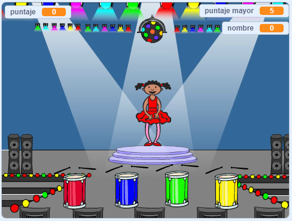

--- no-print ---

Esta es la versión **Scratch 3** del proyecto. También hay una versión [Scratch 2 del proyecto](https://projects.raspberrypi.org/en/projects/memory-scratch2).

--- /no-print ---

## Introducción

¡En este proyecto, crearás un juego de memoria en el que tendrás que memorizar y repetir una secuencia aleatoria de colores!

### Lo que harás

--- no-print ---

Haz clic en la bandera verde para empezar. Observa la secuencia de colores que se muestra en el vestido de la bailarina y escucha los sonidos de los tambores, luego repite los colores de la bailarina. Si te equivocas en el orden de los colores, ¡se acabó el juego!

  <iframe allowtransparency="true" width="485" height="402" src="//scratch.mit.edu/projects/embed/396433023/?autostart=false" frameborder="0" allowfullscreen scrolling="no" mark="crwd-mark"></iframe> 

--- /no-print ---

--- print-only ---

--- /print-only ---

--- collapse ---
---
title: Lo que aprenderás
---
+ Cómo agregar sonido a tu proyecto Scratch
+ Cómo crear y usar listas para almacenar datos
+ Cómo crear y usar bloques personalizados para repetir código

--- /collapse ---

--- collapse ---
---
title: Lo que necesitarás
---
### Hardware

+ Una computadora capaz de ejecutar Scratch 3

### Software

Scratch 3 (ya sea [ en línea ](https://rpf.io/scratchon) {:target="_blank"} o [sin conexión](https://rpf.io/scratchoff){:target="_blank"})

--- /collapse ---

--- collapse ---
---
title: Información adicional para educadores
---
--- no-print ---

Si necesitas imprimir este proyecto, por favor utiliza la [versión de impresión amigable](https://projects.raspberrypi.org/es-LA/projects/memory/print){:target="_blank"}.

--- /no-print ---

Puedes [descargar el proyecto completo aquí](http://rpf.io/p/es-LA/memory-get).

--- /collapse ---