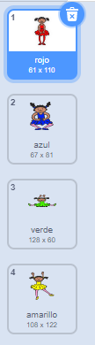
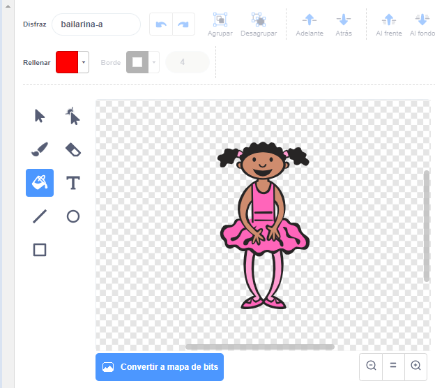
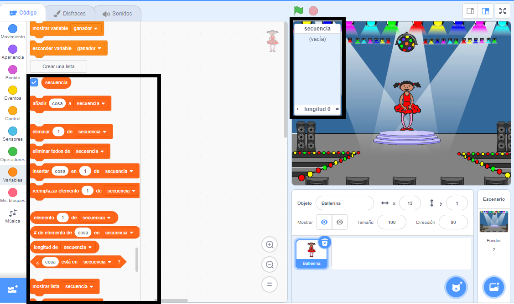

## Crea una secuencia de colores

Primero crea un personaje que pueda mostrar una secuencia aleatoria de colores.

\--- task \---

Abre un nuevo proyecto en Scratch.

** en línea ** abre un nuevo proyecto Scratch en línea en [ rpf.io/scratch-new ](https://rpf.io/scratch-new) {: target = "_ blank"}.

**Sin conexión:** abre un nuevo proyecto en el editor sin conexión.

Si necesitas descargar e instalar el editor offline de Scratch, puedes encontrarlo en [rpf.io/scratchoff](https://rpf.io/scratchoff){:target="_blank"}.

\--- /task \---

\--- task \---

Elige un personaje objeto y un escenario. Puedes usar la bailarina, pero tu personaje no tiene que ser una persona, solo necesita poder mostrar diferentes colores.


\--- /task \---

+ Tu juego debe usar un número diferente para representar cada color:
    
    + 1 = rojo
    + 2 = azul
    + 3 = verde
    + 4 = amarillo

\--- task \---

Dale a tu personaje cuatro disfraces de diferentes colores, uno para cada uno de los cuatro colores anteriores. Asegúrate que tus disfraces de colores estén en el mismo orden que la lista anterior.



\--- /task \---

Puedes usar la herramienta **rellenar** para colorear partes del traje de un color diferente.



A continuación, añade una lista para almacenar la secuencia aleatoria de colores que el jugador tiene que recordar.

\--- task \---

Crea una lista llamada `secuencia`{: class = "block3variables"}. Solo el objeto del personaje necesita ver esta lista, por lo que puedes seleccionar **Sólo para este objeto** al crear la lista.

[[[generic-scratch3-make-list]]]

\--- /task \---

Ahora deberías ver muchos nuevos bloques de código para usar listas. La lista vacía debería ser visible en la esquina superior izquierda del Escenario.



Cada color tiene un número diferente, por lo que puedes elegir un color al azar al elegir un número aleatoriamente y agregarlo a la lista.

\--- task \---

Añade este código al personaje para elegir un número aleatorio y añadirlo a la lista `secuencia`{:class="block3variables"}:


```blocks3
when flag clicked
add (pick random (1) to (4)) to [sequence v]
```

\--- /task \---

\--- task \---

Prueba tu código. Comprueba que, cada vez que haces clic en la bandera, un número aleatorio entre 1 y 4 se añade a la lista.

\--- /task \---

\--- task \---

¿Puedes añadir código a tu programa para generar cinco números aleatorios a la vez?

\--- hints \---

\--- hint \---

Add a `delete all of sequence`{:class="block3variables"} to first delete all the items on the list, and then add a `repeat`{:class="block3control"} block that adds five random numbers to the list.

\--- /hint \---

\--- hint \---

Así es como debería verse tu código:


```blocks3
when flag clicked
delete (all v) of [sequence v]
repeat (5)
    add (pick random (1) to (4)) to [sequence v]
end
```

\--- /hint \---

\--- /hints \---

\--- /task \---

\--- task \---

Cada vez que se añada un número a la lista, el personaje debe cambiar su disfraz de forma que el color del traje coincide con el número. Pon estos bloques en tu código justo debajo del bloque que añade un número aleatorio a la lista `secuencia`{:class="block3variables"}:


```blocks3
switch costume to (item (length of [sequence v]) of [sequence v])
wait (1) seconds
```

\--- /task \---