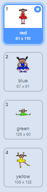
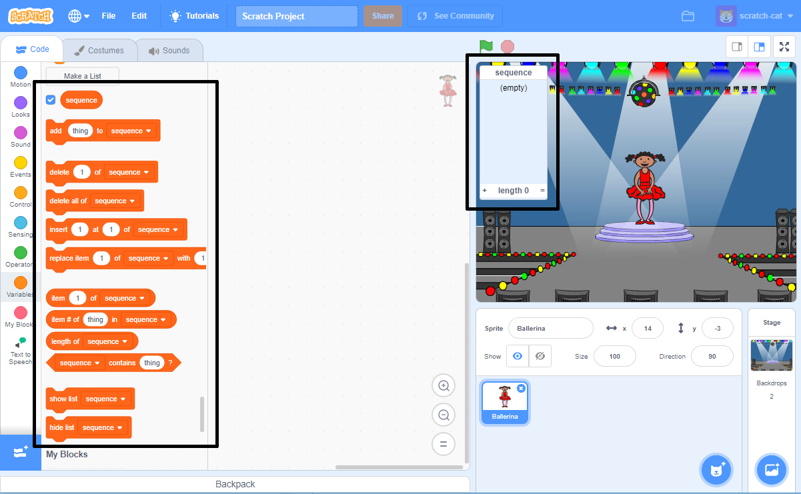

## Crée une séquence de couleurs

Premièrement, crée un personnage qui puisse afficher des séquences de couleurs aléatoires.

\--- task \--- Ouvre un nouveau projet Scratch.

**Online**: ouvre un nouveau projet scratch à [rpf.io/scratch-new](https://rpf.io/scratchon).

**Offline**: ouvre Un nouveau projet dans l’éditeur hors-ligne.

Si tu as besoin de télécharger et d’installer l’éditeur Scratch hors-ligne, tu peux le trouver ici : [rpf.io/scratchoff](https://rpf.io/scratchoff).

\--- /task \---

\--- tâche \--- Choisissez un sprite de personnage et une toile de fond. Vous pouvez utiliser la ballerine, mais votre personnage ne doit pas nécessairement être une personne, il suffit de pouvoir montrer des couleurs différentes.

 \--- /task \---

+ Ton jeu doit utiliser différents nombres afin de représenter chaque couleur :
    
    + 1 = rouge
    + 2 = bleu
    + 3 = vert
    + 4 = jaune

\--- task \--- Donne à ton personnage quatre costumes, chacun ayant une couleur différente, un costume pour chacune des couleurs ci-dessus. Assure-toi que les costumes colorés sont dans le même ordre que ci-dessus.

 \--- /task \---

Si tu le souhaites, tu peux utiliser l’outil de **color a shape** pour remplir les parties du costume avec une couleur différente.


Ensuite, ajoute une liste pour stocker la séquence aléatoire de couleurs que le joueur doit mémoriser.

\--- task \--- Créer une liste appelée `sequence` {:class ="block3variables"}. Seul le sprite de personnage a besoin de voir cette liste, vous pouvez donc sélectionner ** Pour ce sprite uniquement ** lorsque vous créez la liste.

[[[generic-scratch3-make-list]]]

\--- /task \---

Tu devrais maintenant voir beaucoup de nouveaux blocs de code pour utiliser les listes. La liste vide doit être visible dans le coin supérieur gauche de la scène.



Chaque couleur a un numéro différent, tu peux donc choisir une couleur aléatoire en choisissant un nombre au hasard et en l'ajoutant à la liste.

\--- task \--- Ajoutez ce code au sprite de personnage pour choisir un nombre aléatoire et l'ajouter à la `sequence` {:class=block3variables"}:


```blocks3
when flag clicked
add (pick random (1) to (4)) to [sequence v]
```

\--- /task \---

\--- task \--- Teste ton code. Vérifie que, chaque fois que tu cliques sur le drapeau, un chiffre aléatoire entre 1 et 4 est ajouté à la liste. \--- /task \---

\--- task \--- Peux-tu ajouter du code à ton programme qui génère cinq chiffres aléatoires en même temps ?

\--- hints \--- \--- hint \--- Add a `delete all of sequence`{:class="block3variables"} pour supprimer premièrement tous les éléments de la liste, puis ajoute un bloc `repeat`{:class="block3control"} qui va ajouter 5 nombres aléatoires à la liste. \--- /hint \--- \--- hint \---

Voici à quoi ton code devrait ressembler :


```blocks3
when flag clicked
delete (all v) of [sequence v]
repeat (5)
    add (pick random (1) to (4)) to [sequence v]
end
```

\--- /hint \--- \--- /hints \--- \--- /task \---

\--- task \--- Chaque fois qu'un nombre est ajouté à la liste, le personnage doit changer son costume de sorte à ce que la couleur du costume corresponde au nombre. Mettez ces blocs dans votre code immédiatement en dessous où un nombre aléatoire est ajouté à `sequence` {:class="block3variables"}:


```blocks3
switch costume to (item (length of [sequence v]) of [sequence v])
wait (1) seconds
```

\--- /task \---