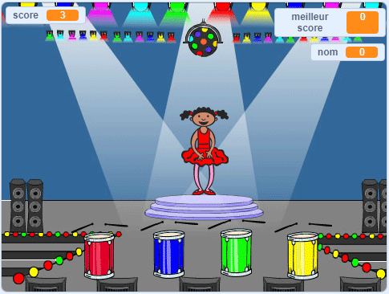

\--- no-print \---

Ceci est la version **Scratch 3** du projet. Il y a aussi une version [Scratch 2 du projet](https://projects.raspberrypi.org/en/projects/memory-scratch2).

\--- /no-print \---

## Introduction

Dans ce projet, tu vas créer un jeu de mémoire dans lequel tu devras mémoriser et répéter une séquence aléatoire de couleurs !

### Ce que tu vas créer

\--- no-print \--- Clique sur le drapeau vert pour commencer. Observe la séquence de couleurs montrée par la robe de la danseuse et écoutez les battements de tambour qui l'accompagnent, puis répète les couleurs à la danseuse. Si tu répètes les couleurs dans le mauvais ordre, tu as perdu !

  <iframe allowtransparency="true" width="485" height="402" src="//scratch.mit.edu/projects/embed/284452634/?autostart=false" frameborder="0" allowfullscreen scrolling="no" mark="crwd-mark"></iframe> 

\--- /no-print \---

\--- print-only \---  \--- /print-only \---

## \--- collapse \---

## title: What you will learn

+ How to add sound to your Scratch project
+ How to create and use lists to store data
+ How to create and use custom blocks for repeating code

\--- /collapse \---

## \--- collapse \---

## title: What you will need

### Hardware

+ A computer capable of running Scratch 3

### Software

Scratch 3 (either [online](https://rpf.io/scratchon){:target="_blank"} or [offline](https://rpf.io/scratchoff){:target="_blank"}) \--- /collapse \---

## \--- collapse \---

## title: Additional information for educators

\--- no-print \---

If you need to print this project, please use the [printer-friendly version](https://projects.raspberrypi.org/en/projects/memory/print){:target="_blank"}.

\--- /no-print \---

You can find the [completed project here](http://rpf.io/p/en/memory-get).

\--- /collapse \---