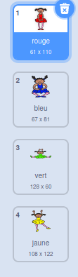
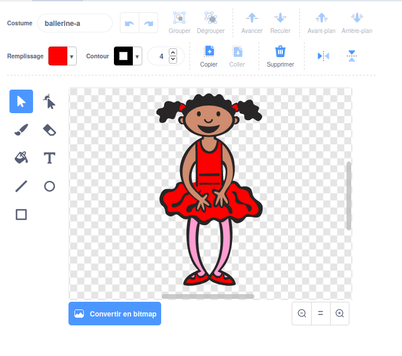
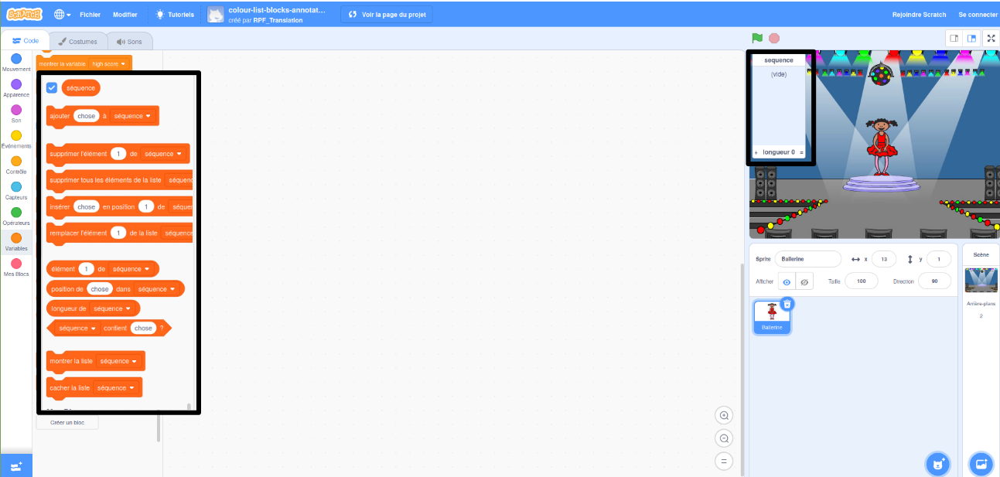

## Crée une séquence de couleurs

Premièrement, crée un personnage qui puisse afficher des séquences de couleurs aléatoires.

\--- task \---

Ouvre un nouveau projet Scratch.

**En ligne:** ouvre un nouveau projet Scratch en ligne sur [rpf.io/scratch-new](https://rpf.io/scratch-new) {:target="_blank"}.

**Hors-ligne**: ouvre un nouveau projet dans l’éditeur hors-ligne.

Si tu dois télécharger et installer l'éditeur hors-ligne Scratch, tu peux le trouver à [rpf.io/scratchoff](https://rpf.io/scratchoff){:target="_blank"}.

\--- /task \---

\--- task \---

Choisis un sprite de personnage et un arrière-plan. Tu peux utiliser la ballerine, mais ton personnage ne doit pas forcément être une personne, il doit seulement être capable de montrer différentes couleurs.


\--- /task \---

+ Ton jeu doit utiliser différents nombres pour représenter chaque couleur :
    
    + 1 = rouge
    + 2 = bleu
    + 3 = vert
    + 4 = jaune

\--- task \---

Donne à ton personnage quatre costumes de couleurs différentes, un costume pour chacune des quatre couleurs indiquées ci-dessus. Assure-toi que tes costumes de couleur sont dans le même ordre que la liste ci-dessus.



\--- /task \---

Si tu le souhaites, tu peux utiliser l’outil de ** coloriage de forme ** pour remplir les parties du costume avec une couleur différente.



Ensuite, ajoute une liste pour stocker la séquence aléatoire de couleurs que le joueur doit mémoriser.

\--- task \---

Crée une liste appelée `séquence`{:class="block3variables"}. Seul le sprite personnage a besoin de voir cette liste, donc tu peux sélectionner **Pour ce sprite uniquement** quand tu crées la liste.

[[[generic-scratch3-make-list]]]

\--- /task \---

Tu devrais maintenant voir beaucoup de nouveaux blocs de code pour utiliser les listes. La liste vide doit être visible dans le coin supérieur gauche de la scène.



Chaque couleur a un numéro différent, tu peux donc choisir une couleur aléatoire en choisissant un nombre au hasard et en l'ajoutant à la liste.

\--- task \---

Ajoute ce code au sprite personnage pour choisir un nombre aléatoire et l'ajouter à la `séquence` {:class="block3variables"}:


```blocks3
quand le drapeau est cliqué
ajouter (nombre aléatoire entre (1) et (4)) à [séquence v]
```

\--- /task \---

\--- task \---

Teste ton code. Vérifie que, chaque fois que tu cliques sur le drapeau, un chiffre aléatoire entre 1 et 4 est ajouté à la liste.

\--- /task \---

\--- task \---

Peux-tu ajouter du code à ton programme pour générer cinq nombres aléatoires en une fois ?

\--- hints \---

\--- hint \---

Ajoute un `supprime tous les éléments de la liste séquence`{:class="block3variables"} pour d'abord supprimer tous les éléments de la liste, puis ajoute un bloc `répéter`{:class="block3control"} qui ajoute cinq nombres aléatoires à la liste.

\--- /hint \---

\--- hint \---

Voici à quoi ton code devrait ressembler :


```blocks3
quand le drapeau est cliqué
supprimer tous les éléments de la liste [séquence v]
répéter (5) fois
    ajouter (nombre aléatoire entre (1) et (4)) à [séquence v]
fin
```

\--- /hint \---

\--- /hints \---

\--- /task \---

\--- task \---

Chaque fois qu'un nombre est ajouté à la liste, le personnage doit changer son costume afin que la couleur du costume corresponde au nombre. Mets ces blocs dans ton code immédiatement en-dessous où un nombre aléatoire est ajouté à `séquence`{:class="block3variables"}:


```blocks3
basculer sur le costume (élément (longueur de séquence [v]) de séquence [v])
attendre (1) secondes
```

\--- /task \---