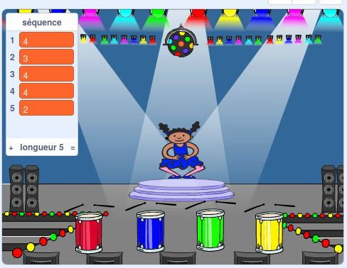

## Répéter la séquence

Maintenant, tu vas ajouter quatre boutons sur lesquels le joueur doit appuyer pour répéter la séquence de couleurs.

\--- task \---

Ajoute quatre nouveaux sprites à ton projet pour représenter les quatre boutons.

+ Modifie les costumes des nouveaux sprites de manière à ce qu'il y ait un sprite dans chacune des quatre couleurs
+ Place les sprites dans le même ordre sur la scène que les costumes : rouge, bleu, vert et jaune



\--- /task \---

\--- task \---

Ajoute du code au sprite rouge pour que, lorsque le sprite est cliqué, il `envoie`{:class="block3events"} un message « rouge » au sprite du personnage :


```blocks3
    quand ce sprite est cliqué
    envoyer à tous (rouge v)
```

\--- /task \---

Un `envoyer à tous`{:class="block3events"} est comme une annonce par haut-parleur : elle doit être entendue par tous les sprites. Tous les sprites peuvent entendre le `envoyer à tous`{:class="block3events"}, mais seul le sprite dont la tâche est de répondre fera quelque chose.

\--- task \---

Ajoute un code similaire aux sprites bleu, vert et jaune pour leur faire faire des messages ` envoyer à tous `{:class="block3events"} à propos de leur propre couleur.

\--- /task \---

Te souviens-tu que le ` envoyer à tous `{:class="block3events"} est comme un message de haut-parleur ? Tu vas ajouter du code pour que le travail du sprite personnage soit de répondre aux messages `envoyer à tous`{:class="block3events"}.

\--- task \---

Quand ton sprite reçoit le message `rouge`{:class="block3events"}, le code doit vérifier si le nombre ` 1 ` est au début de la liste ` séquence `{:class="block3variables"} (ce qui signifie que ` rouge `{:class="block3events"} est la prochaine couleur de la séquence).

Si `1` est au début de la liste, le code devrait supprimer le numéro de la liste, car le joueur s'est souvenu de la bonne couleur. Sinon, le jeu est terminé, et le code doit `stopper tout`{:class="block3control"} pour terminer le jeu.


```blocks3
quand je reçois [rouge v]
si <(élément (1 v) de [séquence v])=[1]> alors
supprimer l'élément (1 v) de [séquence v]
sinon
dire [Perdu!] pendant (1) secondes
stop [tout v]
fin
```

\--- /task \---

\--- task \---

Ajoute au code que tu viens d'écrire pour qu'un battement de tambour joue également quand le sprite de personnage reçoit le bon `message`{:class="block3events"}.

\--- hints \---

\--- hint \---

Peux-tu utiliser les nombres qui correspondent à chaque couleur pour jouer le battement correct du tambour ?

+ 1 = rouge
+ 2 = bleu
+ 3 = vert
+ 4 = jaune

\--- /hint \---

\--- hint \---

Au-dessus du bloc `supprimer 1 de séquence`{:class="block3variables"}, ajoute le bloc `jouer du tambour`{:class="block3sound"} pour jouer le premier son de la liste `séquence`{:class="block3variables"}.

\--- /hint \---

\--- hint \---

Voici le code que tu devras ajouter :

```blocks3
quand je reçois [rouge v]
si <(élément (1 v) de [séquence v]) = [1]> alors 
 + jouer du tambour ((1) caisse claire v) pendant (0.25) temps
 supprimer l'élément (1 v) de [séquence v]
sinon 
 dire [Perdu!] pendant (1) secondes
 stop [tout v]
fin
```

\--- /hint \---

\--- /hints \---

\--- /task \---

\--- task \---

Duplique le code que tu as utilisé pour que ton sprite personnage réponde au message `rouge`{:class="block3events"}. Change le code dupliqué pour qu'il envoie le message `bleu`{:class="block3events"}.

\--- /task \---

Quand le sprite répond au message `bleu`{:class="block3events"}, quel bit de code doit rester le même, et quel bit doit changer ? Rappelle-toi que chaque couleur a un nombre correspondant.

\--- task \---

Change le code du sprite du personnage de sorte que le caractère réponde correctement au message `bleu`{:class="block3events"}.

\--- hints \---

\--- hint \---

Garde ces blocs, mais tu dois les changer d'une manière ou d'une autre :


```blocks3
<(élément (1 v) de [séquence v]) = [1]>

quand je reçois [rouge v]

jouer du tambour ((1) caisse claire v) pendant (0.25) temps
```

\--- /hint \---

\--- hint \---

Voici à quoi devrait ressembler ton code pour le message `bleu`{:class="block3events"}.


```blocks3
quand je reçois [bleu v]
si <(élément (1 v) de [séquence v]) = [2]> alors 
  jouer du tambour ((2) grosse caisse v) pendant (0.25) temps
  supprimer l'élément (1 v) de [séquence v]
sinon 
  dire [Perdu!] pendant (1) secondes
  stop [tout v]
fin
```

\--- /hint \---

\--- /hints \---

\--- /task \---

\--- task \---

Dupliquer à nouveau le code deux fois (pour les boutons vert et jaune), et change les parties nécessaires pour que le personnage réponde correctement aux nouveaux `messages`{:class="block3events"}.

\--- /task \---

N'oublie pas de tester le code ! Peux-tu mémoriser une séquence de cinq couleurs ? La séquence est-elle différente à chaque fois ?

When the player repeats the whole colour sequence correctly, the `sequence`{:class="block3variables"} list is empty and the player wins. Si tu veux, tu peux aussi afficher quelques lumières clignotantes en récompense une fois que la liste `séquence`{:class="block3variables"} est vide.

\--- task \---

Ajoute ce code à la fin du script de ton personnage ` lorsque le drapeau est cliqué`{:class="block3events"} :


```blocks3
    attendre jusqu'à ce que <(longueur de [séquence v]) = [0]>
envoyer à tous (gagné v) et attendre
```

\--- /task \---

\--- task \---

Passe à la scène, et importe le son `drum machine` ou un autre son que tu aimes.

[[[generic-scratch3-sound-from-library]]]

\--- /task \---

\--- task \---

Ajoute ce code pour jouer un son et faire en sorte que la couleur de fond change quand le joueur gagne.


```blocks3
    quand je reçois [gagné v]
    jouer le son (drum machine v)
    répéter (50) fois
        ajouter (25) à l'effet [couleur v]
        attendre (0.1) secondes
    fin
    annuler les effets graphiques
```

\--- /task \---