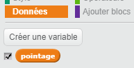

## De multiples niveaux

Jusqu'à maintenant, le joueur n'a qu'à se souvenir de 5 couleurs. Nous allons donc améliorer notre jeu en rendant la séquence plus longue.

+ Créez une nouvelle variable nommée `pointage` {.blockdata}.

	

+ Ce `pointage` {.blockdata} sera utilisé pour déterminer la longueur de la séquence que le joueur doit mémoriser. Pour commencer, le pointage (et la taille de la séquence) sera de 3. Ajoutez ce bloc de code au début du code `quand ⚑ cliqué` {.blockevents} de votre personnage :

	```blocks
		[pointage v] prend la valeur [3]
	```

+ Au lieu de toujours créer une séquence de 5 couleurs, vous voulez avoir un `pointage` qui {.blockdata} détermine la longueur de la séquence. Changez la boucle `répéter` {.blockcontrol} de votre personnage (pour créer la séquence) en :

	```blocks
    répéter (pointage) fois
    fin
	```

+ Si la séquence a été identifiée correctement, vous devez ajouter 1 au pointage afin d'augmenter la longueur de la séquence.

	```blocks
		ajouter à [pointage v] (1)
	```

+ Enfin, vous aurez besoin d'ajouter une boucle `répéter indéfiniment` {.blockcontrol} autour du code qui génère la séquence afin de créer une nouvelle séquence pour chaque niveau. Le code de votre lutin devrait apparaître comme suit :

	```blocks
    quand le drapeau vert pressé
    [pointage v] prend la valeur [3]
    répéter indéfiniment
       supprimer l'élément (tout v) de la liste [séquence v]
       répéter (pointage) fois
          ajouter (nombre aléatoire entre (1) et (4)) à [séquence v]
          basculer sur costume (élément (dernier v) de [séquence v])
          attendre (1) secondes
       fin
       attendre jusqu’à <(longueur de [séquence v]) = [0]>
       envoyer à tous [gagné v] et attendre
       ajouter à [pointage v] (1)
    fin
	```

+ Demandez à vos amis de tester votre jeu. Pensez à cacher la liste `séquence` {.blockdata} avant de lancer le jeu!
