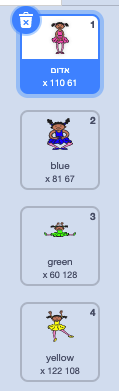
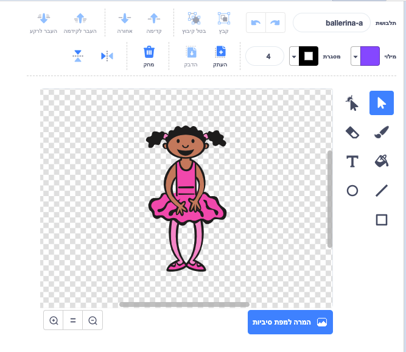

## צרו רצף של צבעים

קודם כל, צרו דמות שתציג רצף אקראי של צבעים.

\--- task \--- פתחו פרוייקט חדש של Scratch.

**Online**: open a new online Scratch project at [rpf.io/scratch-new](https://rpf.io/scratch-new){:target="_blank"}.

** לא מקוון: ** פתחו פרוייקט חדש בעורך הלא מקוון.

If you need to download and install the Scratch offline editor, you can find it at [rpf.io/scratchoff](https://rpf.io/scratchoff){:target="_blank"}.

\--- /task \---

\--- task \--- בחרו דמות ורקע. אתם יכולים לבחור ברקדנית, אבל הדמות שלכם לא חייבת להיות אנושית, העיקר שתוכל להציג צבעים שונים.

 \--- /task \---

+ במשחק, כל צבע ייוצג על ידי מספר:
    
    + 1 = אדום
    + 2 = כחול
    + 3 = ירוק
    + 4 = צהוב

\--- task \--- בחרו לדמות שלכם ארבע תלבושות, אחת בכל אחד מהצבעים שהזכרנו קודם. ודאו שהתלבושות הצבעוניות יהיו באותו הסדר כמו ברשימה.

 \--- /task \---

אם תרצו, תוכלו להשתמש בכלי **מילוי** כדי למלא חלקי התלבושת בצבע שונה.



Next, add a list for storing the random sequence of colours that the player has to remember.

\--- task \--- Create a list called `sequence`{:class="block3variables"}. Only the character sprite needs to see this list, so you can select **For this sprite only** when you create the list.

[[[generic-scratch3-make-list]]]

\--- /task \---

You should now see lots of new code blocks for using lists. The empty list should be visible in the top left-hand corner of the Stage.


Each colour has a different number, so you can choose a random colour by randomly choosing a number and adding it to the list.

\--- task \--- Add this code to the character sprite to choose a random number and add it to `sequence`{:class="block3variables"}:


```blocks3
when flag clicked
add (pick random (1) to (4)) to [sequence v]
```

\--- /task \---

\--- task \--- Test your code. Check that, each time you click the flag, a random number between 1 and 4 gets added to the list. \--- /task \---

\--- task \--- Can you add code to your program to generate five random numbers at once?

\--- hints \--- \--- hint \--- Add a `delete all of sequence`{:class="block3variables"} to first delete all the items on the list, and then add a `repeat`{:class="block3control"} block that adds five random numbers to the list. \--- /hint \--- \--- hint \---

This is what your code should look like:


```blocks3
when flag clicked
delete (all v) of [sequence v]
repeat (5)
    add (pick random (1) to (4)) to [sequence v]
end
```

\--- /hint \--- \--- /hints \--- \--- /task \---

\--- task \--- Each time a number gets added to the list, the character should change its costume so the costume's colour matches the number. Put these blocks into your code immediately below where a random number is added to `sequence`{:class="block3variables"}:


```blocks3
switch costume to (item (length of [sequence v]) of [sequence v])
wait (1) seconds
```

\--- /task \---