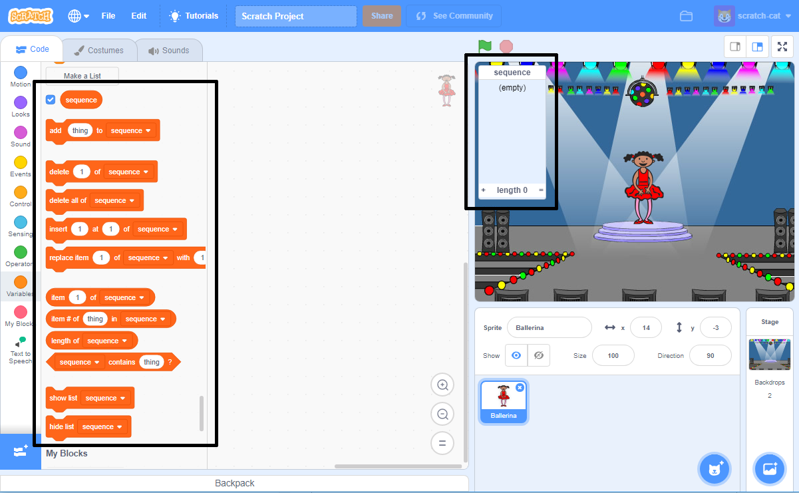

## रंगो का अनुक्रम बनाएँ

पहले एक पात्र बनाएं जो रंगों के यादृच्छिक (random) अनुक्रम को प्रदर्शित कर सके।

--- task ---

एक नया Scratch प्रोजेक्ट खोलिये।

**ऑनलाइन**: [rpf.io/scratch-new](https://rpf.io/scratch-new){:target="_blank"} पर एक नया Scratch प्रोजेक्ट खोलें।

**ऑफ़लाइन**: ऑफ़लाइन संपादक में एक नया प्रोजेक्ट खोलें।

यदि आपको Scratch ऑफ़लाइन संपादक (offline editor) को डाउनलोड और इंस्टॉल (download and install) करने की आवश्यकता है, तो आप इसे [rpf.io/scratchoff](https://rpf.io/scratchoff) {:target="_blank"} पर पा सकते हैं।

--- /task ---

--- task ---

एक पात्र स्प्राइट और एक पृष्ठभूमि (backdrop) चुनें। आप बैलेरीना (ballerina) का उपयोग कर सकते हैं लेकिन आपके पात्र को एक व्यक्ति होने की आवश्यकता नहीं है, उन्हें केवल अलग-अलग रंग दिखाने में सक्षम होने की आवश्यकता है।


--- /task ---

+ आपके खेल को प्रत्येक रंग का प्रतिनिधित्व करने के लिए एक अलग संख्या का उपयोग करना चाहिए:
    
    + 1 = लाल
    + 2 = नीला
    + 3 = हरा
    + 4 = पीला

--- task ---

अपने चरित्र को चार पोशाकें (costume) दें जिनमें अलग-अलग रंग हों, ऊपर दिखाए गए चार रंगों में से प्रत्येक के लिए एक पोशाक। सुनिश्चित करें कि आपके रंगीन परिधान ऊपर की सूची के समान क्रम में हैं।


--- /task ---

यदि आप चाहें, तो आप एक अलग रंग के साथ पोशाक के कुछ हिस्सों को भरने के लिए **color a shape** का उपयोग कर सकते हैं।


फिर रंगों के यादृच्छिक अनुक्रम को संग्रहीत करने के लिए एक सूची जोड़ें जिसे खिलाड़ियों को याद रखना होगा।

--- task ---

`sequence`{:class="block3variables"} नामक एक सूची बनाएँ । केवल पात्र स्प्राइट को इस सूची को देखने की आवश्यकता है, इसलिए जब आप सूची बनाते हैं आप **For this sprite only** का चयन कर सकते हैं।

[[[generic-scratch3-make-list]]]

--- /task ---

अब आपको सूचियों का उपयोग करने के लिए बहुत सारे नए कोड ब्लॉक दिखाई देने चाहिए।स्टेज के ऊपरी बाएं कोने में खाली सूची दिखाई देनी चाहिए।



प्रत्येक रंग की एक अलग संख्या है, इसलिए आप यादृच्छिक रूप से एक संख्या चुनकर और उसे सूची में जोड़कर एक यादृच्छिक रंग चुन सकते हैं।

--- task ---

एक यादृच्छिक संख्या चुनने के लिए और इसे `sequence` {:class="block3variables"}: सूची में जोड़ने के लिए इस कोड को पात्र स्प्राइट में जोड़ें।


```blocks3
when flag clicked
[(pick random (1) to (4)) to [sequence v) को जोड़ें
```

--- /task ---

--- task ---

अपने कोड का परीक्षण करें। जांच करें कि हर बार जब आप ध्वज पर क्लिक करते हैं, तो सूची में 1 और 4 के बीच एक यादृच्छिक संख्या जुड़ जाती है।

--- /task ---

--- task ---

क्या आप एक बार में पाँच यादृच्छिक संख्याएँ बनाने के लिए अपने प्रोग्राम में कोड जोड़ सकते हैं?

--- hints ---

--- hint ---

पहले सूची के सभी संख्याओं को हटाने के लिए एक `delete all of sequence`{:class="block3variables"} जोड़ें, और फिर एक `repeat` {:class="block3control"} ब्लॉक जोड़ें जो सूची में पाँच यादृच्छिक संख्याएँ जोड़ता है।

--- /hint ---

--- hint ---

आपका कोड ऐसा दिखना चाहिए:


```blocks3
when flag clicked
delete (all v) of [sequence v]
repeat (5)
    add (pick random (1) to (4)) to [sequence v]
end
```

--- /hint ---

--- /hints ---

--- /task ---

--- task ---

प्रत्येक बार जब कोई संख्या सूची में जुड़ जाती है, तो पात्र की पोशाक बदलनी चाहिए ताकि पोशाक का रंग संख्या से मेल खाए। इन ब्लॉकों को तुरंत अपने कोड में डालें जहां एक यादृच्छिक संख्या `sequence`{:class="block3variables"}: में जोड़ी जाती है 


```blocks3
switch costume (item (length of [sequence v]) of [sequence v])
wait (1) seconds
```

--- /task ---