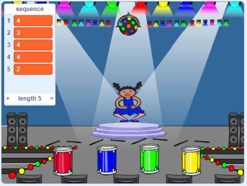

## अनुक्रम दोहराएं

अब आप चार बटन जोड़ने जा रहे हैं जिन्हें खिलाड़ी को रंग क्रम दोहराने के लिए दबाना होगा।

--- task ---

चार बटनों का प्रतिनिधित्व करने के लिए अपनी प्रोजेक्ट में चार नए स्प्राइट जोड़ें।

+ नए स्प्राइट की पोशाक (costume) को संपादित (edit) करें ताकि चारों रंगों में से प्रत्येक में एक स्प्राइट हो
+ स्टेज पर स्प्राइट्स को पोशाकों के ही क्रम में डालें: लाल, नीला, हरा, पीला



--- /task ---

--- task ---

लाल स्प्राइट में कोड जोड़ें ताकि स्प्राइट पर क्लिक करने पर यह पात्र स्प्राइट के लिए एक `broadcasts`{:class="block3events"} 'लाल' संदेश प्रसारित करें:


```blocks3
    when this sprite clicked
    broadcast (red v)
```

--- /task ---

`broadcasts`{:class="block3events"} बटन एक लाउडस्पीकर पर घोषित एक संदेश की तरह है, जिसे आप उदाहरण के लिए स्कूलों या सुपरमार्केटों में सुन सकते हैं। सभी स्प्राइट्स `broadcast`{:class="block3events"}को सुन सकते हैं लेकिन केवल वह स्प्राइट ही कुछ करेगा जिसका काम इसका जवाब देना है।

--- task ---

नीले, हरे और पीले स्प्राइट में भी ऐसा ही कोड जोड़ें, ताकि वे भी अपने रंग के बारे में `broadcast`{:class="block3events"} संदेश सुन पाएं ।

--- /task ---

क्या आपको याद है कि `broadcast`{:class="block3events"} एक लाउडस्पीकर संदेश की तरह है? आप `broadcast`{:class="block3events"} संदेशों का जवाब देने को पात्र स्प्राइट की ज़िम्मेदारी बनाने के लिए कोड जोडेंगे।

--- task ---

जब आपका पात्र स्प्राइट `red`{:class="block3events"} संदेश प्राप्त करता है, तो कोड को जांचना चाहिए कि संख्या `1` `sequence`{:class="block3variables"} सूची के शुरुआत में है या नहीं (जिसका अर्थ है कि `red`{:class="block3events"} अनुक्रम में अगला रंग है)।

यदि `1` सूची की शुरुआत में है, कोड को सूची से संख्या को हटा देना चाहिए, क्योंकि खिलाड़ी को सही रंग याद था। अन्यथा खेल खत्म और खेल को समाप्त करने के लिए कोड में `stop all`{:class="block3control"} जोड़ें।


```blocks3
when I receive [red v]
if <(item (1 v) of [sequence v])=[1]> then
delete (1 v) of [sequence v]
else
say [Game over!] for (1) seconds
stop [all v]
end
```

--- /task ---

--- task ---

आपके द्वारा लिखे गए कोड में जोड़ें ताकि जब पात्र स्प्राइट को सही `broadcast`{:class="block3events"} प्राप्त हो तो एक ड्रम की आवाज़ भी बजे।

--- hints ---

--- hint ---

क्या आप सही ड्रम की अवाज बजाने के लिए प्रत्येक रंग के अनुरूप संख्याओं का उपयोग कर सकते हैं?

+ 1 = लाल (red)
+ 2 = नीला (blue)
+ 3 = हरा (green)
+ 4 = पीला (yellow)

--- /hint ---

--- hint ---

`delete 1 of sequence`{:class="block3variables"} ब्लॉक के ऊपर, `sequence`{:class="block3variables"} सूची में पहली ध्वनि बजाने के लिए `play drum`{:class="block3sound"} ब्लॉक जोड़ें।

--- /hint ---

--- hint ---

यहाँ दिया गया कोड आपको जोड़ना होगा:

```blocks3
when I receive [red v]
if <(item (1 v) of [sequence v])=[1]> then
+ play drum (\(1\) Snare Drum v) for (0.25) beats
delete (1 v) of [sequence v]
else
say [Game over!] for (1) seconds
stop [all v]
end
```

--- /hint ---

--- /hints ---

--- /task ---

--- task ---

अपने पात्र स्प्राइट द्वारा `red`{:class="block3events"} संदेश के प्रति प्रतिक्रिया देने के लिए आपके द्वारा उपयोग किए गए कोड को दोहराएँ। दोहराए गए कोड को बदलें ताकि यह `blue`{:class="block3events"} संदेश भेजे।

--- /task ---

जब स्प्राइट `blue`{:class="block3events"} संदेश का जवाब देता है तब कौन सा कोड समान रहना चाहिए, और कौन सा कोड बदलना चाहिए? याद रखें कि प्रत्येक रंग के अनुरूप एक संख्या है।

--- task ---

पात्र स्प्राइट के कोड को बदलें ताकि पात्र `blue`{:class="block3events"} संदेश को सही तरीके से प्रतिक्रिया दे।

--- hints ---

--- hint ---

इन ब्लॉकों को रखे लेकिन आपको उन्हें किसी तरह से बदलने की आवश्यकता है:


```blocks3
<(item (1 v) of [sequence v]) = [1]>

when I receive [red v]

play drum (\(1\) Snare Drum v) for (0.25) beats
```

--- /hint ---

--- hint ---

आपका कोड `blue`{:class="block3events"} प्रसारण के लिए ऐसा दिखना चाहिए ।


```blocks3
when I receive [blue v]
if <(item (1 v) of [sequence v])=[2]> then
	play drum (\(2\) Bass Drum v) for (0.25) beats
	delete (1 v) of [sequence v]
else
	say [Game over!] for (1) seconds
	stop [all v]
end
```

--- /hint ---

--- /hints ---

--- /task ---

--- task ---

कोड को फिर से दो बार (हरे (green)और पीले (yellow) बटन के लिए) दोहराएँ, और आवश्यक भागों को बदल दें ताकि पात्र नए `broadcasts`{:class="block3events"} के लिए सही ढंग से प्रतिक्रिया दे।

--- /task ---

कोड का परीक्षण करना याद रखें! क्या आप पांच रंगों के अनुक्रम को याद कर सकते हैं? क्या हर बार अनुक्रम अलग है?

जब खिलाड़ी रंगों के पूरे अनुक्रम को सही ढंग से दोहराता है, तो `sequence`{:class="block3variables"} सूची ख़ाली हो जाती है और खिलाड़ी जीत जाता है। यदि आप चाहें, तो जब `sequence`{:class="block3variables"} सूची ख़ाली होती है तब आप इनाम के रूप में कुछ चमकती रोशनी को भी प्रदर्शित कर सकते हैं ।

--- task ---

अपने पात्र के `when flag clicked`{:class="block3events"} स्क्रिप्ट के अंत में इस कोड को जोड़ें:


```blocks3
    wait until < (length of [sequence v]) = [0]>
    broadcast (won v) and wait
```

--- /task ---

--- task ---

स्टेज पर जाएं और `drum machine` ध्वनि या कोई अन्य ध्वनि जो आपको पसंद हो को इम्पोर्ट (import) करें।

[[[generic-scratch3-sound-from-library]]]

--- /task ---

--- task ---

खिलाड़ी के जीतने पर एक आवाज़ निकालने और पृष्ठभूमि (backdrop) का रंग बदलने के लिए इस कोड को जोड़ें ।


```blocks3
    when I receive [won v]
    start sound (drum machine v)
    repeat (50)
        change [color v] effect by (25)
        wait (0.1) seconds
    end
    clear graphic effects
```

--- /task ---