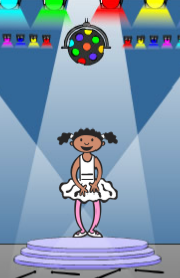

## चुनौती: अपने गेम में सुधार करें

### और ब्लॉक बनाएँ

क्या आपको कोई अन्य कोड दिखाई देता है जो चारों बटन के लिए समान है?

```blocks3
जब मुझे [लाल v] प्राप्त हो
अगर <[अनुक्रम v] का (मद (1 v))=[1]> फिर
    (0.25) बीट्स के लिए (\(1\) फंदे वाला ड्रम v) बजाएँ
    [अनुक्रम v] का (1 v) हटाएँ
अन्यथा
    खेल समाप्त :: custom
अंत

जब मुझे [नीला v] प्राप्त हो
अगर <[अनुक्रम v] का (मद (1 v))=[1]> फिर
    (0.25) बीट्स के लिए (\(2\) बेस वाला ड्रम v) बजाएँ
    [अनुक्रम v] का (1 v) हटाएँ
अन्यथा
    खेल समाप्त :: custom
अंत
```

Can you make another custom block that all buttons can use?

### Another costume

Can you see that your game starts with your character showing one of the four colours, and that the character always displays the last colour in the sequence while the player is repeating the colour sequence?

Can you add another plain white costume to your character, and add code so that the character displays this costume at the start of the game and while the player is repeating the sequence?



### Difficulty level

Can you allow your player to choose between playing the game in 'easy mode' (using just the red and blue colours) and 'normal mode' (which uses all four colours)?

If you want, you can even add a 'hard' mode, which makes use of a fifth drum!