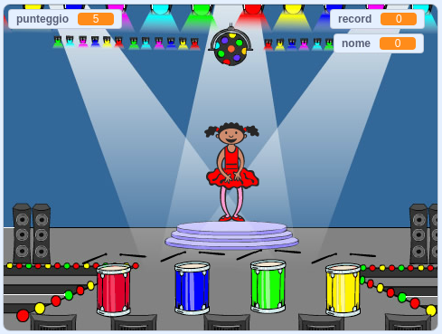

\--- no-print \---

Questa è la versione **Scratch 3** del progetto. C'è anche una [versione Scratch 2 del progetto](https://projects.raspberrypi.org/en/projects/memory-scratch2).

\--- /no-print \---

## Introduzione

In questo progetto, creerai un gioco di memoria nel quale dovrai memorizzare e ripetere una sequenza casuale di colori!

### Che cosa creerai

\--- no-print \--- Fare clic sulla bandiera verde per vedere l'animazione. Guarda la sequenza di colori mostrata dall'abito della ballerina e ascolta i ritmi della batteria, quindi ripeti la sequenza di colori. Se ripeti l'ordine dei colori sbagliato, è game over!

  <iframe allowtransparency="true" width="485" height="402" src="//scratch.mit.edu/projects/embed/284452634/?autostart=false" frameborder="0" allowfullscreen scrolling="no" mark="crwd-mark"></iframe> 

\--- /no-print \---

\--- print-only \---  \--- /print-only \---

## \--- collapse \---

## title: Cosa imparerai

+ Come aggiungere suoni al tuo progetto Scratch
+ Come creare e utilizzare le liste per memorizzare i dati
+ Come creare e utilizzare blocchi personalizzati per la ripetizione del codice

\--- /collapse \---

## \--- collapse \---

## title: Di cosa avrai bisogno

### Hardware

+ Un computer in grado di eseguire Scratch 3

### Software

Scratch 3 (o [online](https://rpf.io/scratchon){:target="_ blank"} o [offline](https://rpf.io/scratchoff){:target="_ blank"}) \--- / collapse \---

## \--- collapse \---

## title: Informazioni aggiuntive per gli educatori

\--- no-print \---

Se intendete stampare questo progetto, cliccate su [Versione stampabile](https://projects.raspberrypi.org/en/projects/memory/print){:target = "_ blank"}.

\--- /no-print \---

Puoi trovare il [progetto completato qui ](http://rpf.io/p/en/memory-get).

\--- /collapse \---