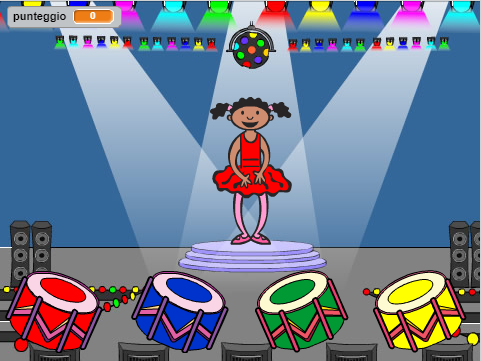

## Introduction

In this project, you will create a memory game in which you have to memorise and repeat a random sequence of colours!

### What you will make

Click on the green flag to start. Watch the sequence of colours shown by the dancer's dress and listen to the accompanying drum beats, then repeat them back to her. If you get the order wrong, it's game over!

  <iframe allowtransparency="true" width="485" height="402" src="https://scratch.mit.edu/projects/embed/34874510/?autostart=false" frameborder="0"></iframe>
  

### What you will learn

This project covers elements from the following strands of the [Raspberry Pi Digital Making Curriculum](http://rpf.io/curriculum){:target="_blank"}:

+ [Combine programming constructs to solve a problem.](https://www.raspberrypi.org/curriculum/programming/builder){:target="_blank"}

### Additional information for educators

If you need to print this project, please use the [printer friendly version](https://projects.raspberrypi.org/en/projects/memory/print){:target="_blank"}.

Use the link in the footer to access the GitHub repo for this project, which contains all resources (including an example finished project) in the 'en/resources' folder.