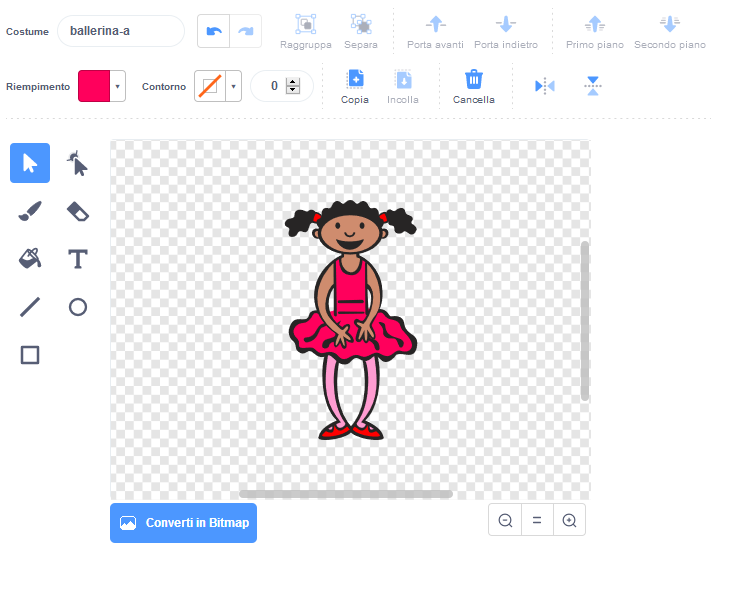

## Crea una sequenza di colori

Prima crea un personaggio con il quale visualizzare una sequenza casuale di colori.

\--- task \---

Inizia un nuovo progetto Scratch.

**Online:** apri un nuovo progetto Scratch online su [rpf.io/scratch-new](https://rpf.io/scratch-new){:target="_blank"}.

**Offline**: apri un nuovo progetto nell'editor offline.

Se hai bisogno di scaricare ed installare l'editor Scratch offline, puoi trovarlo su [rpf.io/scratchoff](https://rpf.io/scratchoff){:target="_blank"}.

\--- /task \---

\--- task \---

Scegli uno sprite come personaggio e uno sfondo. Potresti usare la ballerina, ma il tuo personaggio non deve essere necessariamente una persona, deve solo essere in grado di mostrare colori diversi.


\--- /task \---

+ Il tuo gioco userà un numero diverso per rappresentare ciascun colore:
    
    + 1 = rosso
    + 2 = blu
    + 3 = verde
    + 4 = giallo

\--- task \---

Attribuisci quattro costumi colorati diversi al tuo personaggio, uno per ciascuno dei quattro colori citati prima. Assicurati che i tuoi costumi colorati siano nello stesso ordine della lista definita prima.


\--- /task \---

Se lo desideri, puoi utilizzare lo strumento **colora una forma** per riempire parti del costume con un colore diverso.



Quindi, aggiungi un elenco per memorizzare la sequenza casuale di colori che il giocatore deve ricordare.

\--- task \---

Crea una lista chiamata `sequenza`{:class="block3variables"}. Solo lo sprite del personaggio deve vedere questa lista, quindi puoi selezionare **Solo per questo sprite** quando crei la lista.

[[[generic-scratch3-make-list]]]

\--- /task \---

Ora dovresti vedere molti nuovi blocchi di codice per l'utilizzo delle liste. La lista vuota dovrebbe essere visibile nell'angolo in alto a sinistra dello stage.


Ogni colore ha un numero diverso, quindi puoi scegliere un colore casuale scegliendo casualmente un numero e aggiungendolo all'elenco.

\--- task \---

Aggiungi questo codice allo sprite del personaggio per scegliere un numero casuale e aggiungerlo alla lista `sequenza`{:class="block3variables"}:


```blocks3
quando si clicca sulla bandiera verde
aggiungi (numero a caso tra (1) e (4)) a [sequenza v]
```

\--- /task \---

\--- task \---

Verifica il tuo codice. Controlla che, ogni volta che fai clic sulla bandiera, un numero casuale compreso tra 1 e 4 venga aggiunto all'elenco.

\--- /task \---

\--- task \---

Puoi aggiungere codice al tuo programma per generare cinque numeri casuali in una volta sola?

\--- hints \---

\--- hint \---

Add a `delete all of sequence`{:class="block3variables"} to first delete all the items on the list, and then add a `repeat`{:class="block3control"} block that adds five random numbers to the list.

\--- /hint \---

\--- hint \---

Ecco cosa dovresti ottenere:


```blocks3
quando si clicca sulla bandiera verde
cancella (tutto v) da [sequenza v]
ripeti (5) volte 
  aggiungi (numero a caso tra (1) e (4)) a [sequenza v]
end
```

\--- /hint \---

\--- /hints \---

\--- /task \---

\--- task \---

Ogni volta che un numero viene aggiunto alla lista, il personaggio dovrebbe cambiare il suo costume in modo che il colore del costume corrisponda al numero estratto. Metti questi blocchi nel tuo codice immediatamente sotto al comando che aggiunge un numero casuale alla lista `sequenza`{:class="block3variables"}:


```blocks3
passa al costume (elemento (lunghezza di [sequenza v]) di [sequenza v])
attendi (1) secondi
```

\--- /task \---