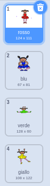
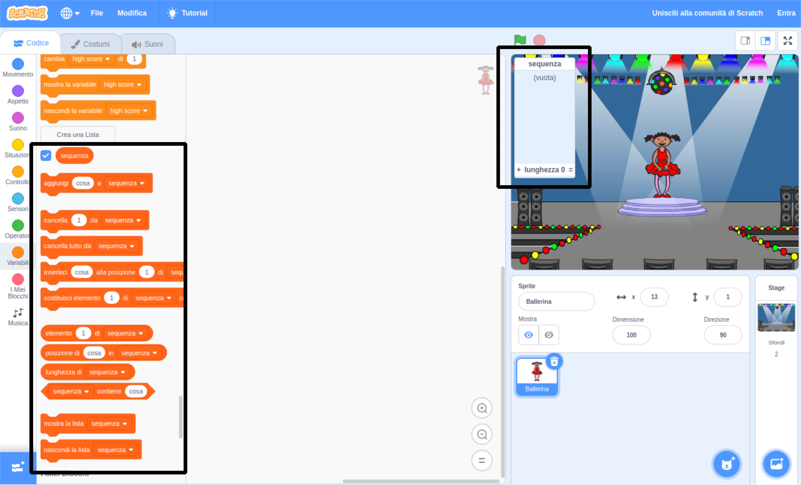

## Crea una sequenza di colori

Prima crea un personaggio in grado di visualizzare una sequenza casuale di colori.

\--- task \--- Apri un nuovo progetto Scratch.

**Online**: apri un nuovo progetto Scratch online a [rpf.io/scratch-new](https://rpf.io/scratchon).

**Offline**: apre un nuovo progetto nell'editor offline.

Se devi scaricare e installare l'editor offline di Scratch, puoi trovarlo su [rpf.io/scratchoff](https://rpf.io/scratchoff).

\--- /task \---

\--- task \--- Scegli un personaggio sprite e uno sfondo. Potresti usare la ballerina, ma il tuo personaggio non deve essere una persona, devono solo essere in grado di mostrare colori diversi.

 \--- /task \---

+ Il tuo gioco userà un numero diverso per rappresentare ciascun colore:
    
    + 1 = rosso
    + 2 = blu
    + 3 = verde
    + 4 = giallo

\--- task \--- Dai al tuo personaggio quattro costumi con colori diversi, un costume per ciascuno dei quattro colori mostrati sopra. Assicurati che i tuoi costumi colorati siano nello stesso ordine dell'elenco sopra.

 \--- /task \---

Se lo desideri, puoi utilizzare lo strumento **colora una forma** per riempire parti del costume con un colore diverso.


Quindi, aggiungi un elenco per memorizzare la sequenza casuale di colori che il giocatore deve ricordare.

\--- task \--- Crea una lista chiamata `sequenza`{: class = "block3variables"}. Solo lo sprite del personaggio deve vedere questa lista, quindi puoi selezionare **Solo per questo sprite** quando crei la lista.

[[[generic-scratch3-make-list]]]

\--- /task \---

Ora dovresti vedere molti nuovi blocchi di codice per l'utilizzo delle liste. L'a lista vuota dovrebbe essere visibile nell'angolo in alto a sinistra dello schermo.



Ogni colore ha un numero diverso, quindi puoi scegliere un colore casuale scegliendo casualmente un numero e aggiungendolo all'elenco.

\--- task \--- Aggiungi questo codice allo sprite del personaggio per scegliere un numero casuale e aggiungilo a `sequenza`{: class = "block3variables"}:


```blocks3
quando si clicca sulla bandiera verde
aggiungi (numero a caso tra (1) e (4)) a [sequenza v]
```

\--- /task \---

\--- task \--- Verifica il tuo codice. Controlla che, ogni volta che fai clic sulla bandiera, un numero casuale compreso tra 1 e 4 venga aggiunto all'elenco. \--- /task \---

\--- task \--- Puoi aggiungere codice al tuo programma per generare cinque numeri casuali in una volta?

\--- hints \--- \--- hint \--- Aggiungi a `delete all of sequenza`{: class = "block3variables"} per eliminare prima tutti gli elementi nella lista, quindi aggiungi un `repeat`{: class = "block3control"} che aggiunge cinque numeri casuali all'elenco. \--- /hint \--- \--- hint \---

Ecco come dovrebbe apparire il risultato:


```blocks3
quando si clicca sulla bandiera verde
cancella (tutto v) da [sequenza v]
ripeti (5) volte 
  aggiungi (numero a caso tra (1) e (4)) a [sequenza v]
end
```

\--- /hint \--- \--- /hints \--- \--- /task \---

\--- task \--- Ogni volta che un numero viene aggiunto alla lista, il personaggio dovrebbe cambiare il suo costume in modo che il colore del costume corrisponda al numero. Metti questi blocchi nel tuo codice immediatamente sotto, dove viene aggiunto un numero casuale a `sequenza`{: class = "block3variables"}:


```blocks3
switch costume to (item (length of [sequenza v]) of [sequenza v])
wait (1) seconds
```

\--- /task \---