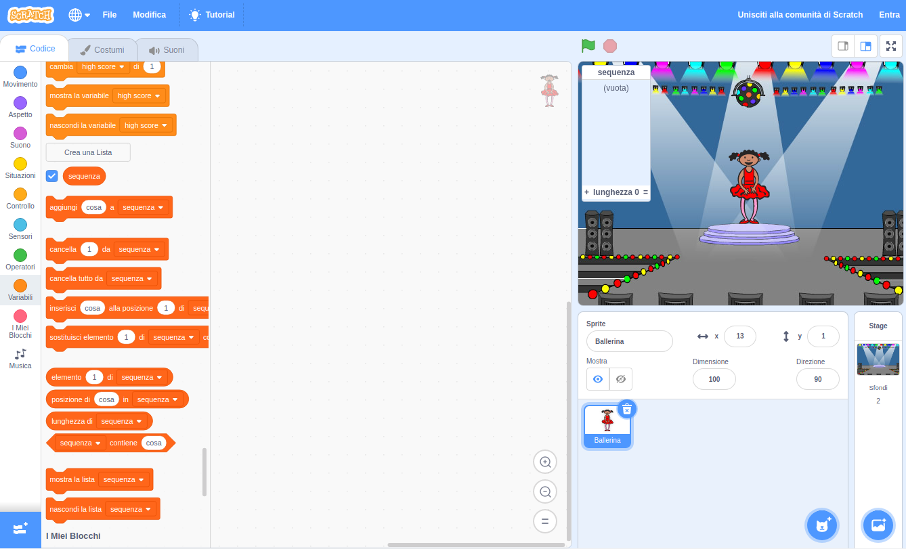

## Crea una sequenza di colori

Innanzitutto, creiamo un personaggio che mostrerà una sequenza casuale di colori da memorizzare.

+ Apri un nuovo progetto Scratch ed elimina lo sprite del gatto, in modo che il tuo progetto sia vuoto. Puoi trovare l'editor di Scratch online [qui](http://jumpto.cc/scratch-new).

+ Scegli lo sprite di un personaggio ed uno sfondo. Il tuo personaggio non deve essere per forza una persona, ma dovrà essere in grado di mostrare colori diversi.


+ Nel tuo gioco, userai un numero diverso per rappresentare ogni colore:
    
    + 1 = rosso
    + 2 = blu
    + 3 = verde
    + 4 = giallo
    
    Attribuisci quattro costumi colorati diversi al tuo personaggio, uno per ciascuno dei quattro colori citati prima. Assicurati che i tuoi costumi colorati siano nello stesso ordine della lista definita prima.
    
    
    
    Puoi usare lo strumento *Colora una forma* per tingere parti del costume con un colore diverso.

Creiamo una sequenza casuale di colori.

+ Crea una lista chiamata `sequenza`{:class="blockdata"}. Useremo questa lista per memorizzare la sequenza di colori che il giocatore deve ricordare. Solo lo sprite del personaggio deve vedere la lista, quindi puoi selezionare **Solo per questo sprite**.

[[[generic-scratch-make-list]]]

Ora dovresti vedere la tua lista vuota in alto a sinistra nel tuo stage, oltre a molti nuovi blocchi per usare le liste.



+ Ti ricordi che abbiamo dato ad ogni colore un numero? Possiamo scegliere casualmente un colore selezionando un numero casuale e aggiungendolo alla lista. Aggiungi questo codice:

```blocks
quando si clicca sulla bandiera verde
aggiungi (numero a caso tra (1) e (4)) a [sequenza v]
```

+ Testa il tuo codice cliccando sulla bandiera verde. Assicurati che, ad ogni click, venga aggiunto un numero casuale compreso tra 1 e 4 alla lista.

+ Riesci ad aggiungere questo blocco al tuo programma per generare cinque numeri casuali in una sola volta?

```blocks
ripeti (5) volte

end
```

+ Potresti notare che la tua lista si è riempita un po' troppo. Aggiungiamo un blocco per eliminare l'intera lista all'inizio prima di generare qualsiasi numero.

```blocks
quando si clicca sulla bandiera verde
cancella (tutto v) da [sequenza v]
ripeti (5) volte 
  aggiungi (numero a caso tra (1) e (4)) a [sequenza v]
end
```

+ Infine, per ogni numero, cambiamo il costume della ballerina con l'ultimo elemento che è stato aggiunto alla lista, che sarà il numero che è stato appena generato. Aggiungi questi blocchi al tuo codice subito dopo aver aggiunto il numero casuale alla tua lista:

```blocks
passa al costume (elemento (last v) di [sequenza v])
attendi (1) secondi
```