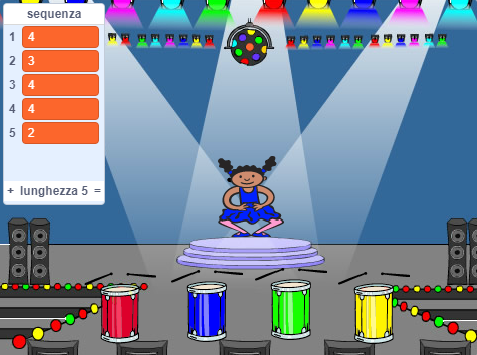

## Ripetere la sequenza

Ora stai per aggiungere quattro pulsanti che il giocatore deve premere per ripetere la sequenza di colori.

\--- task \--- Aggiungi quattro nuovi sprite al tuo progetto per rappresentare i quattro pulsanti.

+ Modifica i costumi dei nuovi sprite in modo che ci sia uno sprite in ciascuno dei quattro colori
+ Metti gli sprite nello stesso ordine sul palco come i costumi: rosso, blu, verde, giallo

 \--- /task \---

\--- task \--- Aggiungere il codice al sprite rosso in modo che, quando lo sprite viene cliccato, un messaggio 'rosso' `viene inviato`{: class = "block3events"} allo sprite personaggio:


```blocks3
    when this sprite clicked
    broadcast (red v)
```

\--- /task \---

Un `broadcast`{: class = "block3events"} è come un messaggio annunciato da un altoparlante, che si può per esempio sentire nelle scuole o nei supermercati. Tutti gli sprite possono ascoltare il `broadcast`{: class = "block3events"}, ma solo lo sprite incaricato di rispondere farà qualcosa.

\--- task \---

Aggiungi codice simile agli sprite blu, verdi e gialli per far loro trasmettere messaggi `broadcast`{: class = "block3events"} del proprio colore.

\--- /task \---

Ti ricordi che il `broadcast`{: class = "block3events"} è come un messaggio di altoparlante? Si aggiungerà codice per renderlo il lavoro del sprite personaggio di rispondere alla `trasmissione`{: class = "block3events"} messaggi.

\--- task \---

Quando il tuo personaggio sprite riceve il messaggio `red`{: class = "block3events"}, il codice dovrebbe verificare se il numero `1` è all'inizio della lista di `sequenza`{: class = "block3variables"} (che significa che `rosso`{: class = "block3events"} è il colore successivo nella sequenza).

Se `1` è all'inizio della lista, il codice deve rimuovere il numero dalla lista, perché il giocatore ha ricordato il colore corretto. Altrimenti è game over, e il codice ha bisogno di fermare tutto `fermare tutti`{: class = "block3control"} per terminare il gioco.


```blocks3
quando ricevo [rosso v]
se <(elemento (1 v) di [sequenza v]) = [1]> allora 
 cancella (1 v) da [sequenza v]
altrimenti 
 dire [Hai perso!] per (1) secondi
 ferma [all v]
end
```

\--- /task \---

\--- task \--- Aggiungi al codice che hai appena scritto in modo che anche un tamburo suoni quando lo sprite del personaggio riceve la corretta trasmissione `broadcast`{: class = "block3events"}.

\--- hints \--- \--- hint \--- Riesci a usare i numeri che corrispondono ad ogni colore per riprodurre il suono di tamburo corretto?

+ 1 = rosso
+ 2 = blu
+ 3 = verde
+ 4 = giallo \--- /hint \--- \--- hint \--- Sopra il `delete 1 of sequenza`{: class = "block3variables"}, aggiungi il `play drum`{: class = " block3sound "} per riprodurre il primo suono nell'elenco `sequenza`{: class =" block3variables "}.

\--- /hint \--- \--- hint \--- Ecco il codice che dovrai aggiungere:

```blocks3
quando ricevo [rosso v]
se <(elemento (1 v) di [sequenza v]) = [1]> allora 
 + suona il tamburo ((1) Snare Drum v) per (0.25) battute
 cancella (1 v) da [sequenza v]
altrimenti 
 dire [Hai perso!] per (1) secondi
 ferma [all v]
end

```

\--- /hint \--- \--- /hints \--- \--- /task \---

\--- task \--- Duplica il codice che hai usato per far rispondere lo sprite del tuo personaggio al messaggio `red`{: class = "block3events"}. Cambia il codice appena copiato in modo che invii il messaggio `blue`{: class = "block3events"}. \--- /task \---

Quando lo sprite risponde al messaggio `blue`{: class = "block3events"}, quale parte di codice dovrebbe rimanere lo stesso e quale dovrebbe cambiare? Ricorda che ogni colore ha un numero corrispondente.

\--- task \--- Modifica il codice dello sprite del personaggio in modo che il carattere risponda correttamente al messaggio `blue`{: class = "block3events"}.

\--- hints \--- \--- hint \---

Conserva questi blocchi, ma è necessario modificarli in qualche modo:


```blocks3
<(elemento (1 v) di [sequenza v]) = [1]>

quando ricevo [rosso v]

suona il tamburo ((1) Snare Drum v) per (0.25) battute
```

\--- /hint \--- \--- hint \--- Ecco come il tuo codice dovrebbe cercare la trasmissione `blu`{: class = "block3events"}.


```blocks3
quando ricevo [blu v]
se <(elemento (1 v) di [sequenza v]) = [2]> allora 
  suona il tamburo ((2) Bass Drum v) per (0.25) battute
  cancella (1 v) da [sequenza v]
altrimenti 
  dire [Hai perso!] per (1) secondi
  ferma [all v]
end
```

\--- /hint \--- \--- /hints \--- \--- /task \---

\--- task \--- Duplica nuovamente il codice due volte (per i pulsanti verde e giallo) e modifica le parti necessarie in modo che il carattere risponda correttamente alle nuove trasmissioni `broadcast`{: class = "block3events"}. \--- /task \---

Ricordati di testare il codice! Puoi memorizzare una sequenza di cinque colori? La sequenza è diversa ogni volta?

Quando il giocatore ripete correttamente l'intera sequenza di colori, la `sequenza `{: class = "block3variables"} si svuota e il giocatore vince. Se vuoi, puoi anche mostrare alcune luci lampeggianti come ricompensa una volta che la lista `sequenza`{: class = "block3variables"} è vuota.

\--- task \--- Aggiungi questo codice alla fine dello script del tuo personaggio `when flag clicked`{: class = "block3events"}:


```blocks3
    attendi fino a quando <(lunghezza di [sequenza v]) = [0]>
invia a tutti (vinto v) e attendi
```

\--- /task \---

\--- task \--- Passa allo schermo principale e importa il suono `batteria elettronica` o un altro suono che si desidera.

[[[generic-scratch3-sound-from-library]]]

\--- /task \---

\--- task \--- Aggiungi questo codice per riprodurre un suono e fare in modo che lo sfondo cambi colore quando il giocatore vince.


```blocks3
    quando ricevo [vinto v]
avvia riproduzione suono (drum machine v)
ripeti (50) volte 
  cambia effetto [color v] di (25)
  attendi (0.1) secondi
end
rimuovi effetti grafici
```

\--- /task \---