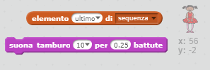

\--- challenge \---

## Sfida: Aggiungere un suono

Testa il tuo progetto un paio di volte. Potresti notare che alcune volte lo stesso numero viene generato più volte di seguito, rendendo più difficile la memorizzazione della sequenza. Riesci ad aggiungere un suono di tamburo ogni volta che il personaggio cambia il costume?

Sei in grado di riprodurre un suono di batteria diverso per ogni numero generato? Sarà *molto* simile al codice che cambia il costume del personaggio.

\--- hints \--- \--- hint \--- Puoi completare questa sfida aggiungendo solo due blocchi al codice attuale del tuo personaggio! \--- /hint \--- \--- hint \--- Questi sono i blocchi che ti serviranno:

 \--- /hint \---

\--- hint \--- Ecco come dovrebbe essere il codice completo:

```blocks
quando si clicca sulla bandiera verde
cancella (tutto v) da [sequenza v]
ripeti (5) volte 
  aggiungi (numero a caso tra (1) e (4)) a [sequenza v]
  suona tamburo (elemento (last v) di [sequenza v]) per (0.25) battute
  passa al costume (elemento (last v) di [sequenza v])
  attendi (1) secondi
end
```

\--- /hint \---

\--- /hints \---

\--- /challenge \---