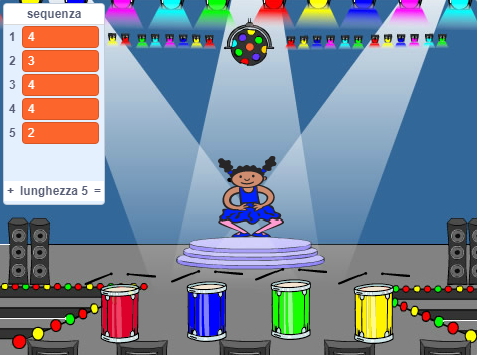
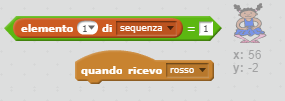

## Ripetere la sequenza

Aggiungiamo quattro pulsanti per permettere al giocatore di ripetere la sequenza memorizzata.

+ Aggiungiamo quattro nuovi sprite al tuo progetto per rappresentare i quattro pulsanti. Modifica i costumi in modo che ci sia uno sprite per ogni colore. Disponi gli sprite nello stesso ordine dei costumi: rosso, blu, verde, giallo.



+ Quando il tamburo rosso viene cliccato, dovrai trasmettere un messaggio al tuo personaggio per comunicarlo che il pulsante rosso è stato cliccato. Aggiungi questo codice al tuo tamburo rosso:

```blocks
    quando si clicca questo sprite
    invia a tutti [rosso v]
```

Una trasmissione assomiglia ad un annuncio fatto da un altoparlante - come quelli che senti mentre fai la spesa al supermercato. Tutti gli sprite possono sentire il messaggio, ma solo quello che deve rispondere farà qualcosa.

+ Aggiungi un codice simile ai tamburi blu, verde e giallo per farli trasmettere messaggi sul loro colore.

\--- hints \--- \--- hint \--- Ecco un metodo semplice per copiare il codice da uno sprite a un altro. Cambia la trasmissione in ogni sprite in modo che corrisponda al colore dello sprite.  \--- /hint \--- \--- /hints \---

Ti ricordi quando abbiamo detto che la trasmissione assomiglia ad un annuncio fatto da un altoparlante? Solo lo sprite che deve rispondere farà qualcosa, quindi facciamo in modo che il lavoro dello sprite del personaggio sia quello di rispondere ai messaggi. Possiamo farlo scrivendo un codice che il personaggio deve eseguire quando sente un messaggio.

+ Quando lo sprite del tuo personaggio riceve il messaggio `rosso`, il codice dovrebbe verificare se il numero `1` è all'inizio della lista (il che significa che il `rosso` è il prossimo colore nella sequenza).
    
    Se ciò è vero, il codice dovrebbe rimuovere il numero dalla lista, visto che il colore è stato indovinato. Altrimenti il gioco è finito e dovremo eseguire `ferma tutto`{:class="blockcontrol"} per fermarlo.

```blocks
    quando ricevo [red v]
    se <(item (1 v) of [sequenza v]) = [1]> allora 
        cancella (1 v) da [sequenza v]
    altrimenti
        dire [Game over!] per (1) secondi
        ferma [tutto v]
    end
```

+ Aggiungi il codice che hai appena scritto per riprodurre un battito di tamburo quando il colore corretto è ricevuto.

\--- hints \--- \--- hint \--- Riesci a usare i numeri che corrispondono ad ogni colore per riprodurre il suono di tamburo corretto?

+ 1 = rosso
+ 2 = blu
+ 3 = verde
+ 4 = giallo \--- /hint \--- \--- hint \--- Dovrai aggiungere il blocco `suona tamburo`{:class="blocksound"} per riprodurre il primo suono nella sequenza prima di eseguire `cancella 1 da sequenza`{:class="blockdata"}:

 \--- /hint \--- \--- hint \--- Ecco il codice che dovrai aggiungere:

```blocks
suona tamburo (elemento (1 v) di [sequence v]) per (0.25) battute
```

\--- /hint \--- \--- /hints \---

+ Duplica il codice che hai usato per far rispondere lo sprite del tuo personaggio al messaggio `rosso`. Stavolta, cambia il messaggio in `blue`.

Quando lo sprite risponde al messaggio `blu`, quale parte di codice dovrebbe rimanere uguale e quale dovrebbe cambiare? Ricordati che ogni colore ha un numero corrispondente.

+ Cambia il tuo codice per far rispondere correttamente il personaggio al messaggio `blu`.

\--- hints \--- \--- hint \--- Mantieni questi blocchi, anche se dovrai cambiarli un po':  \--- /hint \--- \--- hint \--- Ecco come dovrebbe essere il codice per il messaggio blu.

```blocks
    quando ricevo [blu v]
    se <(item (1 v) of [sequenza v]) = [2]> allora 
        suona tamburo (elemento (1 v) di [sequenza v]) per (0.25) battute
        cancella (1 v) da [sequenza v]
    altrimenti
        dire [Game over!] per (1) secondi
        ferma [tutto v]
    end
```

\--- /hint \--- \--- /hints \---

+ Duplica ancora il codice per due volte per i pulsanti verde e giallo, e fai le modifiche necessarie per far rispondere correttamente il personaggio.

+ Ricordati di testare il codice che hai aggiunto! Riesci a memorizzare una sequenza di cinque colori? La sequenza cambia ogni volta?

Potresti anche mostrare delle luci lampeggianti come premio quando la lista si svuota, dato che significa che l'intera sequenza è stata memorizzata correttamente.

+ Aggiungi questo codice alla fine del codice del tuo personaggio che inizia con `quando si clicca sulla bandiera verde`{:class="blockevents"}:

```blocks
    attendi fino a quando <(lunghezza di [sequenza v]) = [0]>
    invia a tutti [won v] e attendi
```

+ Passa allo stage, e aggiungi questo codice per riprodurre un suono e cambiare il colore dello sfondo quando il giocatore vince. Puoi scegliere qualsiasi suono ti piaccia.

```blocks
    quando ricevo [vinto v]
    produci suono [drum machine v]
    ripeti (50) volte 
        cambia effetto [colore v] di (25)
        attendi (0.1) secondi
    end
    rimuovi effetti grafici
```