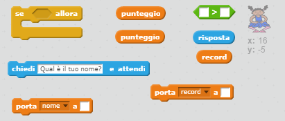
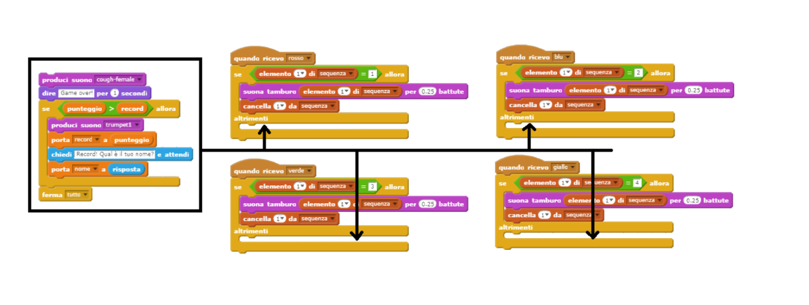
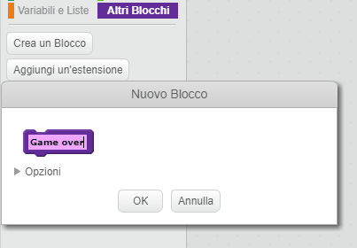
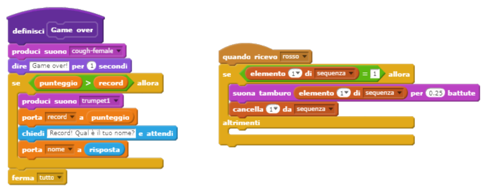
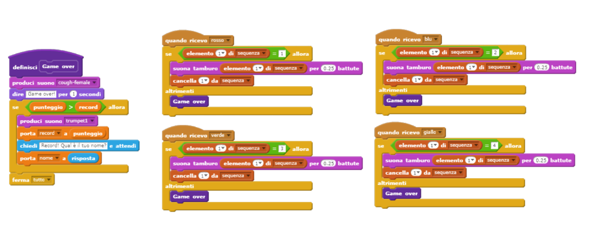
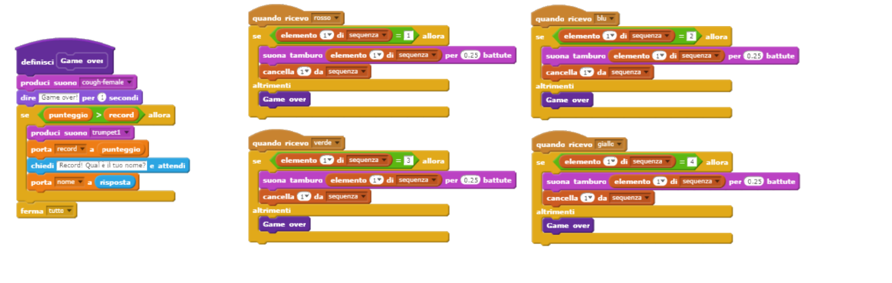

## Record

Salviamo il punteggio più alto, così puoi giocare contro i tuoi amici.

+ Aggiungiamo due nuove variabili chiamate `record`{:class="blockdata} e `nome`{:class="blockdata"} al tuo progetto.

Quando il gioco finisce per una sequenza sbagliata dal giocatore, dovrai controllare se il suo punteggio è più alto del record attuale. Se è così, dovrai salvare il punteggio come record e il nome del giocatore.

+ Aggiungi del codice allo sprite del tuo personaggio per salvare il record. Inoltre, chiedi al giocatore il suo nome e salvalo nella variabile `nome`{:class="blockdata"}.

[[[generic-scratch-high-score]]]

\--- hints \--- \--- hint \--- Il tuo nuovo codice deve seguire questa logica: Dopo il messaggio `Game over` `Se` il `punteggio` è `maggiore` del `record` `Porta` la variabile `record` a `punteggio` `Chiedi` il nome del giocatore `Porta` la variabile `nome` a `risposta` \--- /hint \--- \--- hint \--- Avrai bisogno dei seguenti blocchi:



\--- /hint \--- \--- hint \--- Ecco come dovrebbe essere il codice per quando viene premuto il pulsante rosso:

```blocks
    quando ricevo [rosso v]
    se <(item (1 v) of [sequenza v]) = [1]> allora 
        cancella (1 v) da [sequenza v]
    altrimenti
        dire [Game over!] per (1) secondi
        se <(punteggio) > (record)> allora 
            porta [record v] a (punteggio)
            ask [Record! Qual è il tuo nome?] e attendi
            porta [nome v] a (risposta)
        end
        ferma [tutto v]
    end
```

\--- /hint \--- \--- /hints \---

+ Dovrai aggiungere questo codice allo sprite del personaggio anche per gli altri tre colori! Hai notato che il codice per il 'Game over' è esattamente lo stesso per tutti i colori?



Se dovessi avere bisogno di cambiare questo codice, per esempio, aggiungendo un suono o cambiando il messaggio di 'Game over', dovresti cambiarlo quattro volte. Sarebbe fastidioso e uno spreco di tempo.

Per evitarlo, puoi dichiarare i tuoi blocchi e usarli nel tuo progetto. Per farlo, clicca `Altri blocchi`{:class="blockmoreblocks"}, e poi **Crea un Blocco**. Chiama questo nuovo blocco 'Game over'.



+ Aggiungi il codice dall'`else`{:class="blockcontrol"} del codice connesso al pulsante rosso al blocco che hai creato:



+ Ora hai creato una nuova *funzione* chiamata `Game over`{:class="blockmoreblocks"}, che puoi usare ovunque tu voglia. Trascina il tuo nuovo blocco `Game over`{:class="blockmoreblocks"} nei quattro codici dei pulsanti.



+ Ora aggiungi un suono per quando viene premuto un pulsante sbagliato. Hai bisogono di aggiungere questo codice solo nel blocco `Game over`{:class="blockmoreblocks"} che hai creato, e non quattro volte!

