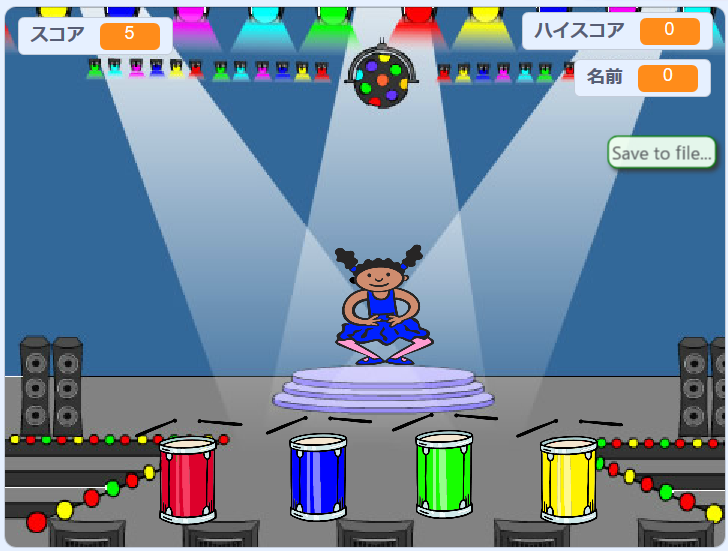

--- no-print ---

これは、このプロジェクトの**Scratch 3**バージョンです。このプロジェクトの[ Scratch 2バージョン](https://projects.raspberrypi.org/ja-JP/projects/memory-scratch2)もあります。

--- /no-print ---

## はじめに

このプロジェクトでは、ばらばらな色の順序を記憶して再現する、記憶ゲームを作成します。

### あなたが作るもの

--- no-print ---

緑の旗をクリックしてスタートします。 ダンサーのドレスで示される色の順序を覚えて、その時に聞こえるドラムの音を聞き、順番通りに同じ色のドラムをたたいてください。 色の順番を間違えると、ゲームオーバーになります！

  <iframe allowtransparency="true" width="485" height="402" src="//scratch.mit.edu/projects/embed/388343054/?autostart=false" frameborder="0" allowfullscreen scrolling="no" mark="crwd-mark"></iframe> 

--- /no-print ---

--- print-only ---

--- /print-only ---

--- collapse ---
---
title: 学習すること
---

+ Scratchプロジェクトに音を追加する方法
+ データを保存するためのリストを作成し使用する方法
+ コードを繰り返すためのカスタムブロックを作成して使用する方法

--- /collapse ---

--- collapse ---
---
title: 必要なもの
---

### ハードウェア

+ Scratch 3を実行できるコンピュータ

### ソフトウェア

Scratch3 ([オンライン](https://rpf.io/scratchon){:target="_blank"}または[オフライン](https://rpf.io/scratchoff){:target="_blank"}のどちらか)

--- /collapse ---

--- collapse ---
---
title: 教育者向けの追加情報
---

--- no-print ---

このプロジェクトを印刷する必要がある場合は、 [印刷用バージョン](https://projects.raspberrypi.org/ja-JP/projects/memory/print){:target="_blank"}を使用してください。

--- /no-print ---

[ここで完成したプロジェクト](https://rpf.io/p/ja-JP/memory-get)を見ることができます 。

--- /collapse ---